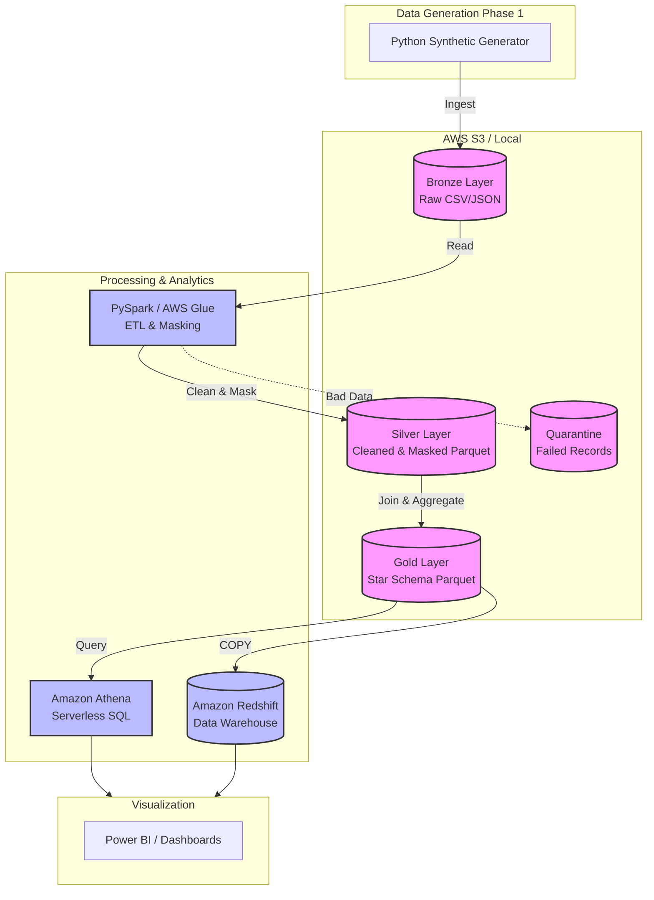
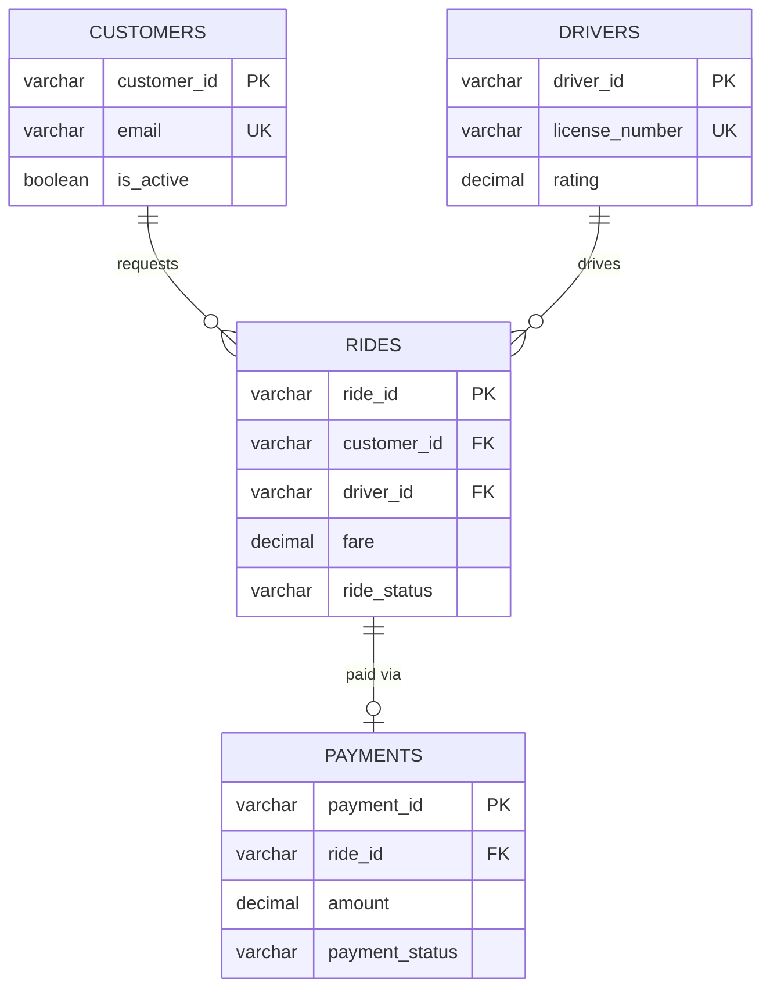

# Mobility Data Platform & Analytics Lakehouse

A production-grade data engineering platform simulating a ride-hailing company's data infrastructure.

## Architecture



## Phase 2 Database Schema (ERD)



### Access Control (RBAC)

| Role | Access Level | Purpose |
|------|-------------|---------|
| `etl_writer` | **Full (Read/Write)** | Used by Python pipelines to load and modify data |
| `data_analyst` | **Read-Only** | Used by Analysts to query raw tables for reporting |
| `bi_reader` | **Views Only** | Used by BI tools (No direct access to raw PII data) |

## Current Phase: Phase 2 — PostgreSQL Local Store

### Quick Start

```bash
# 1. Create virtual environment
python -m venv venv
venv\Scripts\activate        # Windows

# 2. Install dependencies
pip install -r requirements.txt

# 3. Phase 1: Generate synthetic data
python main.py generate

# 4. Phase 2: Start PostgreSQL & Load Data (Docker required)
docker compose -f docker/docker-compose.yml up -d
python main.py load-postgres

# 4. Run tests
pytest tests/ -v
```

### Documentation

To view the project documentation (Data Dictionary, Data Governance Rules, etc.):

You can view the live documentation here: [https://RaviShinde19.github.io/mobility-data-platform/](https://RaviShinde19.github.io/mobility-data-platform/)

*(Alternatively, to run it locally, you can use `mkdocs serve` and visit http://127.0.0.1:8000/)*

### Generated Data

| Dataset    | Records | Format   | Location                |
|-----------|---------|----------|-------------------------|
| Customers | 1,000   | CSV/JSON | data/raw/customers/     |
| Drivers   | 500     | CSV/JSON | data/raw/drivers/       |
| Rides     | 10,000  | CSV/JSON | data/raw/rides/         |
| Payments  | 8,000   | CSV/JSON | data/raw/payments/      |

### Project Structure

```
mobility-platform/
├── config/config.yaml           # All configurable parameters
├── docker/                      # Phase 2: PostgreSQL infrastructure
├── sql/                         # Phase 2: DDL and Queries
├── docs/                        # MkDocs documentation
├── src/
│   ├── data_generator/          # Phase 1: Synthetic data generation
│   ├── database/                # Phase 2: Database connections and loading
│   ├── utils/                   # Shared utilities (logging, config)
│   └── models/                  # Data schemas (dataclasses)
├── data/raw/                    # Generated data output
├── tests/                       # Test suite
├── main.py                      # CLI entry point
└── requirements.txt             # Dependencies
```

## Phases

- [x] **Phase 1**: Project Setup & Data Generation
- [x] **Phase 2**: PostgreSQL — Local Relational Store
- [ ] **Phase 3**: Amazon S3 — Bronze Layer Ingestion
- [ ] **Phase 4**: PySpark — Bronze → Silver Transformations
- [ ] **Phase 5**: PySpark — Silver → Gold (Dimensional Model)
- [ ] **Phase 6**: Data Quality & Error Handling
- [ ] **Phase 7**: AWS Glue — Managed Cloud ETL
- [ ] **Phase 8**: Amazon Athena — Query the Lake
- [ ] **Phase 9**: Amazon Redshift — Data Warehouse
- [ ] **Phase 10**: Apache Airflow — Pipeline Orchestration
- [ ] **Phase 11**: Power BI — Dashboards & Visualization

## Tech Stack

| Component      | Technology     | Phase |
|---------------|---------------|-------|
| Data Generation| Python, Faker | 1     |
| Local DB       | PostgreSQL    | 2     |
| Cloud Storage  | Amazon S3     | 3     |
| Processing     | PySpark       | 4-5   |
| Data Quality   | Python        | 6     |
| Cloud ETL      | AWS Glue      | 7     |
| Lake Querying  | Amazon Athena | 8     |
| Warehouse      | Amazon Redshift| 9    |
| Orchestration  | Apache Airflow| 10    |
| Visualization  | Power BI      | 11    |
