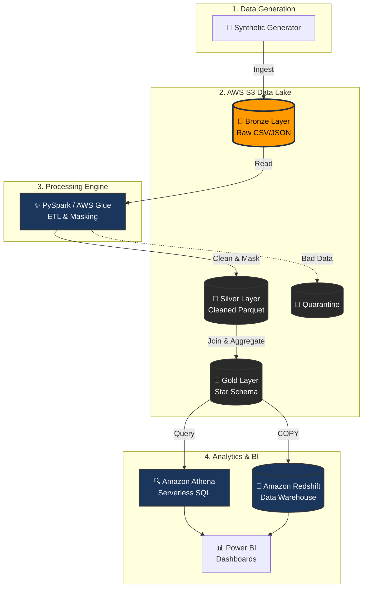
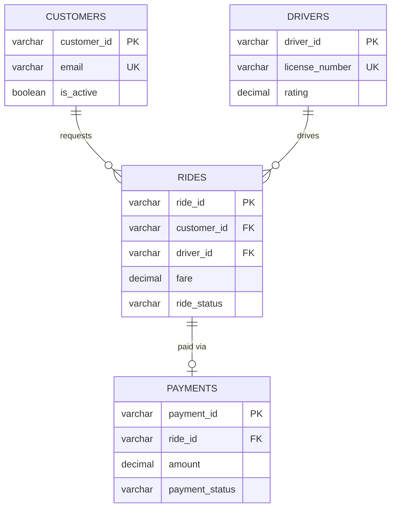

<div align="center">
  
  
  
  
  
  <br/>
  <br/>

  <h1>🚕 Mobility Data Platform & Analytics Lakehouse</h1>
  
  <p>
    <b>A production-grade, end-to-end Data Engineering architecture simulating a modern ride-hailing company (like Uber/Lyft).</b>
  </p>

  <p>
    <a href="#-architecture">Architecture</a> •
    <a href="#-tech-stack">Tech Stack</a> •
    <a href="#-enterprise-governance">Data Governance</a> •
    <a href="#-quick-start">Quick Start</a> •
    <a href="https://RaviShinde19.github.io/mobility-data-platform/">Live Docs</a>
  </p>
</div>

<br/>

> [!TIP]
> **Hiring Managers & Recruiters:** This project demonstrates advanced data engineering principles beyond basic tutorials. It implements **Idempotency, MD5 Checksum Integrity, Least-Privilege IAM, and Medallion Architecture** on AWS. See the [Enterprise Trade-offs Document](docs/enterprise_tradeoffs.md) for architectural decision records.

---

## 🏗️ Architecture

The platform follows a classic **Medallion Architecture** (Bronze ➔ Silver ➔ Gold), separating raw data ingestion from analytical modeling.

<div align="center">


```mermaid
graph TD
    %% Data Sources
    subgraph Sources [1. Data Generation]
        Gen[🐍 Synthetic Generator]
    end

    %% Storage Layers
    subgraph DataLake [2. AWS S3 Data Lake]
        Bronze[(🥉 Bronze Layer<br>Raw CSV/JSON)]
        Silver[(🥈 Silver Layer<br>Cleaned Parquet)]
        Gold[(🥇 Gold Layer<br>Star Schema)]
        Quarantine[(🚫 Quarantine)]
    end

    %% Processing
    subgraph Compute [3. Processing Engine]
        Spark[✨ PySpark / AWS Glue<br>ETL & Masking]
    end

    %% Consumption
    subgraph Analytics [4. Analytics & BI]
        Athena[🔍 Amazon Athena<br>Serverless SQL]
        Redshift[(🐘 Amazon Redshift<br>Data Warehouse)]
        PowerBI[📊 Power BI<br>Dashboards]
    end

    %% Flow
    Gen -->|Ingest| Bronze
    Bronze -->|Read| Spark
    Spark -->|Clean & Mask| Silver
    Spark -.->|Bad Data| Quarantine
    Silver -->|Join & Aggregate| Gold
    
    Gold -->|Query| Athena
    Gold -->|COPY| Redshift
    
    Athena --> PowerBI
    Redshift --> PowerBI

    classDef storage fill:#2a2a2a,stroke:#333,stroke-width:2px,color:#fff;
    classDef compute fill:#1b365d,stroke:#333,stroke-width:2px,color:#fff;
    classDef highlight fill:#ff9900,stroke:#232f3e,stroke-width:3px,color:#000;
    
    class Bronze,Silver,Gold,Quarantine storage;
    class Spark,Athena,Redshift compute;
    class Bronze highlight;
```
*Currently highlighting completion of Phase 3: S3 Bronze Layer Ingestion.*
</div>

---

## 🛡️ Enterprise Governance

This project treats **Data Governance and Security as a first-class citizen**, not an afterthought.

| Feature | Implementation | Business Value |
|:---|:---|:---|
| **Security by Design** | S3 Public Access Blocked, AES-256 Default Encryption, TLS 1.2+ transit enforcement. | Prevents data leaks and ensures compliance with SOC2 / HIPAA. |
| **Data Integrity** | `MD5 Checksums` verified post-upload. | Prevents silent network corruption during TB-scale uploads. |
| **Idempotency** | Static `Hive-style partitioning` (`year=YYYY/month=MM/day=DD`) with atomic overwrites. | Pipelines can be re-run safely without causing duplicate data. |
| **Access Control** | Segregated `IAM Policies` for ingestion (write-only) vs. analytics (read-only masked data). | Mitigates blast radius of compromised credentials. |
| **Lineage Tracking** | Every file is tagged with a unique `Pipeline Run ID` and emits structured JSON logs. | Allows engineers to trace bad dashboard data back to the exact script run. |

---

## 💻 Tech Stack

<table align="center">
  <tr>
    <td align="center" width="96">
      
      <br>Python
    </td>
    <td align="center" width="96">
      
      <br>AWS S3
    </td>
    <td align="center" width="96">
      
      <br>PostgreSQL
    </td>
    <td align="center" width="96">
      
      <br>Docker
    </td>
    <td align="center" width="96">
      
      <br>PySpark <i>(Next)</i>
    </td>
    <td align="center" width="96">
      
      <br>Pytest
    </td>
  </tr>
</table>

---

## 🚀 Quick Start Guide

Experience the full pipeline locally. This guide will walk you through generating the data, loading the local database, and streaming it to the AWS Bronze Layer.

### 📋 Prerequisites
Before you begin, ensure you have the following installed and configured:

**Local Environment:**
*  **Python 3.12+**
*  **Docker Desktop** (Must be running in the background for Phase 2)

**AWS Cloud Account:**
*  **AWS CLI Installed**
* An **IAM User** with programmatic access (Access Keys) and sufficient privileges to create S3 buckets and IAM policies.
* Run `aws configure` in your terminal to link your AWS account to your local machine before starting Phase 3.

### 🛠️ Step 1: Environment Setup
First, clone the repository and install the required data engineering libraries (boto3, faker, psycopg2).

```bash
git clone https://github.com/RaviShinde19/mobility-data-platform.git
cd mobility-data-platform
python -m venv venv
venv\Scripts\activate      # On Windows
pip install -r requirements.txt
```

### 🧬 Step 2: Phase 1 — Generate Synthetic Data
We use the `Faker` library to generate highly realistic, relationally-sound datasets for Customers, Drivers, Rides, and Payments.

```bash
python main.py generate
```
> **What this does:** Generates 10,000+ records and saves them as raw CSV files in `data/raw/`.

### 🐘 Step 3: Phase 2 — Local Database Loading
Spin up the local PostgreSQL data warehouse and load the generated data to verify schema integrity and foreign-key constraints.

```bash
docker compose -f docker/docker-compose.yml up -d
python main.py load-postgres
```
> **What this does:** Provisions a Dockerized Postgres instance, creates schemas, applies RBAC roles (`etl_writer`, `data_analyst`), and executes bulk `COPY` commands.

### ☁️ Step 4: Phase 3 — AWS Data Lake Ingestion
Provision the Bronze Layer infrastructure on AWS, strictly adhering to enterprise security standards, and stream the data.

```bash
python main.py setup-s3
```
> **Infrastructure as Code:** Automatically creates the S3 bucket and enforces AES-256 encryption, TLS-only transit policies, Block Public Access, and 30/90-day Glacier Lifecycle rules.

```bash
python main.py upload-bronze
```
> **Ingestion:** Streams the local CSV files into AWS S3 using `Hive-style partitioning` (e.g., `bronze/rides/year=2026/month=10/day=09/`). Calculates MD5 checksums locally and verifies them against AWS ETags to guarantee zero data corruption.

### 🧪 Step 5: Verification
Run the integration test suite to verify the AWS infrastructure and data integrity.

```bash
pytest tests/ -v
```

---

## 📚 Comprehensive Documentation

The full documentation for this project is hosted using MkDocs Material. It includes detailed Data Dictionaries, Architecture Decision Records (ADRs), and Business Logic rules.

<div align="center">
  <a href="https://RaviShinde19.github.io/mobility-data-platform/">
    
  </a>
</div>

<br>

**To run the documentation locally:**
```bash
pip install mkdocs-material
mkdocs serve
# Navigate to http://127.0.0.1:8000
```

---

## 📂 Repository Structure

Clean separation of concerns between Infrastructure (IaC), Source Code, Testing, and Documentation.

```text
mobility-data-platform/
├── config/                 # YAML configuration (AWS regions, DB credentials)
├── docker/                 # docker-compose.yml for local PostgreSQL
├── docs/                   # MkDocs source files (Architecture, Trade-offs)
├── infrastructure/         # AWS IAM JSON Policies and S3 configurations
├── scripts/                # Utility scripts (e.g., setup_s3.py, teardown_aws.py)
├── src/                    # Core pipeline logic
│   ├── data_generator/     # Phase 1: Python Faker synthetic data engine
│   ├── database/           # Phase 2: PostgreSQL connection & loading logic
│   ├── ingestion/          # Phase 3: Boto3 S3 uploaders & partitioners
│   └── models/             # Shared dataclasses & schemas
├── tests/                  # Integration test suite (Pytest)
├── main.py                 # Central CLI entry point
└── pyproject.toml          # Project metadata & dependencies
```

---

## 📈 The Synthetic Dataset

To simulate a real-world environment, Phase 1 generates a highly relational dataset representing a micro-mobility company's daily operations.

| Dataset | Volume | Description | PII Status |
|:---|---:|:---|:---|
| **Customers** | 1,000 | User profiles, emails, phone numbers, registration dates. | 🔴 Contains Raw PII |
| **Drivers** | 500 | Driver profiles, license numbers, current ratings. | 🔴 Contains Raw PII |
| **Rides** | 10,000 | Core fact table. Pickup/dropoff coordinates, timestamps. | 🟢 Obfuscated Geodata |
| **Payments** | 8,000 | Transaction records, payment methods, processing fees. | 🟢 Financial Aggregates |

---

## 🗺️ Project Roadmap

<details open>
<summary><b>Click to view detailed phase completion</b></summary>
<br>

- [x] **Phase 1: Project Setup & Data Generation** (Python, Faker)
- [x] **Phase 2: Relational Store & RBAC** (PostgreSQL, Docker)
- [x] **Phase 3: Data Lake Landing Zone** (AWS S3, boto3, IaC)
- [ ] **Phase 4: Data Transformation** (PySpark — Bronze ➔ Silver)
- [ ] **Phase 5: Dimensional Modeling** (PySpark — Silver ➔ Gold Star Schema)
- [ ] **Phase 6: Data Quality** (Great Expectations)
- [ ] **Phase 7: Managed Cloud ETL** (AWS Glue)
- [ ] **Phase 8: Serverless Querying** (Amazon Athena)
- [ ] **Phase 9: Data Warehouse** (Amazon Redshift)
- [ ] **Phase 10: Orchestration** (Apache Airflow)
- [ ] **Phase 11: Visualization** (Power BI)

</details>

---

## 🗄️ Database Entity Relationship

<details>
<summary><b>Click to expand Phase 2 ERD (PostgreSQL)</b></summary>
<br>


```mermaid
erDiagram
    CUSTOMERS ||--o{ RIDES : "requests"
    DRIVERS ||--o{ RIDES : "drives"
    RIDES ||--o| PAYMENTS : "paid via"

    CUSTOMERS {
        varchar customer_id PK
        varchar email UK
        boolean is_active
    }
    DRIVERS {
        varchar driver_id PK
        varchar license_number UK
        decimal rating
    }
    RIDES {
        varchar ride_id PK
        varchar customer_id FK
        varchar driver_id FK
        decimal fare
        varchar ride_status
    }
    PAYMENTS {
        varchar payment_id PK
        varchar ride_id FK
        decimal amount
        varchar payment_status
    }
```
</details>

<br>
<div align="center">
  <i>Built with ☕ and Data Engineering Best Practices.</i>
</div>
