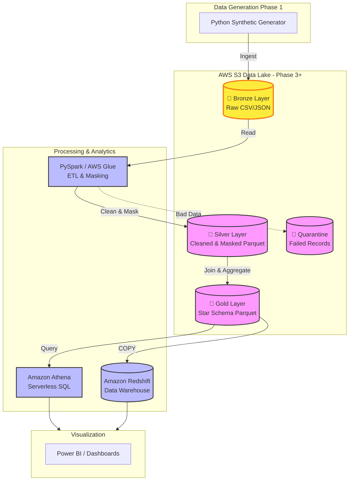
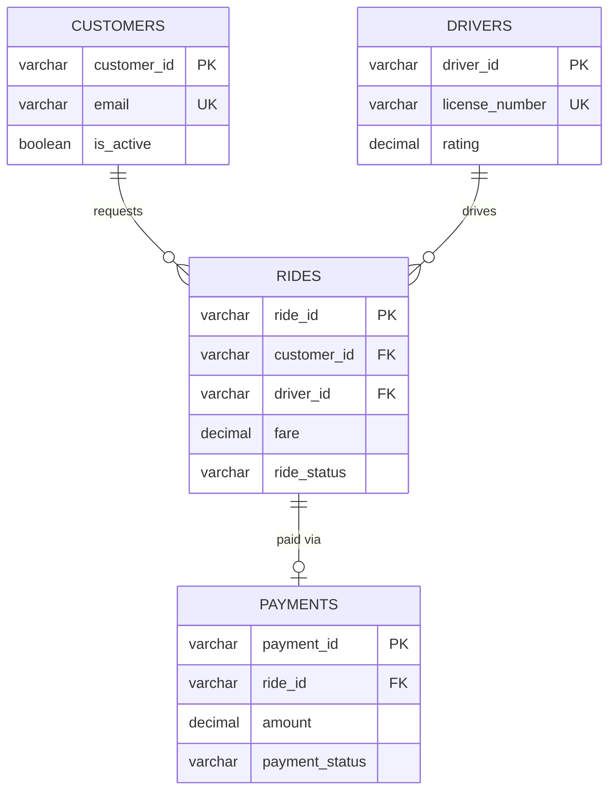

<div align="center">
  
  
  
  
  

  <h1>🚀 Mobility Data Platform & Analytics Lakehouse</h1>
  <p><i>A production-grade, end-to-end Data Engineering platform simulating a ride-hailing company's data infrastructure using the Medallion Architecture.</i></p>
</div>

---

## 🎯 Project Overview
This project is a comprehensive portfolio piece demonstrating the full lifecycle of data engineering. It starts with synthetic data generation (Faker), moves through local database ingestion (PostgreSQL), and scales into a massive cloud-native Data Lake and Data Warehouse architecture on AWS.

## 🏗️ Architecture


```mermaid
graph TD
    %% Data Sources
    subgraph Sources [Data Generation Phase 1]
        Gen[Python Synthetic Generator]
    end

    %% Storage Layers
    subgraph DataLake [AWS S3 Data Lake - Phase 3+]
        Bronze[(🥉 Bronze Layer<br>Raw CSV/JSON)]
        Silver[(🥈 Silver Layer<br>Cleaned & Masked Parquet)]
        Gold[(🥇 Gold Layer<br>Star Schema Parquet)]
        Quarantine[(🚫 Quarantine<br>Failed Records)]
    end

    %% Processing
    subgraph Compute [Processing & Analytics]
        Spark[PySpark / AWS Glue<br>ETL & Masking]
        Athena[Amazon Athena<br>Serverless SQL]
        Redshift[(Amazon Redshift<br>Data Warehouse)]
    end

    %% Consumption
    subgraph BI [Visualization]
        PowerBI[Power BI / Dashboards]
    end

    %% Flow
    Gen -->|Ingest| Bronze
    Bronze -->|Read| Spark
    Spark -->|Clean & Mask| Silver
    Spark -.->|Bad Data| Quarantine
    Silver -->|Join & Aggregate| Gold
    
    Gold -->|Query| Athena
    Gold -->|COPY| Redshift
    
    Athena --> BI
    Redshift --> BI

    classDef storage fill:#f9f,stroke:#333,stroke-width:2px;
    classDef compute fill:#bbf,stroke:#333,stroke-width:2px;
    classDef highlight fill:#ffeb3b,stroke:#f57f17,stroke-width:3px;
    
    class Bronze,Silver,Gold,Quarantine storage;
    class Spark,Athena,Redshift compute;
    class Bronze highlight;
```
> *Highlighted: We just completed Phase 3 (Bronze Layer Ingestion) with production-grade AWS infrastructure.*

---

## 🚀 Quick Start (Up to Phase 3)

```bash
# 1. Create virtual environment
python -m venv venv
venv\Scripts\activate        # Windows

# 2. Install dependencies
pip install -r requirements.txt

# 3. Phase 1: Generate synthetic data (10,000 rides)
python main.py generate

# 4. Phase 2: Start PostgreSQL & Load Data (Docker required)
docker compose -f docker/docker-compose.yml up -d
python main.py load-postgres

# 5. Phase 3: Setup AWS S3 & Ingest Bronze Data (AWS Credentials required)
python main.py setup-s3      # Creates bucket with AES256, TLS, Lifecycle rules
python main.py upload-bronze # Uploads CSVs with Hive-style partitioning

# 6. Run Integration Tests
pytest tests/ -v
```

---

## 🔒 Enterprise-Grade Data Governance
This project is built to strict industry standards, not just basic tutorials. 

- **Idempotency**: Piplelines use Hive-partitioned paths (`year=YYYY/month=MM/day=DD`) and MD5 Checksums to ensure rerunnability without data duplication.
- **Security by Design**: 
  - S3 Public Access strictly blocked.
  - AES-256 Default Encryption applied.
  - Bucket Policies enforcing TLS 1.2+ transit.
- **Least-Privilege IAM**: Custom JSON policies isolate the `ingestion-role` (write-only) from the `analytics-role` (explicit deny on Bronze raw PII).
- **Lineage & Observability**: Every upload generates a unique `Pipeline Run ID`, tags S3 objects, and emits structured JSON audit logs.

📚 Read more about our architectural decisions in the [Enterprise vs. Free Tier Trade-offs](docs/enterprise_tradeoffs.md) document.

---

## 📊 Phase 2 Database Schema (ERD)


```mermaid
erDiagram
    CUSTOMERS ||--o{ RIDES : "requests"
    DRIVERS ||--o{ RIDES : "drives"
    RIDES ||--o| PAYMENTS : "paid via"

    CUSTOMERS {
        varchar customer_id PK
        varchar email UK
        boolean is_active
    }
    DRIVERS {
        varchar driver_id PK
        varchar license_number UK
        decimal rating
    }
    RIDES {
        varchar ride_id PK
        varchar customer_id FK
        varchar driver_id FK
        decimal fare
        varchar ride_status
    }
    PAYMENTS {
        varchar payment_id PK
        varchar ride_id FK
        decimal amount
        varchar payment_status
    }
```

---

## 📚 Documentation
- **Live Site:** [Mobility Platform MkDocs](https://RaviShinde19.github.io/mobility-data-platform/)
- **Data Governance:** See `AGENTS.md` for our strict PII and IAM rules.
- **Screenshots:** See `docs/screenshots/` for visual proof of AWS infrastructure.

---

## 🗺️ Roadmap & Phases

- [x] **Phase 1**: Project Setup & Data Generation (Faker)
- [x] **Phase 2**: PostgreSQL — Local Relational Store & RBAC
- [x] **Phase 3**: Amazon S3 — Bronze Layer Ingestion & Infrastructure as Code (boto3)
- [ ] **Phase 4**: PySpark — Bronze → Silver Transformations (Data Quality)
- [ ] **Phase 5**: PySpark — Silver → Gold (Dimensional Star Schema)
- [ ] **Phase 6**: Data Quality Validation (Great Expectations)
- [ ] **Phase 7**: AWS Glue — Managed Cloud ETL
- [ ] **Phase 8**: Amazon Athena — Serverless Querying
- [ ] **Phase 9**: Amazon Redshift — Data Warehouse
- [ ] **Phase 10**: Apache Airflow — Pipeline Orchestration
- [ ] **Phase 11**: Power BI — Dashboards & Visualization

---

## 🛠️ Tech Stack

| Component | Technology | Phase |
|-----------|-----------|:-----:|
| **Data Generation** | Python, Faker | 1 |
| **Local Database** | PostgreSQL, Docker | 2 |
| **Cloud Storage** | Amazon S3, boto3 | 3 |
| **Processing** | PySpark | 4-5 |
| **Data Quality** | Great Expectations | 6 |
| **Cloud ETL** | AWS Glue | 7 |
| **Lake Querying**| Amazon Athena | 8 |
| **Warehouse** | Amazon Redshift | 9 |
| **Orchestration** | Apache Airflow | 10 |
| **Visualization** | Power BI | 11 |
