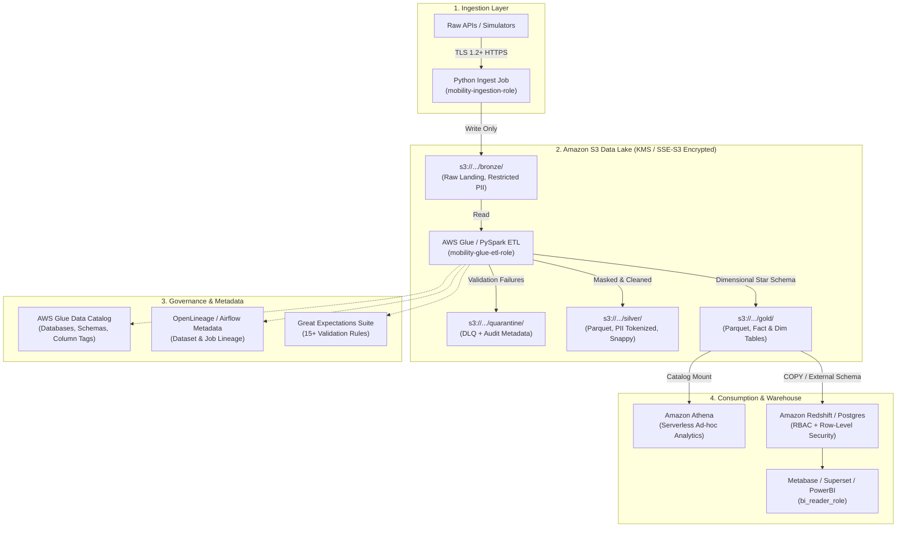

# Data Governance & Security Architecture — Mobility Platform

> **Status**: Active Project Directive & Architecture Blueprint  
> **Applicability**: Enforced across all pipeline layers (Bronze, Silver, Gold, Ingestion, Storage, Processing, Warehouse, Orchestration)

---

## 1. Executive Summary & Core Rules

Data governance sets the policies, data quality rules, lineage, and catalogs; data security provides the technical enforcement (encryption, least-privilege access, PII protection, and network isolation).

In this mobility platform (processing 14M+ records across Customers, Drivers, Rides, and Payments), governance and security are embedded into every layer of our medallion lakehouse.



---

## 2. The 7 Foundational Pillars (Implemented in the Mobility Project)

### Pillar 1: AWS IAM Fundamentals & Least Privilege
Every pipeline component runs with a dedicated IAM role restricted to the exact actions and resources it requires:

- **`mobility-ingestion-role`**:
  - Actions: `s3:PutObject` restricted to `arn:aws:s3:::mobility-data-lake/bronze/*`
  - Zero access to Silver, Gold, or production databases.
- **`mobility-glue-etl-role`**:
  - Actions: `s3:GetObject` on `bronze/*`, `s3:PutObject` on `silver/*`, `gold/*`, and `quarantine/*`.
  - Permissions for Glue Data Catalog database management (`glue:GetDatabase`, `glue:CreateTable`, `glue:UpdateTable`).
- **`mobility-analytics-role`** (Athena & Redshift Spectrum):
  - Read-only (`s3:GetObject`, `s3:ListBucket`) scoped exclusively to `silver/*` and `gold/*`.
  - Explicit `Deny` on `bronze/*` and `quarantine/*`.
- **`mobility-airflow-role`**:
  - Permissions to trigger Glue Jobs, launch EMR steps, and trigger SQL queries, without direct S3 write access.

### Pillar 2: S3 Bucket Security & Prefix Policy
All data lake buckets enforce:
1. **Block Public Access**: All 4 settings enabled (`BlockPublicAcls`, `IgnorePublicAcls`, `BlockPublicPolicy`, `RestrictPublicBuckets`).
2. **In-Transit Encryption Enforcement**:
   ```json
   {
     "Sid": "EnforceTLSRequestsOnly",
     "Effect": "Deny",
     "Principal": "*",
     "Action": "s3:*",
     "Resource": [
       "arn:aws:s3:::mobility-data-lake",
       "arn:aws:s3:::mobility-data-lake/*"
     ],
     "Condition": {
       "Bool": { "aws:SecureTransport": "false" }
     }
   }
   ```
3. **Prefix Isolation**: Separate ACLs and lifecycle rules on `/bronze/`, `/silver/`, `/gold/`, and `/quarantine/`.

### Pillar 3: Encryption Everywhere (Rest & Transit)
- **At Rest**:
  - S3 Buckets: SSE-S3 (`AES256`) or AWS KMS Customer Managed Keys (`aws:kms`).
  - Redshift & RDS: Storage encryption enabled via AWS KMS.
  - Glue Job Scratch: Glue security configuration enabled with local disk and shuffle data encryption.
- **In Transit**:
  - Enforce TLS 1.2+ for all AWS SDK calls, API calls, and JDBC/ODBC connections (`sslmode=require`).

### Pillar 4: PII Handling, Masking & Tokenization
- **Bronze Layer**: Retains raw records for auditability and backfill reproducibility, but access is restricted exclusively to ETL service roles.
- **Silver Layer**:
  - **Names**: Scrubbed or transformed to initials.
  - **Email**: Masked (`j***@example.com`) or SHA-256 salted hash (`sha256(email + salt)`).
  - **Phone Number**: Redacted to last 4 digits (`+1-***-***-1234`).
  - **Payment Data**: PCI-DSS compliance — never store raw credit card numbers. Only store `payment_token`, `payment_method` (`CARD`, `UPI`, `WALLET`), and `card_last_four`.
- **Gold Layer**:
  - Dimensional models expose surrogate keys (`customer_key`, `driver_key`, `ride_key`) generated from deterministic hashing, completely removing raw identifiers from analyst tables.

### Pillar 5: Database-Level Access Control & RBAC
In PostgreSQL and Amazon Redshift, access is governed via dedicated database roles:

```sql
-- 1. Create specialized roles
CREATE ROLE etl_writer;
CREATE ROLE data_analyst;
CREATE ROLE bi_reader;

-- 2. Scoped permissions
GRANT USAGE ON SCHEMA gold TO data_analyst, bi_reader;
GRANT SELECT ON ALL TABLES IN SCHEMA gold TO data_analyst, bi_reader;

GRANT ALL ON SCHEMA silver, gold TO etl_writer;

-- 3. Row-Level Security (RLS) for City Operations
ALTER TABLE gold.fact_rides ENABLE ROW LEVEL SECURITY;

CREATE POLICY city_ops_policy ON gold.fact_rides
FOR SELECT TO regional_analyst
USING (city_id = CURRENT_SETTING('app.current_city_id'));
```

### Pillar 6: Glue Data Catalog & Lineage
- **Central Catalog**: Datasets registered in `mobility_bronze_db`, `mobility_silver_db`, and `mobility_gold_db`.
- **Partitioning & Pruning**: Partitioned by `city` and date (`year=YYYY/month=MM/day=DD`) to minimize Athena query scan costs.
- **Data Lineage**: Transformation metadata attached to output datasets:
  - `_source_file_uri`: Location of source Bronze object.
  - `_pipeline_run_id`: Unique Airflow run ID.
  - `_processed_timestamp`: UTC timestamp of transformation.

### Pillar 7: Data Quality & Quarantine (DLQ)
- **15+ Validation Rules**: Enforced via Great Expectations or PySpark schema checks (e.g., `fare_amount >= 0`, `distance_km > 0`, `status IN ('COMPLETED', 'CANCELLED', 'FAILED')`).
- **Quarantine Routing**: Records failing validation are filtered out and written to `s3://.../quarantine/{dataset}/dt=YYYY-MM-DD/` with error metadata:
  ```json
  {
    "raw_record": "{...}",
    "error_code": "INVALID_COORDINATES",
    "error_message": "pickup_latitude must be between -90 and 90",
    "ingestion_timestamp": "2026-09-12T10:00:00Z"
  }
  ```

---

## 3. Advanced Additions to Implement (Next-Level Upgrades)

Beyond the 7 baseline steps, the following capabilities elevate the mobility platform to enterprise production grade:

### 1. Geospatial Privacy & Obfuscation (H3 Hexagonal Indexing)
*Why mobility needs it:* Exact GPS coordinates (latitude/longitude) of rider pickup and dropoff locations expose sensitive private locations (homes, workplaces, hospitals).  
*Implementation:* In the Silver/Gold layer, convert raw `(pickup_latitude, pickup_longitude)` into **Uber H3 spatial indices** (e.g. resolution 7 ~1.2 km² or resolution 8 ~0.4 km²) or **GeoHash**.
- Enables rich geospatial analytics (heatmaps, surge pricing zones, demand clustering).
- Guarantees individual rider privacy by eliminating pinpoint residential tracking.

### 2. S3 Lifecycle Tiering & Cost Governance
*Why it matters:* Storing millions of raw CSV files indefinitely in S3 Standard is expensive.
*Implementation:* Automated S3 Lifecycle rules:
- `bronze/`: Move to **S3 Standard-IA** after 30 days; transition to **S3 Glacier Flexible Retrieval** after 90 days.
- `quarantine/`: Expire and delete bad records after 30 days (once reviewed/reprocessed).
- `silver/` & `gold/`: Retain in S3 Standard with Glacier tiering after 365 days.
- Result: **60–80% reduction in cloud storage expenditure**.

### 3. Automated Audit Logging & Compliance Trails (CloudTrail + Access Logs)
*Implementation:*
- Enable **S3 Server Access Logging** targeting a dedicated logging bucket `s3://mobility-audit-logs/`.
- Enable **AWS CloudTrail Data Events** on the lakehouse bucket to capture every `GetObject`, `PutObject`, and `DeleteObject` API call with caller identity and IP.
- Query audit logs via Athena to generate audit reports for GDPR, CCPA, or SOC-2 compliance.

### 4. Secrets Management & Zero-Trust Credential Rotation
*Implementation:*
- Store database credentials, Redshift admin passwords, and API keys in **AWS Secrets Manager** or **AWS Systems Manager (SSM) Parameter Store**.
- Python and PySpark fetch secrets dynamically at runtime using IAM authentication, eliminating `.env` file vulnerability risks.
- Automatic password rotation enabled on 30-day schedules.

### 5. Automated Data Quality & Anomaly Alerting
*Implementation:*
- Integrate Slack / Webhook / Amazon SNS alerting into Airflow DAG failure callbacks and Great Expectations validation checkpoints.
- Alerts trigger when:
  - Daily rejected record rate exceeds 5%.
  - Total daily ride volume drops by >30% compared to historical rolling 7-day average.
  - Payment mismatch occurs between `fact_rides` and `fact_payments`.

### 6. End-to-End Lineage with OpenLineage & Marquez
*Implementation:*
- Embed OpenLineage listeners into Apache Airflow and PySpark jobs.
- Visual lineage graph dynamically maps every column from:
  `Raw CSV -> Bronze S3 -> Silver Parquet -> Gold Star Schema -> Redshift Marts -> BI Dashboard`.
- Immediate impact analysis: if a schema changes in raw rides, instantly see which dashboards will be affected.

### 7. Dynamic Data Masking (DDM) & Column-Level Security
*Implementation:*
- In Amazon Redshift or PostgreSQL, define masking policies on columns like `driver_ssn_or_nid`, `rider_email`, and `payment_card_last_four`:
  ```sql
  -- Redshift Dynamic Data Masking example:
  CREATE MASKING POLICY mask_email_policy
  AS (val varchar(256)) RETURNS varchar(256) ->
  CASE 
    WHEN pg_has_role(CURRENT_USER, 'data_protection_officer', 'MEMBER') THEN val
    ELSE REGEXP_REPLACE(val, '(^.).*(@.*$)', '\\1***\\2')
  END;

  ATTACH MASKING POLICY mask_email_policy ON gold.dim_customers(email);
  ```

### 8. Synthetic Data Privacy & Anonymity Validation
*Implementation:*
- Run differential privacy and k-anonymity validation checks on the synthetic data generator (`src/data_generator/`) to verify that generated data does not replicate real telephone numbers or existing customer identities.

### 9. Infrastructure-as-Code (Terraform / CloudFormation) Security Baseline
*Implementation:*
- Codify all IAM roles, S3 bucket policies, KMS keys, security groups, and Glue databases in Terraform (`infra/terraform/`).
- Enforce peer code review and automated linting (`tflint`, `checkov`, `tfsec`) to guarantee zero security regressions.

### 10. Automated Pre-Commit & CI/CD Security Guardrails
*Implementation:*
- Integrate **Trufflehog** or **GitGuardian** in pre-commit hooks to block accidental secret commits.
- Run **Bandit** (Python AST static security linter) and **Safety** (vulnerable dependencies checker) in GitHub Actions on every pull request.
