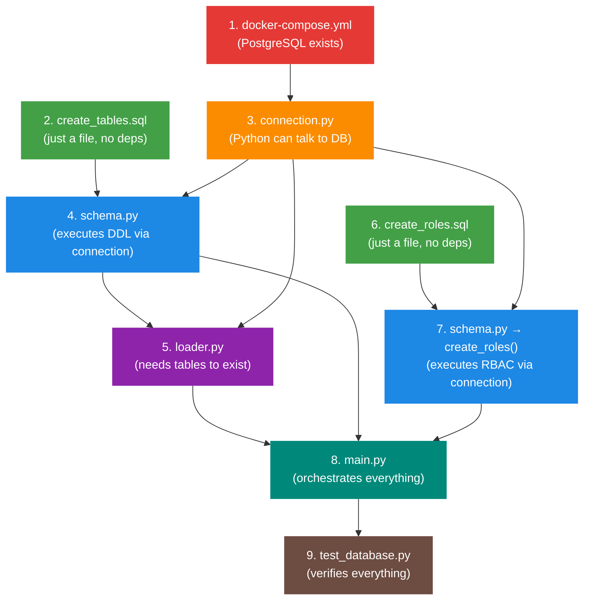
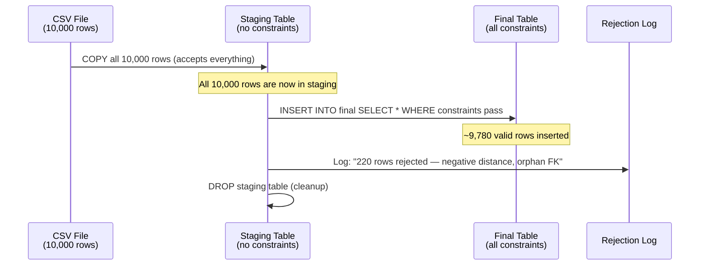
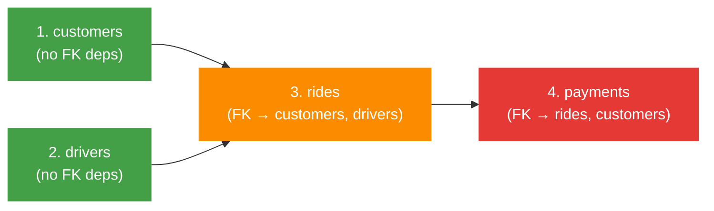
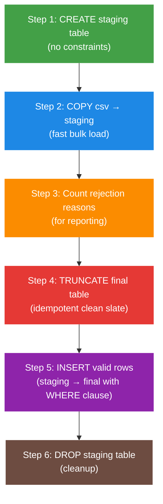
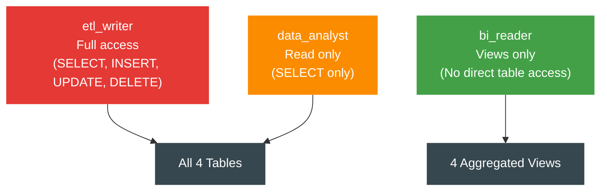
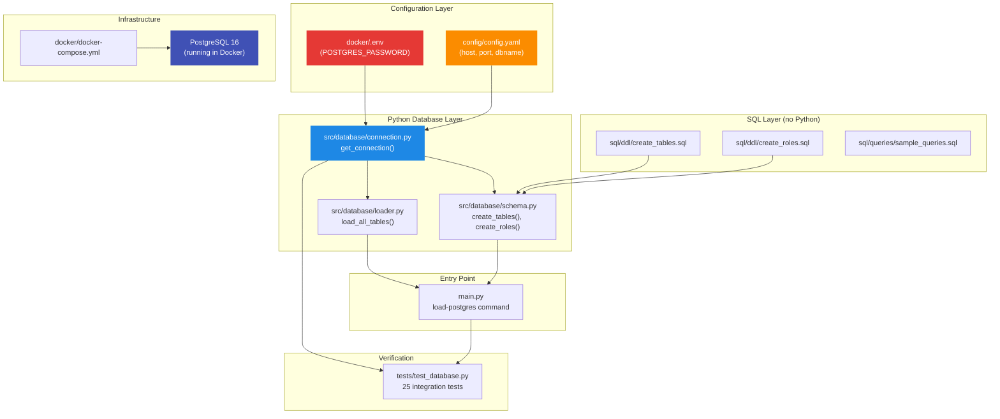

# :material-database: Phase 2 — Complete Technical & Educational Documentation

> **Purpose**: After studying this document, you should be able to rebuild Phase 2 entirely on your own — from an empty folder to 52 passing tests — without any help.
>
> **Reading time**: ~45 minutes (but worth every minute)

---

## :material-brain: Part 1: The "Why" — Architecture & Logic

### 1.1 What Problem Are We Solving?

After Phase 1, our data lives in **flat CSV files**:

```
data/raw/
├── customers/customers.csv    → 1,000 rows
├── drivers/drivers.csv        → 500 rows
├── rides/rides.csv            → 10,000 rows
└── payments/payments.csv      → 7,965 rows
```

These CSVs have **zero enforcement**. The `fare` column could contain the word `"banana"` and the file wouldn't complain. A `customer_id` could point to a person who doesn't exist. There's no way to query across tables efficiently.

**We need a relational database** to solve three critical problems:

| Problem | CSV Reality | Database Solution |
|---------|------------|-------------------|
| **No type safety** | `fare` is just a string | `fare DECIMAL(10,2)` — must be a number |
| **No referential integrity** | A ride can reference `customer_id = "XXXXX"` (doesn't exist) | Foreign Key rejects it |
| **No query engine** | Finding "average fare in Mumbai" requires a Python script | One SQL query: `SELECT AVG(fare) FROM rides WHERE pickup_city = 'Mumbai'` |
| **No access control** | Anyone can open/edit the CSV | RBAC: analysts can read, only ETL can write |

### 1.2 Why PostgreSQL? (Decision Matrix)

Before writing any code, I evaluated three options:

| Criteria | PostgreSQL :material-star: | SQLite | MySQL |
|----------|:---:|:---:|:---:|
| RBAC (roles/permissions) | ✅ Full RBAC | ❌ None | ⚠️ Basic |
| COPY bulk loading | ✅ Native | ❌ No | ⚠️ LOAD DATA |
| Same SQL as Redshift (Phase 9) | ✅ Yes | ❌ No | ❌ No |
| CHECK constraints | ✅ Enforced | ⚠️ Parsed but ignored | ⚠️ Partial |
| Setup complexity | Docker needed | Zero setup | Docker needed |

**Verdict**: PostgreSQL wins because skills transfer directly to Phase 9 (AWS Redshift uses PostgreSQL's SQL dialect). SQLite has zero RBAC. MySQL uses a different SQL dialect.

### 1.3 The Dependency DAG — Why Build Order Matters

Before touching any file, I mapped out what depends on what:



!!! danger "Golden Rule"
    You CANNOT build things out of order. `loader.py` needs `connection.py` (for database access) and `schema.py` (tables must exist before loading). If you try to write the loader first, you'll have nothing to test against.

### 1.4 The Staging Pattern — Core ETL Concept

This is the most important architectural decision in Phase 2.

**The Problem**: PostgreSQL's `COPY` command is all-or-nothing. If you COPY 10,000 rows and row #5,001 has a negative fare, the **entire COPY fails**. Zero rows loaded. 9,999 good rows wasted.

**The Solution**: A temporary "staging" table with no constraints:



**Why not just INSERT row-by-row and skip bad ones?** Speed.

| Method | 10,000 rows | 1,000,000 rows |
|--------|:-----------:|:--------------:|
| INSERT one-by-one | ~20 seconds | ~2,000 seconds (33 min) |
| COPY + staging | ~0.5 seconds | ~10 seconds |

The staging pattern gives you the speed of COPY with the flexibility of row-level filtering.

---

## :material-timeline: Part 2: The Developer Journey (Chronological)

This is the exact sequence of what was done, in the exact order. Each step builds on the previous one.

---

### Journey Step 1: Installing the Python Dependency

**Timestamp**: Before any files were created

**What I did**: Added `psycopg2-binary` to `requirements.txt` and installed it.

**Why this came first**: You can't import `psycopg2` in Python code if it's not installed. Every file we're about to write (`connection.py`, `schema.py`, `loader.py`) imports this library.

```bash
# Added to requirements.txt:
psycopg2-binary==2.9.10

# Then installed:
.\venv\Scripts\pip.exe install -r requirements.txt
```

!!! info "Why `psycopg2-binary` and not `psycopg2`?"
    `psycopg2` compiles from C source code — requires PostgreSQL development headers on your machine (painful on Windows). `psycopg2-binary` ships pre-compiled. Identical API, zero compile hassle.

---

### Journey Step 2: Docker Compose + Credentials

**Files created**: `docker/docker-compose.yml`, `docker/.env`, `docker/.env.example`

**Why this came second**: We need a running PostgreSQL instance before we can test ANY Python code. Docker is the infrastructure foundation.

**What I navigated**: Created the `docker/` directory (it didn't exist yet).

#### File: `docker/docker-compose.yml`

```yaml
services:
  postgres:
    image: postgres:16-alpine           # [1]
    container_name: mobility-postgres    # [2]
    restart: unless-stopped              # [3]
    env_file:
      - .env                            # [4]
    environment:
      POSTGRES_DB: ${POSTGRES_DB:-mobility_db}           # [5]
      POSTGRES_USER: ${POSTGRES_USER:-mobility_admin}
      POSTGRES_PASSWORD: ${POSTGRES_PASSWORD:?POSTGRES_PASSWORD must be set in docker/.env}  # [6]
    ports:
      - "${POSTGRES_PORT:-5432}:5432"    # [7]
    volumes:
      - pgdata:/var/lib/postgresql/data  # [8]
    healthcheck:                         # [9]
      test: ["CMD-SHELL", "pg_isready -U ${POSTGRES_USER:-mobility_admin} -d ${POSTGRES_DB:-mobility_db}"]
      interval: 5s
      timeout: 5s
      retries: 5
      start_period: 10s
    deploy:
      resources:
        limits:
          memory: 512M                   # [10]

volumes:
  pgdata:
    name: mobility-pgdata               # [11]
```

**Line-by-line explanation:**

| Line | Code | What it does | Why |
|:----:|------|-------------|-----|
| [1] | `postgres:16-alpine` | Uses PostgreSQL 16 on Alpine Linux | Alpine is ~80MB vs ~400MB for full image. Version 16 matches Redshift's dialect. |
| [2] | `container_name: mobility-postgres` | Gives the container a readable name | So `docker ps` shows `mobility-postgres`, not `random-hex-abc123` |
| [3] | `restart: unless-stopped` | Auto-restarts if it crashes | Unless you explicitly ran `docker compose down` |
| [4] | `env_file: .env` | Reads password from `.env` file | AGENTS.md Rule 1: zero hardcoded secrets |
| [5] | `${POSTGRES_DB:-mobility_db}` | Uses env var, defaults to `mobility_db` | The `:-` syntax means "use default if not set" |
| [6] | `${POSTGRES_PASSWORD:?...must be set}` | FAILS if password not set | The `:?` syntax means "error if not set" — prevents running without a password |
| [7] | `5432:5432` | Maps laptop port 5432 → container port 5432 | Left is YOUR machine, right is INSIDE the container |
| [8] | `pgdata:/var/lib/postgresql/data` | Stores database files in a Docker volume | Without this, `docker compose down` DELETES all your data |
| [9] | `healthcheck: pg_isready` | Checks if PostgreSQL is actually accepting connections | Container "running" ≠ PostgreSQL "ready". It takes 2-3 seconds to initialize. |
| [10] | `memory: 512M` | Limits RAM usage to 512MB | Prevents a runaway query from eating all your laptop's memory |
| [11] | `name: mobility-pgdata` | Names the volume | So `docker volume ls` shows a readable name |

#### File: `docker/.env.example` (committed to git — template)

```bash
POSTGRES_DB=mobility_db
POSTGRES_USER=mobility_admin
POSTGRES_PASSWORD=CHANGE_ME_TO_A_REAL_PASSWORD
POSTGRES_PORT=5432
```

#### File: `docker/.env` (gitignored — your actual password)

Same structure but with a real password. This file is in `.gitignore` so it never goes to GitHub.

#### Updated: `.gitignore`

Added `docker/.env` to prevent accidentally committing secrets.

#### Terminal commands run:

```bash
# Start PostgreSQL
docker compose -f docker/docker-compose.yml up -d

# Verify it's running and healthy
docker compose -f docker/docker-compose.yml ps
# → mobility-postgres   running (healthy)
```

!!! warning "Bug Encountered: Docker Hub Timeout"
    **Error**: Image download timed out on standard Wi-Fi.
    **Root cause**: Indian ISPs sometimes throttle Docker Hub connections.
    **Fix**: Switched to mobile hotspot. Also configured Google DNS (`8.8.8.8`) in Docker Desktop settings.
    **Lesson**: Network issues are the #1 DevOps headache. Always have fallback DNS and mirrors.

---

### Journey Step 3: SQL DDL — Defining Table Structure

**File created**: `sql/ddl/create_tables.sql`

**Why this came third**: PostgreSQL is now running (Step 2), but it's an empty database. We need to define the SHAPE of our tables before writing any Python loading code.

**Why pure SQL, not Python strings?**

- SQL files get syntax highlighting in your editor
- A DBA can review the SQL without knowing Python
- Same SQL can be run directly via `psql` for debugging
- Industry standard: DDL lives in `sql/ddl/` directories

**Table creation order matters (DAG again):**



If `rides` is defined BEFORE `customers`, PostgreSQL will error:
```
ERROR: relation "customers" does not exist
```
Because `REFERENCES customers(customer_id)` points to a table that doesn't exist yet.

**Key SQL constructs explained:**

```sql
CREATE TABLE IF NOT EXISTS customers (
    customer_id     VARCHAR(10)     PRIMARY KEY,     -- [A]
    first_name      VARCHAR(100)    NOT NULL,        -- [B]
    email           VARCHAR(255)    NOT NULL,
    signup_date     DATE            NOT NULL,
    is_active       BOOLEAN         NOT NULL DEFAULT TRUE,  -- [C]
    CONSTRAINT uq_customer_email UNIQUE (email)      -- [D]
);
CREATE INDEX IF NOT EXISTS idx_customers_city ON customers(city);  -- [E]
```

| Tag | Concept | What it does | Real-world analogy |
|:---:|---------|-------------|-------------------|
| [A] | `PRIMARY KEY` | Unique identifier for each row. No NULLs, no duplicates. | Your Aadhaar number — unique to you |
| [B] | `NOT NULL` | This column MUST have a value. Cannot be empty. | A required field on a form |
| [C] | `DEFAULT TRUE` | If no value is provided, use `TRUE` | A checkbox that starts checked |
| [D] | `UNIQUE` | No two rows can have the same email | You can't register twice with the same email |
| [E] | `INDEX` | Creates a lookup structure for fast queries | A book's index vs reading every page |

**The rides table — where constraints get serious:**

```sql
CREATE TABLE IF NOT EXISTS rides (
    -- Foreign Keys: ride must reference REAL customer and driver
    CONSTRAINT fk_rides_customer FOREIGN KEY (customer_id)
        REFERENCES customers(customer_id),           -- [F]

    -- Data validation: catch bad source data
    CONSTRAINT chk_ride_distance CHECK (distance_km >= 0),  -- [G]
    CONSTRAINT chk_ride_fare CHECK (fare >= 0),
    CONSTRAINT chk_surge CHECK (surge_multiplier >= 1.0),

    CONSTRAINT chk_ride_status CHECK (
        ride_status IN ('completed', 'cancelled', 'ongoing', 'no_show')  -- [H]
    )
);
```

| Tag | Concept | What it does | Why we need it |
|:---:|---------|-------------|---------------|
| [F] | `FOREIGN KEY` | `customer_id` must exist in the `customers` table | Prevents "ghost rides" for non-existent customers |
| [G] | `CHECK` | `distance_km` must be ≥ 0 | Our Phase 1 data has ~200 intentional negative distances — this catches them |
| [H] | `IN (...)` | Status must be one of 4 known values | Prevents typos like "completd" from entering the database |

**Summary of what this DDL creates:**

| Artifact | Count |
|----------|:-----:|
| Tables | 4 |
| Primary Keys | 4 |
| Foreign Keys | 4 |
| CHECK constraints | 8 |
| UNIQUE constraints | 2 |
| Indexes | 13 |

---

### Journey Step 4: Python Connection Module

**File created**: `src/database/connection.py`

**Why this came fourth**: We need Python to TALK to PostgreSQL. This module is the bridge. Every other module (`schema.py`, `loader.py`) will import from this file.

**Also created**: `src/database/__init__.py` (empty file that tells Python "this is a package")

**Concept: Context Manager** (First Encounter)

A context manager is Python's way of saying "do this, and when you're done (even if there's an error), automatically clean up."

```python
# WITHOUT context manager — DANGEROUS
conn = psycopg2.connect(host="localhost", ...)
cur = conn.cursor()
cur.execute("SELECT * FROM nonexistent_table")  # 💥 Error!
conn.close()  # ❌ This line NEVER runs. Connection leaked!

# WITH context manager — SAFE
with get_connection() as conn:
    cur = conn.cursor()
    cur.execute("SELECT * FROM nonexistent_table")  # 💥 Error!
# ✅ conn.close() runs AUTOMATICALLY, even after the error
```

**Real-world analogy**: A context manager is like a hotel's automatic door. You walk in (the `with` block starts), do your business, and when you walk out (the block ends — even if you trip and fall), the door closes itself. You never have to worry about leaving it open.

**The code, block by block:**

**Block 1: Loading credentials (the priority chain)**

```python
load_dotenv(dotenv_path=os.path.join(..., 'docker', '.env'))

def _get_db_config() -> dict:
    config = ConfigLoader.load()
    db_config = config.get("database") or {}

    return {
        "host": os.getenv("POSTGRES_HOST", db_config.get("host", "localhost")),
        "port": int(os.getenv("POSTGRES_PORT", db_config.get("port", 5432))),
        "dbname": os.getenv("POSTGRES_DB", db_config.get("dbname", "mobility_db")),
        "user": os.getenv("POSTGRES_USER", db_config.get("user", "mobility_admin")),
        "password": os.getenv("POSTGRES_PASSWORD", db_config.get("password", "")),
    }
```

**What this does step by step:**

1. `load_dotenv()` reads `docker/.env` and puts `POSTGRES_PASSWORD=xxx` into the process environment
2. `os.getenv("POSTGRES_PASSWORD", ...)` checks: is there an environment variable? If yes, use it. If no, fall back to `config.yaml`.
3. Priority: **Environment variable** > **config.yaml** > **hardcoded default**

**Why this priority chain?**

- On your laptop: `docker/.env` provides the password via `load_dotenv()`
- In Docker/CI: The orchestrator sets `POSTGRES_PASSWORD` as a real env var
- The code works in BOTH environments without any changes

**Block 2: The `get_connection()` context manager**

```python
@contextmanager
def get_connection(autocommit: bool = False):
    conn = None
    try:
        conn = psycopg2.connect(**config)   # Open the door
        conn.autocommit = autocommit
        yield conn                           # Hand it to the caller
    except psycopg2.OperationalError as e:
        logger.error(f"Failed to connect: {e}")
        raise
    except Exception as e:
        if conn and not conn.closed and not autocommit:
            conn.rollback()                  # Undo any partial work
        raise
    finally:
        if conn and not conn.closed:
            conn.close()                     # Always close the door
```

**What `yield` does** (First Encounter):

`yield` pauses the function and gives control back to the caller. When the caller is done, execution returns here.

```
1. Caller says:   with get_connection() as conn:
2. get_connection: Opens connection, reaches `yield conn`
3. get_connection: PAUSES. Gives `conn` to the caller.
4. Caller:        Uses conn to run queries...
5. Caller:        Exits the `with` block
6. get_connection: RESUMES at `finally:`, closes connection
```

**What `autocommit` means:**

- `autocommit=False` (default): Changes are tentative. You must call `conn.commit()` to make them permanent. If something fails, you `conn.rollback()` to undo everything. **Used for data loading** — if row 5000 fails, you want to undo rows 1-4999.
- `autocommit=True`: Every statement is immediately permanent. **Used for DDL** (CREATE TABLE) because PostgreSQL doesn't allow rolling back DDL anyway.

**Block 3: The `test_connection()` health check**

```python
def test_connection() -> bool:
    try:
        with get_connection() as conn:
            with conn.cursor() as cur:
                cur.execute("SELECT version();")
                return True
    except Exception:
        return False
```

Simple: try to connect and run `SELECT version()`. If it works → `True`. If anything fails → `False`. This is used by `main.py` and `test_database.py` to gracefully handle "Docker not running".

---

### Journey Step 5: Schema Creation Module

**File created**: `src/database/schema.py`

**Why this came fifth**: `connection.py` (Step 4) gives us database access. `create_tables.sql` (Step 3) has the DDL. This module reads one and executes via the other.

**What `schema.py` does:**

```
1. Find the SQL file:  sql/ddl/create_tables.sql
2. Read it as a string: ddl_sql = f.read()
3. Connect to PostgreSQL: with get_connection(autocommit=True) as conn:
4. Execute the SQL: cur.execute(ddl_sql)
5. Report what happened: "Created 4 new tables" or "4 tables already existed"
```

**Key function: `create_tables()`**

```python
def create_tables(sql_file=None):
    # Get tables BEFORE running DDL
    existing_before = _get_existing_tables()

    # Execute the DDL
    with get_connection(autocommit=True) as conn:
        with conn.cursor() as cur:
            cur.execute(ddl_sql)

    # Get tables AFTER running DDL
    existing_after = _get_existing_tables()

    # Difference = what was newly created
    new_tables = existing_after - existing_before
```

**Why check before AND after?** So we can report: "Created `customers`, `drivers`" vs "All 4 tables already existed." This makes the output informative on both first run and re-runs.

**Why `autocommit=True` for DDL?**
PostgreSQL auto-commits DDL statements (CREATE TABLE) regardless. They can't be rolled back. Making it explicit prevents confusion.

**Key function: `drop_all_tables()`** — For the `--reset` flag

```python
tables_to_drop = ["payments", "rides", "drivers", "customers"]
```

Notice the **reverse order**: payments first, customers last. Why?

- You can't DROP `customers` while `rides` still has a FOREIGN KEY referencing it
- PostgreSQL would say: `ERROR: cannot drop table "customers" because other objects depend on it`
- So we drop the dependents first: payments → rides → drivers → customers

This is the **reverse of the creation order**. Creation goes leaf→root. Deletion goes root→leaf.

---

### Journey Step 6: Data Loader Module (The Biggest, Hardest File)

**File created**: `src/database/loader.py` (436 lines — the largest file in Phase 2)

**Why this came sixth**: Tables exist (Step 5). Connection works (Step 4). Now we fill the tables with CSV data.

**Architecture: The `_load_table()` function**

This is the heart of the loader. Every table goes through the same 6-step pipeline:



**The data flow for rides (concrete example):**

```
CSV file (10,000 rows)
    ↓ COPY (accepts everything)
staging_rides (10,000 rows — no constraints)
    ↓ INSERT INTO rides SELECT * WHERE:
    │   distance_km >= 0        ← filters out ~200 negative distances
    │   fare >= 0               ← filters out zero fares
    │   customer_id EXISTS      ← filters out orphan references
    │   driver_id EXISTS        ← filters out orphan references
    ↓
rides (9,780 rows — all valid)
    
Rejected: 220 rows (logged with reasons)
```

**Concept: `copy_expert()` (First Encounter)**

`copy_expert()` is psycopg2's way of using PostgreSQL's `COPY` protocol — a high-speed binary transfer that's 40-100x faster than INSERT.

```python
with open(csv_file, 'r', encoding='utf-8') as f:
    copy_sql = f"""
        COPY staging_rides ({', '.join(columns)})
        FROM STDIN WITH (FORMAT csv, HEADER true, NULL '')
    """
    cur.copy_expert(copy_sql, f)
```

| Part | What it means |
|------|-------------|
| `FROM STDIN` | Read from the Python file object (not a server-side file path) |
| `FORMAT csv` | Input is CSV format |
| `HEADER true` | First row is column names — skip it |
| `NULL ''` | Empty strings in CSV should become SQL NULL |

**Concept: `DISTINCT ON` — Deduplication (First Encounter)**

Our CSV has 2 customers with the same email. The UNIQUE constraint rejects duplicates. Solution:

```sql
INSERT INTO customers
SELECT DISTINCT ON (email)           -- Keep only ONE row per email
    customer_id, first_name, ...
FROM staging_customers
ORDER BY email, customer_id          -- Determines WHICH duplicate to keep (lowest ID)
```

`DISTINCT ON (email)` is PostgreSQL-specific (not standard SQL). It says: "For each unique email, keep only the first row (based on ORDER BY)."

!!! warning "Bug Encountered: Duplicate Email UNIQUE Violation"
    **Error**: `UniqueViolation: duplicate key value violates unique constraint "uq_customer_email"`
    **Root cause**: CSV had 2 rows with email `wkohli@example.com`. The INSERT tried to load both → second one violated UNIQUE.
    **Fix**: Added `DISTINCT ON (email)` to the staging → final INSERT query.
    **Lesson**: Source data ALWAYS has duplicates. Your loader must handle dedup.

**Concept: `EXISTS` subquery — FK validation without the database doing it**

```sql
AND EXISTS (
    SELECT 1 FROM customers c
    WHERE c.customer_id = s.customer_id
)
```

This checks: "Does this ride's customer_id actually exist in the customers table?" If not, the row is filtered out BEFORE the INSERT, avoiding a FK violation error.

**Why not let the FK constraint catch it?** Because FK violations abort the entire INSERT statement. With the `EXISTS` check in our WHERE clause, we skip bad rows gracefully while loading the good ones.

**The `LoadResult` dataclass:**

```python
@dataclass
class LoadResult:
    table_name: str
    rows_staged: int        # How many rows the CSV had
    rows_loaded: int        # How many passed all validations
    rows_rejected: int      # staged - loaded
    rejection_reasons: dict # {"negative_distance": 200, "orphan_customer": 15}
```

This gives us a clean report:
```
rides: 9,780 loaded, 220 rejected (of 10,000 staged)
  └─ negative_distance: 200
  └─ orphan_customer: 15
  └─ orphan_driver: 5
```

---

### Journey Step 7: RBAC Roles

**File created**: `sql/ddl/create_roles.sql`

**Why this came seventh**: Data is loaded (Step 6). Now we restrict WHO can do WHAT with it. Required by AGENTS.md Rule 5.

**Three roles, three levels of access:**



**Why views for `bi_reader`?**

The `customers` table contains PII (email, phone, name). A BI dashboard doesn't need individual customer data — it needs aggregated metrics. Views provide pre-computed aggregations:

```sql
CREATE VIEW v_rides_by_city AS
SELECT pickup_city, COUNT(*) as total_rides, ROUND(AVG(fare)::numeric, 2) as avg_fare
FROM rides GROUP BY pickup_city;
```

`bi_reader` can query `v_rides_by_city` but gets `PERMISSION DENIED` on `SELECT * FROM customers`.

---

### Journey Step 8: Sample Analytical Queries

**File created**: `sql/queries/sample_queries.sql`

**Why this came eighth**: Database is loaded and secured. Now we write business queries to prove the data is useful.

10 queries covering key SQL concepts:

| # | Business Question | SQL Concept |
|---|-------------------|-------------|
| 1 | Total rides per city | `GROUP BY`, `COUNT` |
| 2 | Average fare by status | `GROUP BY`, `AVG` |
| 3 | Peak demand hours | `EXTRACT(HOUR FROM ...)` |
| 4 | Revenue by payment method | `SUM`, `JOIN` |
| 5 | Top 10 drivers | `JOIN`, `ORDER BY`, `LIMIT` |
| 6 | Cancellation rate | `CASE WHEN`, calculated fields |
| 7 | Monthly trend | `DATE_TRUNC` |
| 8 | Average trip distance | `AVG` with `WHERE` |
| 9 | Customers with most rides | `JOIN`, `COUNT` |
| 10 | Payment success rate | `CASE WHEN`, percentage |

These same queries will be reused in Phase 8 (Athena) and Phase 9 (Redshift) — the SQL is nearly identical.

---

### Journey Step 9: CLI Integration (`main.py`)

**File modified**: `main.py` — Added `load-postgres` subcommand

**Why this came ninth**: All modules work individually. Now we wire them into a single CLI command.

**The orchestration flow:**

```python
def _handle_load_postgres(args, config, logger):
    # Step 0: Can we even reach the database?
    if not test_connection():
        print("❌ Cannot connect to PostgreSQL!")
        sys.exit(1)

    # Step 1: Optional reset (drop everything)
    if args.reset:
        drop_all_tables()

    # Step 2: Create tables (DDL)
    create_tables()

    # Step 3: Load data (staging pattern)
    load_all_tables(data_dir=args.data_dir)

    # Step 4: Set up RBAC
    if not args.skip_rbac:
        create_roles()
```

**Why `test_connection()` first?** User experience. If Docker isn't running, instead of a scary Python traceback, they see:

```
❌ Cannot connect to PostgreSQL!
   Make sure Docker is running:
   docker compose -f docker/docker-compose.yml up -d
```

**Why lazy imports?**

```python
def _handle_load_postgres(args, config, logger):
    from src.database.connection import test_connection  # imported HERE, not at top
```

If `psycopg2` isn't installed, `import psycopg2` crashes. By importing inside the function, the `generate` command (Phase 1) still works even if psycopg2 isn't installed.

---

### Journey Step 10: Integration Tests

**File created**: `tests/test_database.py` (25 tests)

**Why this came last**: Everything must be built and running before tests can verify it.

**Test organization:**

| Class | Tests | What it proves |
|-------|:-----:|---------------|
| `TestConnection` | 2 | Database is alive, correct database name |
| `TestSchema` | 5 | Tables exist, columns are correct |
| `TestDataLoading` | 6 | Row counts right, no bad data in DB |
| `TestConstraints` | 3 | FK rejects fake customer, CHECK rejects negative fare, PK rejects duplicates |
| `TestReferentialIntegrity` | 3 | No orphan rides or payments |
| `TestRBAC` | 5 | Roles exist, analyst can't write, bi_reader can't see PII |

**The auto-skip fixture:**

```python
@pytest.fixture(scope="session", autouse=True)
def require_postgres():
    if not test_connection():
        pytest.skip("PostgreSQL is not running")
```

This says: "Before running ANY test in this file, check if PostgreSQL is available. If not, skip ALL 25 tests gracefully." This way, Phase 1's 27 tests still run even if Docker is off.

**Terminal commands run at the end:**

```bash
# Run Phase 2 tests only
.\venv\Scripts\pytest.exe tests/test_database.py -v

# Run ALL tests (Phase 1 + Phase 2) to check for regressions
.\venv\Scripts\pytest.exe tests/ -v
# Result: 52/52 passed ✅
```

---

### Journey Step 11: Bug Fixes During the Process

!!! bug "Bug 1: Docker Hub Timeout"
    **When**: Step 2, trying to pull `postgres:16-alpine`
    **Error**: Connection timeout during image download
    **Diagnosis**: ISP throttling Docker Hub traffic
    **Fix**: Switched to mobile hotspot + configured Google DNS (`8.8.8.8`)
    **Prevention**: Add Docker registry mirrors to Docker Desktop settings

!!! bug "Bug 2: Unicode Crash on Windows"
    **When**: Step 9, running `python main.py load-postgres`
    **Error**: `UnicodeEncodeError: 'charmap' codec can't encode character '\u2713'` (the ✓ symbol)
    **Diagnosis**: Windows PowerShell uses `cp1252` encoding, which can't display ✓
    **Fix**: `$env:PYTHONIOENCODING = "utf-8"` before running
    **Prevention**: Always set `PYTHONIOENCODING=utf-8` in your shell profile

!!! bug "Bug 3: Duplicate Email UNIQUE Violation"
    **When**: Step 6, loading customers
    **Error**: `UniqueViolation: duplicate key value violates unique constraint "uq_customer_email"`
    **Diagnosis**: CSV had 2 customers sharing email `wkohli@example.com`
    **Fix**: Added `DISTINCT ON (email)` to the staging INSERT query
    **Prevention**: Always assume source data has duplicates. Build dedup into your loader.

---

## :material-transit-connection-variant: Part 3: Infrastructure & Connections

### How All Files Talk to Each Other



**The import chain:**

```python
# main.py imports:
from src.database.connection import test_connection    # health check
from src.database.schema import create_tables, create_roles  # DDL + RBAC
from src.database.loader import load_all_tables        # data loading

# schema.py imports:
from src.database.connection import get_connection     # needs DB access

# loader.py imports:
from src.database.connection import get_connection     # needs DB access

# test_database.py imports:
from src.database.connection import get_connection, test_connection
from src.database.schema import get_table_info
from src.database.loader import get_row_counts
```

**connection.py is the hub** — every database module depends on it. That's why it was built first (Journey Step 4).

---

## :material-school: Part 4: Outside Learning Syllabus

To truly master what was built in Phase 2, study these topics independently:

### Tier 1: Essential (Must Know)

| Topic | Resource | Time | Why |
|-------|----------|:----:|-----|
| SQL Fundamentals | [SQLBolt](https://sqlbolt.com/) — Interactive lessons | 3-4 hrs | You need to write queries confidently |
| PostgreSQL Data Types | [PostgreSQL Docs — Types](https://www.postgresql.org/docs/16/datatype.html) | 1 hr | Know when to use VARCHAR vs TEXT, DECIMAL vs FLOAT |
| Docker Basics | [Docker in 100 Seconds](https://www.youtube.com/watch?v=Gjnup-PuquQ) by Fireship | 3 min | Understand images, containers, volumes |
| Python Context Managers | [Real Python — Context Managers](https://realpython.com/python-with-statement/) | 30 min | Understand `with` and `yield` |
| SQL Constraints | [PostgreSQL Tutorial — Constraints](https://www.postgresqltutorial.com/postgresql-tutorial/postgresql-primary-key/) | 1 hr | PK, FK, CHECK, UNIQUE, NOT NULL |

### Tier 2: Important (Should Know)

| Topic | Resource | Time | Why |
|-------|----------|:----:|-----|
| SQL JOINs | [Visual SQL Joins](https://joins.spathon.com/) | 1 hr | Critical for Phase 5 (star schema) |
| Docker Compose | [Docker Compose Docs](https://docs.docker.com/compose/) | 1 hr | Multi-container setups in Phase 7 (Airflow) |
| Python `argparse` | [Real Python — argparse](https://realpython.com/command-line-interfaces-python-argparse/) | 30 min | Building CLI tools |
| psycopg2 Documentation | [psycopg2 Docs](https://www.psycopg.org/docs/) | 1 hr | COPY, cursors, transactions |
| Git .gitignore | [gitignore patterns](https://git-scm.com/docs/gitignore) | 20 min | Keeping secrets out of git |

### Tier 3: Advanced (Good to Know)

| Topic | Resource | Time | Why |
|-------|----------|:----:|-----|
| Database Indexing | [Use The Index, Luke](https://use-the-index-luke.com/) | 2 hrs | Understanding query performance |
| SQL Injection | [OWASP SQL Injection](https://owasp.org/www-community/attacks/SQL_Injection) | 30 min | Why we use parameterized queries |
| PostgreSQL EXPLAIN | [PostgreSQL Explain Visualizer](https://explain.dalibo.com/) | 1 hr | Reading query execution plans |
| Connection Pooling | [PgBouncer](https://www.pgbouncer.org/) | 30 min | Scaling database connections |

### Command-Line Skills to Practice

```bash
# Docker commands you should memorize
docker compose up -d              # Start containers
docker compose down               # Stop containers
docker compose ps                 # List running containers
docker compose logs postgres      # View logs
docker exec <name> psql -U <user> -d <db> -c "SQL"  # Run SQL

# PostgreSQL psql commands
\dt                               # List tables
\d tablename                      # Describe a table's structure
\du                               # List roles
\q                                # Quit psql

# pytest commands
pytest tests/ -v                  # Run all tests, verbose
pytest tests/test_database.py -v  # Run one file
pytest -k "test_customers"        # Run tests matching a pattern
```
