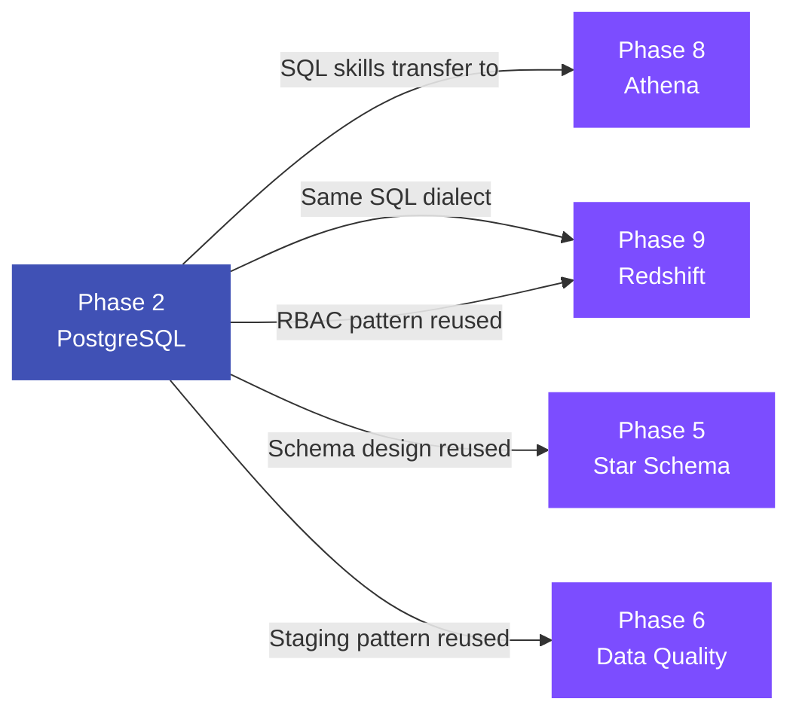
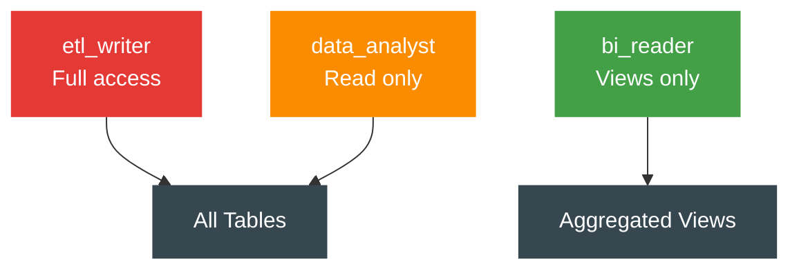
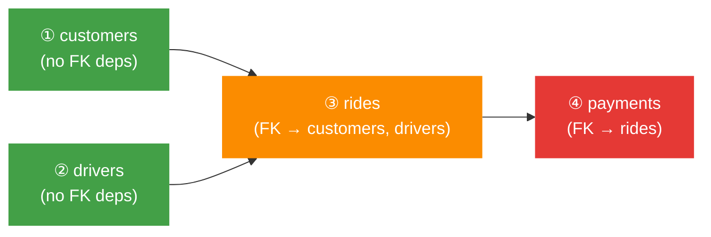
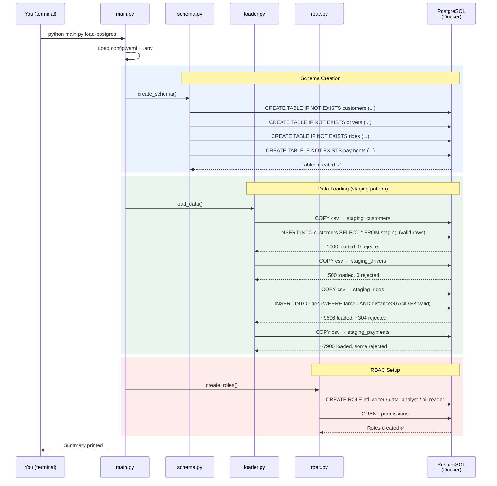

# :material-database: Phase 2 — PostgreSQL Local Relational Store

<div class="grid" markdown>

| Attribute       | Value                                      |
|----------------|--------------------------------------------|
| **Status**     | :material-circle-outline: Planning          |
| **Depends on** | Phase 1 :material-check-circle: Complete    |
| **Duration**   | ~3-4 hours of focused work                  |
| **New tools**  | Docker, PostgreSQL 16, psycopg2             |

</div>

---

## :material-help-circle: 1. Problem Statement

### What's the gap right now?

After Phase 1, our data lives in **flat CSV files on disk**:

```
data/raw/
├── customers/customers.csv    → 1,000 rows
├── drivers/drivers.csv        → 500 rows
├── rides/rides.csv            → 10,000 rows
└── payments/payments.csv      → 7,965 rows
```

To answer *"What's the average fare for completed rides in Mumbai?"* you'd have to write a Python script that opens the CSV, loops through every row, filters, and computes. That's **slow, error-prone, and doesn't scale**.

With a database — **one line of SQL**:

```sql
SELECT AVG(fare)
FROM rides
WHERE pickup_city = 'Mumbai'
  AND ride_status = 'completed';
```

### Why this can't be skipped



!!! abstract "Three reasons this phase exists"

    1. **Learn relational thinking** — Tables, types, constraints, joins, foreign keys. You need this mental model for Phases 5, 8, and 9.
    2. **Simulate an operational source** — In real companies, data starts in databases, not CSVs. This gives us a realistic source system.
    3. **Validate with enforcement** — CSV files accept anything. PostgreSQL constraints **reject** invalid data — our first real validation layer.

---

## :material-scale-balance: 2. Solution Approach — Tool Selection

We have three realistic options. Here's why we're picking PostgreSQL:

=== ":material-check-circle: PostgreSQL (Our Pick)"

    | Aspect       | Detail |
    |-------------|--------|
    | **What**    | Full-featured relational database server |
    | **Setup**   | One `docker compose up` command |
    | **Pros**    | Industry standard, proper RBAC, COPY for bulk loading, ==same SQL dialect as Redshift== (Phase 9), strong type enforcement |
    | **Cons**    | Requires Docker |
    | **Verdict** | :material-star: Best fit — skills transfer directly to Phase 9 |

=== "SQLite"

    | Aspect       | Detail |
    |-------------|--------|
    | **What**    | File-based database — no server needed |
    | **Setup**   | Zero — built into Python |
    | **Pros**    | Instant, no install, portable |
    | **Cons**    | No RBAC (no users/roles), no COPY for bulk loading, not used in production data platforms, SQL dialect differs from Redshift |
    | **Verdict** | :material-close: Missing critical features we need to learn |

=== "MySQL"

    | Aspect       | Detail |
    |-------------|--------|
    | **What**    | Another popular relational database |
    | **Setup**   | Similar to PostgreSQL (Docker) |
    | **Pros**    | Widely used, good docs |
    | **Cons**    | Different SQL dialect than Redshift, weaker CHECK constraints, more common in web apps than data engineering |
    | **Verdict** | :material-close: Wrong ecosystem for data engineering |

---

## :material-school: 3. Concepts to Understand First

!!! tip "Learning priority"
    Read these in order. Each builds on the previous. Items marked :material-book-open-variant: have a short recommended resource.

### 3a. Docker — *"A computer inside your computer"*

Docker runs applications in isolated **containers**. Instead of installing PostgreSQL on your Windows machine (messy, version conflicts), we run it in a container:

```
Your Windows PC
  └── Docker Container
        └── PostgreSQL 16 (isolated, disposable)
```

Delete the container → PostgreSQL vanishes. Nothing left on your machine.

??? info "Key Docker vocabulary (click to expand)"

    | Term              | What it means                                                                 |
    |-------------------|-------------------------------------------------------------------------------|
    | **Image**         | A blueprint. `postgres:16` = "PostgreSQL 16 on Linux"                        |
    | **Container**     | A running instance of an image. Cake from a recipe.                          |
    | **Docker Compose**| A YAML file describing which images to run and how to configure them.        |
    | **Volume**        | Persistent storage that survives container restarts.                          |
    | **Port mapping**  | `5432:5432` = "connect laptop's port 5432 to container's port 5432"          |

:material-book-open-variant: **Recommended**: Watch ["Docker in 100 Seconds" by Fireship](https://www.youtube.com/watch?v=Gjnup-PuquQ) (3 min)

---

### 3b. SQL DDL — *"Defining the shape of tables"*

**DDL** = Data Definition Language. Commands that **create** the structure:

```sql title="Example: Creating the customers table"
CREATE TABLE customers (
    customer_id VARCHAR(10)  PRIMARY KEY,   -- unique, can't be NULL
    first_name  VARCHAR(100) NOT NULL,      -- can't be empty
    city        VARCHAR(50)  NOT NULL,
    signup_date DATE         NOT NULL,
    is_active   BOOLEAN      DEFAULT TRUE   -- defaults to TRUE
);
```

??? info "Constraint types explained (click to expand)"

    | Constraint     | What it does                                                  | Example use               |
    |---------------|---------------------------------------------------------------|---------------------------|
    | `PRIMARY KEY` | Uniquely identifies each row. No NULLs, no duplicates.       | `customer_id`             |
    | `NOT NULL`    | Column must have a value.                                    | `first_name`              |
    | `UNIQUE`      | No two rows can share the same value.                        | `email`                   |
    | `FOREIGN KEY` | Must reference an existing row in another table.             | `rides.customer_id → customers.customer_id` |
    | `CHECK`       | Value must satisfy a condition.                              | `CHECK (fare >= 0)`       |
    | `DEFAULT`     | Value to use if none provided.                               | `DEFAULT TRUE`            |

:material-book-open-variant: **Recommended**: [PostgreSQL CREATE TABLE docs](https://www.postgresql.org/docs/16/sql-createtable.html) — skim the constraint section

---

### 3c. COPY vs INSERT — *"How to load data fast"*

=== "INSERT (slow — row by row)"

    ```sql
    INSERT INTO customers VALUES ('C0001', 'Priya', 'Sharma', ...);
    INSERT INTO customers VALUES ('C0002', 'Rahul', 'Patel', ...);
    -- 1000 separate round-trips to the database
    ```

    | Rows    | Time      |
    |---------|-----------|
    | 1,000   | ~2 sec    |
    | 100,000 | ~200 sec  |

=== "COPY (fast — bulk load) :material-star:"

    ```sql
    COPY customers FROM '/path/to/customers.csv' CSV HEADER;
    -- ONE operation loads ALL 1000 rows at once
    ```

    | Rows    | Time      |
    |---------|-----------|
    | 1,000   | ~0.05 sec |
    | 100,000 | ~2 sec    |

!!! success "We use COPY"
    40–100x faster than INSERT. Same concept appears as Redshift's `COPY` command in Phase 9 — loading from S3 instead of local disk.

---

### 3d. Connection Pooling — *"Don't open a new door every time"*

Every query needs a **connection** (network link between Python and PostgreSQL). Opening one costs ~50-100ms.

```
WITHOUT pooling:
  Query 1: Open → Run → Close  (100ms wasted)
  Query 2: Open → Run → Close  (100ms wasted)

WITH pooling:
  Start: Open 5 connections, keep them ready
  Query 1: Borrow → Run → Return  (0ms wasted)
  Query 2: Borrow → Run → Return  (0ms wasted)
```

We'll use a simple context-manager pattern — proper for our scale.

---

### 3e. RBAC — *"Not everyone should see everything"*

**RBAC** = Role-Based Access Control.



!!! warning "Required by AGENTS.md Rule 5"
    > *"Distinguish `etl_writer`, `data_analyst`, and `bi_reader` roles in PostgreSQL and Redshift."*

    We implement this here and replicate the same pattern in Redshift (Phase 9).

---

## :material-format-list-numbered: 4. Step-by-Step Build Order

Each step has: **what to build**, **what it depends on**, and **how to verify it works**.

---

### Step 1 · Install Docker Desktop { data-toc-label="Step 1: Docker Install" }

!!! example "What to do"

    1. Download from [docker.com/products/docker-desktop](https://www.docker.com/products/docker-desktop/)
    2. Run installer — enable ==WSL 2 backend== when prompted
    3. Restart your computer
    4. Open Docker Desktop — wait for "Docker Desktop is running"

**Depends on**: Nothing.

**Done when**:

```bash
docker --version          # → Docker version 28.x.x
docker compose version    # → Docker Compose version v2.x.x
```

!!! warning "Common blocker"
    If Docker fails to start: your BIOS may have **Virtualization** disabled. Restart → enter BIOS → enable Intel VT-x or AMD-V → save → reboot.

---

### Step 2 · Docker Compose for PostgreSQL { data-toc-label="Step 2: Docker Compose" }

!!! example "Files to create"

    - [x] `docker/docker-compose.yml` — Container definition
    - [x] `docker/.env.example` — Credential template (committed)
    - [x] `docker/.env` — Actual credentials (==gitignored==)

**Depends on**: Step 1.

**Key config decisions**:

| Setting | Value | Why |
|---------|-------|-----|
| Image | `postgres:16-alpine` | Lightweight, matches Redshift dialect |
| Port | `5432:5432` | PostgreSQL default |
| Volume | `pgdata` | Data persists across restarts |
| Health check | `pg_isready` | Know when DB is actually ready |

**Done when**:

```bash
docker compose -f docker/docker-compose.yml up -d
docker compose -f docker/docker-compose.yml ps
# → mobility-postgres  running (healthy)
```

---

### Step 3 · SQL DDL — Table Definitions { data-toc-label="Step 3: Table DDL" }

!!! example "Files to create"

    - [x] `sql/ddl/create_tables.sql` — All 4 tables with constraints

**Depends on**: Step 2 (PostgreSQL running).

**Python → PostgreSQL type mapping**:

| Python field | PostgreSQL type | Why this type |
|-------------|-----------------|---------------|
| `customer_id: str` | `VARCHAR(10)` | Fixed-length IDs like "C0001" |
| `first_name: str` | `VARCHAR(255)` | Variable-length text |
| `fare: float` | `DECIMAL(10,2)` | ==Never use FLOAT for money== — rounding errors |
| `pickup_lat: float` | `DECIMAL(10,6)` | 6 decimals = ~11cm GPS precision |
| `rating: float` | `DECIMAL(3,1)` | e.g., 4.7 |
| `request_time: datetime` | `TIMESTAMP` | Date + time |
| `signup_date: date` | `DATE` | Date only |
| `is_active: bool` | `BOOLEAN` | True/False |

!!! question "Design Decision — Handling intentional bad data"

    Our Phase 1 data has **~200 rides with negative distances** and **~104 with zero fares** — injected on purpose for Phase 4 cleaning.

    === "Option A: Strict constraints :material-star: (Recommended)"

        ```sql
        CHECK (distance_km >= 0)
        CHECK (fare >= 0)
        ```

        - Bad rows get **rejected** during load
        - Teaches that a database is a **validation layer**
        - ~304 rows won't make it into PostgreSQL
        - The CSVs still have them for Phase 4

    === "Option B: Relaxed constraints"

        No CHECK on distance/fare. Everything loads. Phase 4 handles cleaning.

        - Simpler load, but misses a learning opportunity
        - Database doesn't catch anything

    **Recommendation**: Option A. Learning that constraints catch bad data is the whole point of this phase.

**Done when**:

```bash
docker exec -it mobility-postgres psql -U mobility_admin -d mobility_db -c "\dt"
# → 4 tables listed: customers, drivers, rides, payments

docker exec -it mobility-postgres psql -U mobility_admin -d mobility_db -c "\d rides"
# → 18 columns with correct types and constraints
```

---

### Step 4 · Python Connection Module { data-toc-label="Step 4: DB Connection" }

!!! example "Files to create/modify"

    - [x] `src/database/__init__.py`
    - [x] `src/database/connection.py` — Reusable connection manager
    - [x] `requirements.txt` — Add `psycopg2-binary`

**Depends on**: Step 2 (PostgreSQL running).

**Design**:

- **Context manager** pattern: `with get_connection() as conn:` — auto-closes even on errors
- Credentials from **environment variables** (not hardcoded — AGENTS.md Rule 1)
- Falls back to `config.yaml` for non-sensitive defaults

!!! note "Why `psycopg2-binary` and not `psycopg2`?"
    `psycopg2` requires PostgreSQL C libraries to compile from source — painful on Windows. `psycopg2-binary` ships ==pre-compiled==. For production you'd use `psycopg2` (slightly faster), but for learning, binary is the right call.

**Done when**:

```python
from src.database.connection import get_connection

with get_connection() as conn:
    cur = conn.cursor()
    cur.execute("SELECT 1;")
    print(cur.fetchone())  # → (1,)
```

---

### Step 5 · Schema Creation Module { data-toc-label="Step 5: Schema Creator" }

!!! example "Files to create"

    - [x] `src/database/schema.py` — Reads SQL DDL file and executes it

**Depends on**: Step 3 (SQL file), Step 4 (connection works).

**What it does**:

```
1. Connect to PostgreSQL
2. Read sql/ddl/create_tables.sql
3. Execute CREATE TABLE statements
4. Log which tables were created
5. Handle "already exists" gracefully (idempotent)
```

!!! success "Idempotent"
    `CREATE TABLE IF NOT EXISTS` — safe to run multiple times. No errors on re-run.

**Done when**: Run module → tables exist. Run it **again** → no errors.

---

### Step 6 · Data Loader Module { data-toc-label="Step 6: CSV → PostgreSQL" }

!!! example "Files to create"

    - [x] `src/database/loader.py` — Bulk CSV loading with staging pattern

**Depends on**: Step 5 (tables exist), Phase 1 data files.

**Loading order** (DAG — same dependency order as Phase 1):



!!! danger "COPY is all-or-nothing"
    If **one** row violates a constraint, the **entire** COPY fails. We can't skip individual bad rows.

**Solution — Staging pattern**:

```
Step 1: COPY csv → staging_table  (no constraints — accepts everything)
Step 2: INSERT INTO final_table
        SELECT * FROM staging_table
        WHERE [all constraints pass]
Step 3: Log rejected count (rows in staging but not in final)
Step 4: DROP staging_table
```

This is a standard ETL pattern. You'll use it again in Phase 6 (Data Quality) and Phase 9 (Redshift).

**Done when**:

```sql
SELECT 'customers' as tbl, COUNT(*) FROM customers
UNION ALL SELECT 'drivers', COUNT(*) FROM drivers
UNION ALL SELECT 'rides', COUNT(*) FROM rides
UNION ALL SELECT 'payments', COUNT(*) FROM payments;

-- Expected:
--  customers | 1000
--  drivers   | 500
--  rides     | ~9696  (304 rejected)
--  payments  | ~7900
```

---

### Step 7 · RBAC Roles { data-toc-label="Step 7: RBAC" }

!!! example "Files to create"

    - [x] `sql/ddl/create_roles.sql`
    - [x] `src/database/rbac.py`

**Depends on**: Step 5 (tables exist).

**Roles and their permissions**:

| Role | SELECT | INSERT | UPDATE | DELETE | Scope |
|------|:------:|:------:|:------:|:------:|-------|
| `etl_writer` | :material-check: | :material-check: | :material-check: | :material-check: | All tables |
| `data_analyst` | :material-check: | :material-close: | :material-close: | :material-close: | All tables |
| `bi_reader` | :material-check: | :material-close: | :material-close: | :material-close: | Views only |

**Done when**:

```sql
-- As data_analyst — read works:
SET ROLE data_analyst;
SELECT COUNT(*) FROM customers;  -- ✅ Works

-- As data_analyst — write blocked:
INSERT INTO customers VALUES ('CTEST', ...);  -- ❌ PERMISSION DENIED
```

---

### Step 8 · Sample Analytical Queries { data-toc-label="Step 8: SQL Queries" }

!!! example "Files to create"

    - [x] `sql/queries/sample_queries.sql` — 10 business questions

**Depends on**: Step 6 (data loaded).

**Queries to write**:

| # | Business Question | SQL Concept Practiced |
|---|-------------------|----------------------|
| 1 | Total rides per city | `GROUP BY`, `COUNT` |
| 2 | Average fare by ride status | `GROUP BY`, `AVG` |
| 3 | Peak demand hours | `EXTRACT(HOUR FROM ...)`, `GROUP BY` |
| 4 | Revenue by payment method | `SUM`, `GROUP BY` |
| 5 | Top 10 drivers by completed rides | `JOIN`, `ORDER BY`, `LIMIT` |
| 6 | Cancellation rate by city | `CASE WHEN`, calculated fields |
| 7 | Monthly ride trend | `DATE_TRUNC`, time series |
| 8 | Average trip distance (completed) | `AVG` with `WHERE` filter |
| 9 | Customers with most rides | `JOIN`, `COUNT`, `ORDER BY` |
| 10 | Payment success rate | `CASE WHEN`, percentage |

!!! tip "These same queries appear in Phase 8 (Athena) and Phase 9 (Redshift)"
    The SQL is nearly identical. That's the point — learn once, apply across tools.

**Done when**: Each query runs and returns sensible results. Average fares are positive. City counts are roughly proportional.

---

### Step 9 · CLI Command + Integration Tests { data-toc-label="Step 9: CLI + Tests" }

!!! example "Files to create/modify"

    - [x] `main.py` — Add `load-postgres` command
    - [x] `tests/test_database.py` — Integration tests

**Depends on**: All previous steps.

**New CLI command**: `python main.py load-postgres`

Runs the full flow: create tables → load data → create roles → print summary.

**Integration tests verify**:

- [x] Tables exist with correct column count
- [x] Row counts match expected (with rejection accounting)
- [x] Foreign key relationships are enforced
- [x] CHECK constraints reject bad data
- [x] RBAC roles have correct permissions

**Done when**:

```bash
.\venv\Scripts\python.exe main.py load-postgres    # → prints summary
.\venv\Scripts\pytest.exe tests/test_database.py -v  # → all PASSED
```

---

## :material-transit-connection-variant: 5. Data & Control Flow Trace

Exactly what happens at runtime when you run `python main.py load-postgres`:



---

## :material-swap-horizontal: 6. Before / After State

### Before Phase 2

```csv title="data/raw/rides/rides.csv — raw, unvalidated, flat file"
ride_id,customer_id,driver_id,pickup_city,...,distance_km,fare,ride_status
R00001,C0344,D0015,Delhi,...,40.58,871.03,completed
R00002,C0779,D0076,Hyderabad,...,7.17,131.16,completed
R00003,C0267,D0258,Pune,...,-3.02,174.51,completed     ← negative distance!
```

- :material-close: No type enforcement — fare could be "banana"
- :material-close: No referential integrity — customer_id could be "XXXXX"
- :material-close: No SQL querying
- :material-close: No access control

### After Phase 2

```sql title="PostgreSQL — typed, constrained, queryable"
mobility_db=# SELECT ride_id, customer_id, pickup_city, fare, ride_status
              FROM rides WHERE ride_id = 'R00001';

 ride_id | customer_id | pickup_city |  fare  | ride_status
---------+-------------+-------------+--------+------------
 R00001  | C0344       | Delhi       | 871.03 | completed
(1 row)

-- R00003 is MISSING — rejected for negative distance ✅
```

- :material-check: Types enforced — `fare` is `DECIMAL(10,2)`, can't be text
- :material-check: FKs enforced — ride must reference existing customer + driver
- :material-check: SQL querying — instant analytical answers
- :material-check: RBAC — analysts can read but not modify

---

## :material-alert-circle: 7. Failure Modes

| Step | What could fail | How it manifests | Blast radius | Recovery |
|:----:|----------------|-----------------|:------------:|----------|
| 1 | WSL 2 not enabled | Docker Desktop shows error dialog | :material-circle-outline: Nothing runs | Enable in BIOS, restart |
| 2 | Port 5432 in use | `"port already allocated"` | :material-circle-outline: Container won't start | Change port to `5433:5432` |
| 2 | Docker not running | `"Cannot connect to Docker daemon"` | :material-circle-outline: Container won't start | Start Docker Desktop app |
| 3 | SQL typo | PostgreSQL returns syntax error + line number | :material-circle-outline: Table not created | Fix SQL, re-run |
| 5 | Tables already exist | `IF NOT EXISTS` silently skips | :material-check-circle: Safe | None needed |
| 6 | CSV column mismatch | `"extra data after last expected column"` | :material-alert: That table's load fails | Fix column order in COPY |
| 6 | FK violation | Row rejected, logged | :material-check-circle: Other rows fine | Expected behavior |
| 6 | CHECK violation | Row rejected, logged | :material-check-circle: Other rows fine | Expected behavior |
| 7 | Role already exists | `IF NOT EXISTS` skips | :material-check-circle: Safe | None needed |

!!! success "Key safety property"
    The staging pattern means a **failure in one table's load does NOT affect other tables**. If rides fail, customers and drivers are still loaded.

---

## :material-handshake: 8. Interface Contract with Adjacent Phases

### What this phase establishes for later

| Artifact | Consumed by | Format/Contract |
|----------|------------|-----------------|
| SQL schema design (column types) | Phase 7 (Glue Catalog), Phase 9 (Redshift DDL) | Same column names, compatible types |
| RBAC roles pattern | Phase 9 (Redshift) | Same 3 roles, same permission model |
| Staging → validate → load pattern | Phase 6 (Data Quality), Phase 9 | Same ETL approach |
| 10 analytical queries | Phase 8 (Athena), Phase 9 (Redshift) | Same SQL, results must match |
| Rejected row counts (~304) | Phase 6 (Data Quality) | Formalized into quarantine system |

### What Phase 2 does NOT do

| Not this phase | Which phase |
|---------------|-------------|
| PII masking | Phase 4 |
| Data cleaning (messy city names) | Phase 4 |
| Parquet output | Phase 4 |
| Cloud storage | Phase 3 |

---

## :material-package-variant: 9. New Dependencies

| Dependency | Problem it solves | New concept? |
|-----------|-------------------|:------------:|
| **Docker Desktop** | Runs PostgreSQL without installing it permanently. Delete container = clean machine. | :material-book-open-variant: Watch [Docker in 100s](https://www.youtube.com/watch?v=Gjnup-PuquQ) |
| **PostgreSQL 16** (Docker image) | Relational database with typed tables, constraints, SQL queries, and RBAC. | :material-book-open-variant: Skim [PostgreSQL Tutorial](https://www.postgresqltutorial.com/) |
| **psycopg2-binary** (pip) | Python ↔ PostgreSQL driver. Translates Python calls into PostgreSQL wire protocol. | Installed via pip, used in code |
| **python-dotenv** (already installed) | Reads `POSTGRES_PASSWORD` from `.env` so it's never in code. | Already know this from Phase 1 |

---

## :material-checkbox-multiple-marked: 10. Manual Verification Checklist

Run each of these **after** Phase 2 is complete. All must pass.

!!! success "Check 1 — Docker is running"

    ```bash
    docker --version
    # Expected: Docker version 28.x.x

    docker compose version
    # Expected: Docker Compose version v2.x.x
    ```

!!! success "Check 2 — PostgreSQL container is healthy"

    ```bash
    docker compose -f docker/docker-compose.yml ps
    # Expected: mobility-postgres  running (healthy)
    ```

!!! success "Check 3 — Can connect to database"

    ```bash
    docker exec -it mobility-postgres psql -U mobility_admin -d mobility_db -c "SELECT version();"
    # Expected: PostgreSQL 16.x on ...
    ```

!!! success "Check 4 — All 4 tables exist"

    ```bash
    docker exec -it mobility-postgres psql -U mobility_admin -d mobility_db -c "\dt"
    # Expected: customers, drivers, rides, payments
    ```

!!! success "Check 5 — Row counts are correct"

    ```sql
    SELECT 'customers' as tbl, COUNT(*) FROM customers
    UNION ALL SELECT 'drivers', COUNT(*) FROM drivers
    UNION ALL SELECT 'rides', COUNT(*) FROM rides
    UNION ALL SELECT 'payments', COUNT(*) FROM payments;

    -- Expected:
    --  customers | 1000
    --  drivers   | 500
    --  rides     | ~9696
    --  payments  | ~7900
    ```

!!! success "Check 6 — Constraints reject bad data"

    ```sql
    INSERT INTO rides (ride_id, customer_id, driver_id, pickup_city, pickup_area,
      dropoff_city, dropoff_area, pickup_lat, pickup_lon, dropoff_lat, dropoff_lon,
      request_time, distance_km, fare, surge_multiplier, ride_status)
    VALUES ('RTEST', 'C9999', 'D0001', 'X', 'X', 'X', 'X',
      0, 0, 0, 0, NOW(), 10, 100, 1.0, 'completed');

    -- Expected: ERROR — foreign key violation (C9999 doesn't exist)
    ```

!!! success "Check 7 — Analytical query returns sensible results"

    ```sql
    SELECT pickup_city, COUNT(*) as total_rides,
           ROUND(AVG(fare)::numeric, 2) as avg_fare
    FROM rides
    WHERE ride_status = 'completed'
    GROUP BY pickup_city
    ORDER BY total_rides DESC;

    -- Expected: 6 cities, proportional counts, avg fares ₹200-800
    ```

!!! success "Check 8 — RBAC works"

    ```sql
    SET ROLE data_analyst;
    SELECT COUNT(*) FROM customers;           -- ✅ Works
    INSERT INTO customers VALUES ('CTEST', ...); -- ❌ PERMISSION DENIED
    ```

!!! success "Check 9 — CLI + tests pass"

    ```bash
    .\venv\Scripts\python.exe main.py load-postgres  # → prints summary
    .\venv\Scripts\pytest.exe tests/test_database.py -v  # → all PASSED
    ```

---

## :material-comment-question: Open Questions

!!! question "Docker Desktop"
    Docker Desktop is free for personal/learning use. Confirming you're okay installing it?

!!! question "Bad data handling"
    **Strict constraints** (reject negative distances + zero fares at DB level) vs **relaxed** (let everything through, clean in Phase 4)?

    Recommendation: **Strict** — the CSVs still have all the data for Phase 4.

!!! question "Database password"
    I'll put a placeholder in `docker/.env.example`. You set your own in `docker/.env` (gitignored). Any preference, or shall I use a sensible local-dev default?

---

<div class="grid" markdown>

:material-arrow-left: **Previous**: [Phase 1 — Data Generation](phase1_walkthrough.md)

:material-arrow-right: **Next**: Phase 3 — Amazon S3 Bronze Layer

</div>
