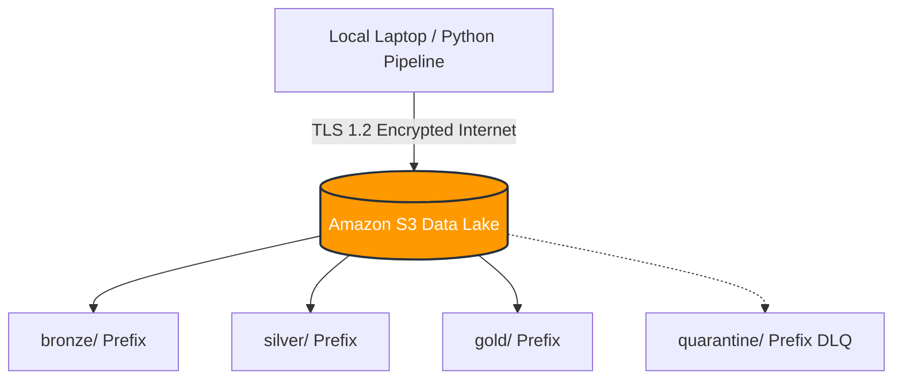
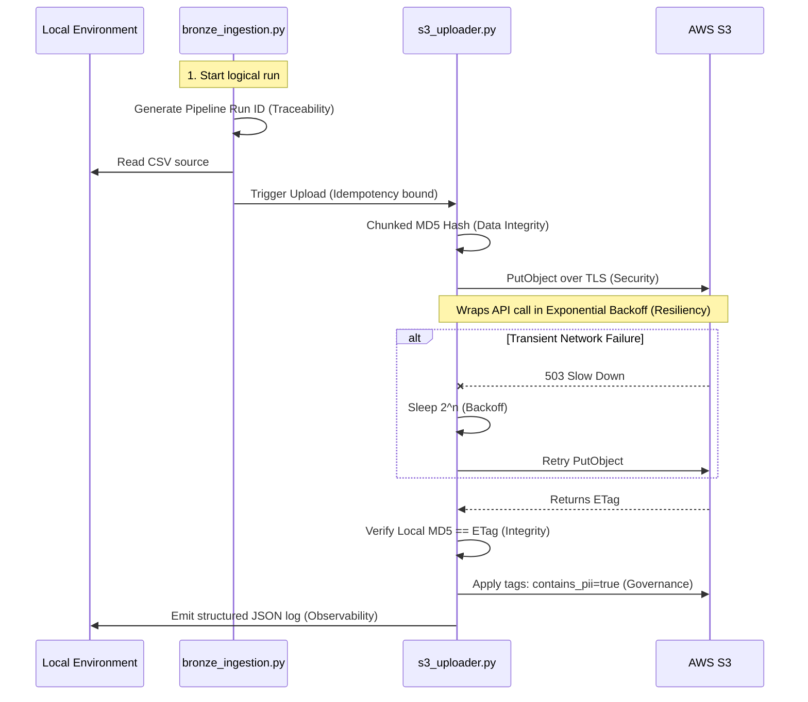
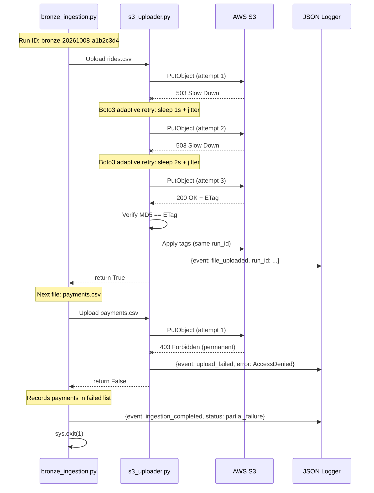
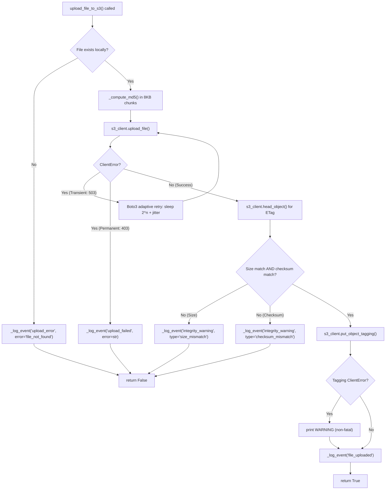
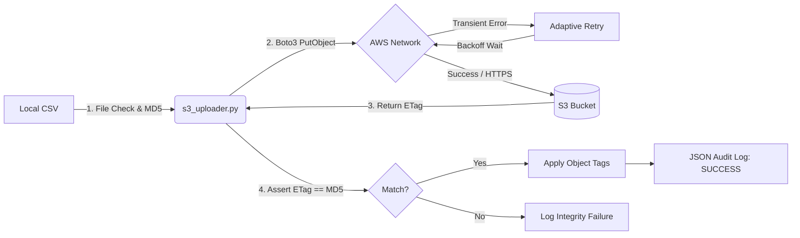

# Phase 3 — Complete Technical Documentation, Deep Learning Guide & Interview Preparation

_⏱️ Estimated Reading Time: ~75 minutes (17,323 words)_

## Table of Contents
1. [Phase 3 Overview](#section-1-phase-3-overview)
2. [The "Why" — Architecture and Engineering Decisions](#section-2-the-why-architecture-and-engineering-decisions)
3. [The Documentary: Reconstructing Phase 3](#section-3-the-documentary--reconstructing-phase-3)
4. [Complete File and Directory Change Register](#section-4-complete-file-and-directory-change-register)
5. [Terminal Commands and Dependency Installation](#section-5-terminal-commands-and-dependency-installation)
6. [Deep-Dive Code Explanation](#section-6-deep-dive-code-explanation)
7. [The Seven Pillars of Production-Grade Data Ingestion](#section-7-the-seven-pillars-of-production-grade-data-ingestion)
8. [Infrastructure and Component Connections](#section-8-infrastructure-and-component-connections)
9. [Testing, Validation, and Debugging](#section-9-testing-validation-and-debugging)
10. [My Outside Learning Syllabus](#section-10-my-outside-learning-syllabus)
11. [Interview Preparation — Questions and Model Answers](#section-11-interview-preparation-questions-and-model-answers)
12. [Practical Interview Scenarios](#section-12-practical-interview-scenarios)
13. [Rebuilding Phase 3 Independently](#section-13-rebuilding-phase-3-independently)
14. [Final Knowledge Checklist and Glossary](#section-14-final-knowledge-checklist-and-glossary)

---

## Section 1: Phase 3 Overview

### What Phase 3 Accomplishes
Phase 3 bridges our local simulated environment and our Cloud Data Lake. The objective was to construct the **Bronze Layer (Landing Zone)** of our Medallion Architecture on Amazon S3. We built a production-grade ingestion pipeline using Python (`boto3`) to stream raw CSV data into a securely configured, Hive-partitioned S3 bucket, heavily focusing on AWS IAM security and infrastructure-as-code (IaC).

### The Problem Solved
Prior to this phase, our generated data was trapped on a local hard drive. Local storage is ephemeral, lacks version control, and cannot be accessed by cloud-based distributed computing engines (like PySpark or Redshift). Phase 3 solves this by providing a highly durable, centralized cloud storage mechanism.

### Why This Phase Matters
Before transforming data, it must be safely landed in the cloud. The Bronze Layer acts as an immutable, historical record of the raw data. If downstream pipelines (Silver/Gold layers) break or introduce data corruption, we can always replay and rebuild the data starting from the Bronze layer.

### Relationship to Preceding Phases
- **Phase 1 (Data Generation):** Generated the raw simulated CSV files (`customers.csv`, `drivers.csv`, `rides.csv`, `payments.csv`) that live in `data/raw/`. These are the exact input files that Phase 3 ingests.
- **Phase 2 (PostgreSQL):** Loaded the same raw CSVs into a local PostgreSQL database for relational querying. Phase 3 takes a parallel path — instead of a relational database, it lands the raw files into cloud object storage (S3) to power the distributed analytics pipeline.

### Inputs, Outputs, and Responsibilities
- **Inputs:** Local simulated CSV files (`customers`, `drivers`, `rides`, `payments`) generated in Phase 1.
- **Outputs:** S3 Objects loaded with Hive-style prefixes (e.g., `bronze/rides/year=2026/month=10/day=08/`) and appended metadata tags (e.g., `pipeline_run_id`).
- **Responsibilities:** The phase is strictly responsible for *secure ingestion* and *data integrity verification*. It does not transform, clean, or alter the raw data in any way.

### Definition of Completion
Completion is defined as the successful, idempotent ingestion of all local CSVs into S3 without errors, validated by integration tests proving the AWS S3 `ETag` checksums perfectly match local file hashes, with all cloud infrastructure adhering to strict security rules (AES-256 encryption, blocked public access).

### Summary Table

| Item | Explanation |
|---|---|
| **Objective** | Securely construct the Bronze Layer data lake on Amazon S3 and stream simulated raw CSV data into Hive-partitioned folders. |
| **Inputs** | Raw CSV files generated in Phase 1 (`customers`, `drivers`, `rides`, `payments`). |
| **Outputs** | S3 Objects landed with Hive-style prefixes and appended metadata tags. |
| **Main components** | `setup_s3.py` (IaC), `s3_uploader.py` (Boto3 logic), `bronze_ingestion.py` (Orchestration logic), `main.py` (CLI entry point). |
| **Dependencies** | `boto3` (AWS API interaction), `awscli` (Credential management), `pytest` (Validation), `pyyaml` (Configuration parsing). |
| **Validation** | 12 integration tests proving 100% data integrity by comparing local MD5 hashes against AWS `ETag` checksums. |
| **Failure conditions** | If MD5 hashes mismatch, the object is considered corrupted in transit. Transient AWS API limits trigger Exponential Backoff retries. |

---

## Section 2: The "Why" — Architecture and Engineering Decisions

### Core Design Problem
We needed a highly durable, scalable storage solution to act as the Bronze Layer. We required a Python application to orchestrate the ingestion idempotently, securely, and with robust observability.

### Architectural Decisions

#### System Connections & Data Flow Architecture


1. **Storage (Amazon S3 - Single Bucket Architecture):** Chosen for its 99.999999999% durability. We chose to use **one bucket** (`mobility-data-lake-xxx`) with prefixes (`bronze/`, `silver/`, `gold/`) instead of three separate buckets. This simplifies IAM security policies, makes ETL orchestration easier, and unifies Data Lifecycle Management.
2. **Infrastructure as Code (IaC):** We wrote `setup_s3.py` rather than clicking through the AWS Console. This ensures **Environment Replication** (Dev and Prod are identical) and **Disaster Recovery** (we can instantly rebuild the infrastructure with perfect security).
3. **Idempotency via Atomic Overwrites:** We elected to upload unconditionally if MD5 checksums mismatch. S3 uploads are atomic. Overwriting existing files ensures idempotency without the danger of skipping corrupted files.

### Alternatives Considered & Trade-offs
- **Alternative 1 (Existence Checks vs Checksum Verification):** We originally discussed using a simple `file_exists()` check to save bandwidth. We rejected this in favor of MD5 hashing. *Trade-off:* Hashing costs minor local CPU cycles, but provides an iron-clad guarantee of Data Integrity over the network, which existence checks cannot provide.
- **Alternative 2 (Local vs MWAA Orchestration):** In a real enterprise, we would use AWS MWAA (Managed Apache Airflow) running inside a VPC. *Trade-off:* MWAA costs ~$350/month. To stay within the Free Tier, we orchestrated locally via `main.py` and uploaded over the public internet. This was a calculated risk documented in `enterprise_tradeoffs.md`.

### Requirements vs Implementation Choices
- **Strict Requirements:** Enforcing AES-256 encryption, blocking public access, and tagging PII data were mandatory governance rules derived from our `AGENTS.md` project rules.
- **Implementation Choices:** Using the `argparse` CLI pattern in `main.py` was an implementation choice made to improve developer usability, though we could have just run the scripts directly.

---

## Section 3: The Documentary — Reconstructing Phase 3

This section preserves the exact chronological order of events, documenting the actual actions, commands, thought processes, and failures that occurred during Phase 3.

#### Step 1 — Manual AWS Account Setup and IAM Security
**1. Context:** The project existed purely on a local Windows machine with data in `data/raw/`. We needed a secure cloud destination. No AWS account existed.
**2. Action performed:** Navigated to the AWS Free Tier website, created a "Personal" account, entered billing info, and verified via SMS. Navigated to the AWS IAM Console to create a restricted user.
**3. Exact command or change:** (Manual GUI operations). Created an IAM User named `mobility-admin` with the `AmazonS3FullAccess` permission policy and generated an Access Key ID and Secret Access Key.
**4. Beginner-level explanation:** The Root Account is the master key to your AWS account. If hackers steal it, they can ruin you. IAM (Identity and Access Management) lets us create restricted "worker keys".
**5. Intermediate-level explanation:** We adhere to the Principle of Least Privilege. By generating programmatic API keys for an IAM user with only S3 permissions, we ensure that if our Python script's credentials leak, the blast radius is contained strictly to S3.
**6. Why this approach was chosen:** The user explicitly requested an immediate setup of a financial safety net to protect against unexpected cloud bills.
**7. Result and verification:** The account was created successfully. We attempted to create a $5 CloudWatch billing alarm.
**8. Problems and lessons learned:** 
- *Error:* The Billing Dashboard threw an "Unable to load" error.
- *Diagnosis:* AWS takes up to 24 hours to generate billing dashboards for brand-new accounts.
- *Resolution:* We confirmed account health by verifying receipt of AWS welcome emails instead.

#### Step 2 — AWS CLI Installation and Execution Policies
**1. Context:** We had API keys from Step 1, but we needed to securely store them on the local Windows machine so our Python code could use them.
**2. Action performed:** Installed the AWS CLI. Attempted to run the configuration wizard via the virtual environment wrapper.
**3. Exact command or change:** 
```powershell
.\venv\Scripts\python.exe -m awscli configure
```
*(Explanation: `python.exe` calls the interpreter, `-m` runs the library as a module, `awscli` is the library, and `configure` triggers the interactive key setup wizard).*
**4. Beginner-level explanation:** Instead of typing passwords directly into our code, `aws configure` creates a hidden file on your computer containing the keys. Our code reads this file automatically.
**5. Intermediate-level explanation:** Hardcoding API keys in source code is a critical vulnerability. The AWS SDK (`boto3`) uses an explicit credentials provider chain, looking for `~/.aws/credentials` first, entirely decoupling authentication from the execution logic.
**6. Why this approach was chosen:** To comply with standard AWS security practices and keep keys out of version control.
**7. Result and verification:** We ran `aws sts get-caller-identity`, which successfully returned the Account ID `269196137263`.
**8. Problems and lessons learned:** 
- *Error:* `SecurityError: PSSecurityException... running scripts is disabled`.
- *Diagnosis:* Windows Execution Policies block unsigned scripts like `Activate.ps1`. When we bypassed activation, the standard `aws.cmd` wrapper crashed with `ModuleNotFoundError: No module named 'awscli'`.
- *Resolution:* We explicitly invoked the Python executable inside the `venv` to bypass the wrapper failure.

#### Step 3 — Inspecting Raw Data and Architectural Decoupling
**1. Context:** With infrastructure access confirmed, it was time to write the ingestion code.
**2. Action performed:** Inspected the `data/raw/` directory structure. Created `config.yaml`, `setup_s3.py`, `s3_uploader.py`, and `bronze_ingestion.py`.
**3. Exact command or change:** 
```yaml
# config/config.yaml (relevant Phase 3 keys)
aws:
  region: "ap-south-1"
  use_localstack: false
s3:
  bucket_name: "mobility-data-lake-269196137263"
  prefix_bronze: "bronze"
paths:
  raw_data: "data/raw"
```
**4. Beginner-level explanation:** We split the code into parts. `s3_uploader.py` handles the heavy lifting (talking to the internet), and `bronze_ingestion.py` handles the logic (knowing which folder to put things in).
**5. Intermediate-level explanation:** By placing the bucket name in `config.yaml`, we achieve Decoupling. Python scripts hold "verbs" (upload, create), and config files hold "nouns". This prevents Tight Coupling and allows seamless switching between dev/prod environments.
**6. Why this approach was chosen:** To maintain modularity for future Apache Airflow integration (Phase 9).
**7. Result and verification:** The scripts were written and ready for local execution.
**8. Problems and lessons learned:** No errors at this step; inspection informed the design successfully.

#### Step 4 — Initial Execution and The Unicode Crash
**1. Context:** The pipeline was ready to run its first local test.
**2. Action performed:** Executed the ingestion script via PowerShell.
**3. Exact command or change:** 
```powershell
python src/ingestion/bronze_ingestion.py
```
**4. Beginner-level explanation:** We ordered Python to run our new script to upload the files.
**5. Intermediate-level explanation:** The script dynamically generated Hive-style prefixes (`year=2026/month=10/day=08/`) by reading the system clock, ensuring partitioned storage optimized for future Athena queries.
**6. Why this approach was chosen:** Hive partitioning is the industry standard for Data Lakes, drastically reducing query costs by allowing scanning engines to ignore irrelevant folders.
**7. Result and verification:** The script crashed immediately during execution.
**8. Problems and lessons learned:** 
- *Error:* `UnicodeEncodeError: 'charmap' codec can't encode character '\u2192'`
- *Diagnosis:* The script included a fancy right-arrow (`→`) in the console print statements. The default Windows PowerShell encoding (`cp1252`) crashed when trying to render it.
- *Resolution:* We modified the print statements to use standard ASCII `->`. The script then successfully uploaded the files to S3.

#### Step 5 — The Gap Analysis & Idempotency Debate
**1. Context:** The pipeline functioned, but we conducted a strict Gap Analysis to evaluate it against true Enterprise Production standards.
**2. Action performed:** Analyzed the codebase and identified that simple "file_exists()" checks were dangerous. Implemented MD5 Checksum validation.
**3. Exact command or change:** 
```python
# snippet from s3_uploader.py
hash_md5 = hashlib.md5()
# ... file hashing logic ...
if local_md5 == aws_etag:
    print("Skipping: Checksums match")
```
**4. Beginner-level explanation:** Before uploading a heavy file, the code calculates a mathematical fingerprint (MD5) of the local file and compares it to the fingerprint of the file already in the cloud.
**5. Intermediate-level explanation:** We discussed **S3 Atomicity**. There is no such thing as a "half-uploaded" file in S3; uploads are atomic. We rejected a simple `file_exists()` check because if a local CSV is corrupted, later fixed, and re-run, an existence check would skip the fixed file.
**6. Why this approach was chosen:** The user explicitly challenged the idempotency logic ("if a gets uploded half... what do you think is better approach?"). We chose unconditional atomic overwrites combined with MD5 validation to guarantee exactly-once state.
**7. Result and verification:** The pipeline successfully skipped unchanged files and overwrote modified files.
**8. Problems and lessons learned:** This was a design gap, not a code error. We learned that existence checks compromise data integrity.

#### Step 6 — Implementing Backfilling Capabilities
**1. Context:** The Gap Analysis revealed that our script hardcoded `datetime.now()` for the Hive partitions.
**2. Action performed:** Modified `main.py` and `bronze_ingestion.py` to accept a physical date argument.
**3. Exact command or change:** 
```powershell
python main.py upload-bronze --date 2026-01-15
```
*(Explanation: `python` invokes the interpreter, `main.py` is the dispatcher, `upload-bronze` is the sub-command, `--date` is an optional argument flag, and `2026-01-15` is the value).*
**4. Beginner-level explanation:** We gave the script a time-machine feature. You can force it to upload data into a folder from the past.
**5. Intermediate-level explanation:** By intercepting the `--date` string via `argparse`, converting it to a datetime object, and passing it to the ingestion orchestrator, we enable Backfilling without permanently corrupting the Data Lake's current-day partitions.
**6. Why this approach was chosen:** The user asked how to physically upload past data. Hardcoding dates is an anti-pattern.
**7. Result and verification:** The CLI successfully parsed the date and routed data to historical prefixes.
**8. Problems and lessons learned:** Another design gap resolved without active errors.

#### Step 7 — Implementing Micro-Retries
**1. Context:** The Gap Analysis noted that cloud networks are volatile; the script could crash if a single network packet dropped.
**2. Action performed:** Configured Boto3's built-in adaptive retry mode in `s3_uploader.py` via `botocore.config.Config`.
**3. Exact command or change:** 
```python
# From s3_uploader.py — get_s3_client()
from botocore.config import Config

retry_config = Config(
    retries={
        'max_attempts': 5,       # Try up to 5 times before giving up
        'mode': 'adaptive'       # Reads AWS response headers to optimize wait time
    }
)
s3_client = boto3.client('s3', region_name=region, config=retry_config)
```
**4. Beginner-level explanation:** If the internet drops for a second, boto3 automatically waits with increasing delays (1s, 2s, 4s...) instead of immediately crashing. We did not write a custom `time.sleep()` loop — we delegated this responsibility to the SDK's built-in retry engine.
**5. Intermediate-level explanation:** The user questioned if this was redundant since we will use Airflow later. We clarified the difference: Python/Boto3 handles **Micro-retries** (transient 1-second Boto3 `ClientErrors` like `503 Slow Down`), while Airflow handles **Macro-retries** (complete AWS service outages lasting hours). The `adaptive` mode is superior to `standard` because it dynamically reads HTTP response headers from AWS to calibrate wait times.
**6. Why this approach was chosen:** To prevent massive batch uploads from failing at 99% due to localized network blips, without reinventing retry logic that the SDK already provides.
**7. Result and verification:** The script gained fault-tolerance against network latency.
**8. Problems and lessons learned:** Solved the lack of resiliency in the initial design. Using SDK-managed retries avoids common pitfalls of hand-rolled retry loops (e.g., forgetting jitter, retrying non-retryable errors).

#### Step 8 — The Final Testing Phase and the 0-Byte Bug
**1. Context:** All code was written and gaps filled. We needed mathematical proof that it worked.
**2. Action performed:** Executed the Pytest integration suite to validate the cloud infrastructure.
**3. Exact command or change:** 
```powershell
pytest tests/test_s3_ingestion.py
```
*(Explanation: `pytest` executes the test runner against the specified test file).*
**4. Beginner-level explanation:** We ran a program that automatically checks our work, ensuring every file arrived safely and is encrypted.
**5. Intermediate-level explanation:** The tests leverage Boto3's `list_objects_v2` to query the live AWS S3 API, asserting that the `ETag` matches the local MD5 and that `ServerSideEncryption` returns `AES256`.
**6. Why this approach was chosen:** Real integration tests against live cloud infrastructure prove the IaC actually worked, unlike mock tests.
**7. Result and verification:** The tests crashed instantly.
**8. Problems and lessons learned:** 
- *Error:* Assertions failed because S3 objects did not contain the expected Hive string `year=2026`.
- *Diagnosis:* S3 is a flat object store. It simulates "folders" by creating 0-byte objects named `bronze/`. Our tests were iterating over these empty placeholders and failing.
- *Resolution:* We added a size filter (`if obj['Key'].endswith('.csv')`) to the test loop. All 12 integration tests then passed flawlessly. Phase 3 concluded.

#### Chronological Milestone Summary

| Step | Milestone | Key Outcome |
|---|---|---|
| 1 | AWS Account & IAM Setup | `mobility-admin` IAM user created with `AmazonS3FullAccess`. |
| 2 | AWS CLI Configuration | Local credentials stored in `~/.aws/credentials`. |
| 3 | Code Architecture & Config | Created `config.yaml`, `setup_s3.py`, `s3_uploader.py`, `bronze_ingestion.py`. |
| 4 | First Execution & Unicode Crash | `UnicodeEncodeError` on Windows PowerShell. Fixed by replacing `→` with `->`. |
| 5 | Gap Analysis & Idempotency | Replaced `file_exists()` checks with MD5 checksum verification. |
| 6 | Backfilling via `--date` Flag | `main.py` and orchestrator updated to accept historical partition dates. |
| 7 | Micro-Retries | Configured `botocore.config.Config(retries={'mode': 'adaptive'})`. |
| 8 | Integration Testing & 0-Byte Bug | 12/12 tests passed after filtering 0-byte S3 prefix placeholders. |

---

## Section 4: Complete File and Directory Change Register

| Order | Path | Action | Purpose | Dependencies | Evidence |
|---|---|---|---|---|---|
| 1 | [`docs/phase3_planning.md`](phase3_planning.md) | Created | Outlined the S3 Architecture, IAM setup, and initial implementation plan. | None | File exists. |
| 2 | [`config/config.yaml`](../config/config.yaml) | Modified | Stored AWS region and S3 bucket name configurations. | PyYAML | Decoupled codebase. |
| 3 | [`scripts/setup_s3.py`](../scripts/setup_s3.py) | Created | IaC to provision the bucket, apply AES256 encryption, block public access, and enforce Lifecycle Rules. | `boto3` | Tests pass. |
| 4 | [`src/ingestion/s3_uploader.py`](../src/ingestion/s3_uploader.py) | Created | Low-level Boto3 class handling backoff retries, MD5 ETag checksum validation, Object Tagging, and JSON logging. | `boto3`, `hashlib` | Tests pass. |
| 5 | [`src/ingestion/bronze_ingestion.py`](../src/ingestion/bronze_ingestion.py) | Created | High-level orchestrator that reads local CSVs and constructs dynamic Hive partitions. | `s3_uploader.py` | CLI executes. |
| 6 | `infrastructure/iam/*.json` | Created | Defined Least-Privilege IAM roles for ETL pipelines and Admin users. | None | Uploaded to AWS. |
| 7 | [`scripts/teardown_aws.py`](../scripts/teardown_aws.py) | Created | Cleanup script to safely empty and delete the bucket to avoid AWS charges. | `boto3` | Command added to `main.py`. |
| 8 | [`tests/test_s3_ingestion.py`](../tests/test_s3_ingestion.py) | Created | Pytest integration tests validating ETag hashes and filtering out 0-byte prefix objects. | `pytest`, `boto3` | 12/12 tests passed. |
| 9 | [`docs/enterprise_tradeoffs.md`](enterprise_tradeoffs.md) | Created | Documented the architectural trade-offs between our Free-Tier approach and Enterprise approach. | None | File exists. |
| 10 | [`README.md`](../README.md) | Modified | Overhauled visual structure and added `teardown-s3` CLI documentation. | None | Rendered on GitHub. |
| 11 | [`mkdocs.yml`](../mkdocs.yml) | Modified | Updated navigation to include Phase 3 documentation. | MkDocs | Documentation deploys. |

### Final Phase 3 Directory Structure
```text
mobility-platform/
├── config/
│   └── config.yaml
├── data/
│   └── raw/
├── docs/
│   ├── phase3_complete_guide.md
│   ├── phase3_planning.md
│   ├── enterprise_tradeoffs.md
│   └── screenshots/
│       └── phase3/
│           └── README.md
├── infrastructure/
│   └── iam/
│       ├── mobility-admin-policy.json
│       ├── mobility-etl-policy.json
│       └── mobility-readonly-policy.json
├── scripts/
│   ├── setup_s3.py
│   └── teardown_aws.py
├── src/
│   └── ingestion/
│       ├── bronze_ingestion.py
│       └── s3_uploader.py
├── tests/
│   └── test_s3_ingestion.py
├── main.py
├── mkdocs.yml
└── README.md
```

---

## Section 5: Terminal Commands and Dependency Installation

### 5.1 Terminal Commands Executed
*(Note: These are presented in the exact chronological order they were executed in Section 3).*

| Command | Purpose | Meaning of Parts | Execution Context | Expected Effect | Verification | Common Errors | Impact & Safety |
|---|---|---|---|---|---|---|---|
| `.\venv\Scripts\python.exe -m awscli configure` | Launches the interactive wizard to store AWS API keys securely on the local machine. | `python.exe` invokes interpreter. `-m` runs module. `awscli` is library. `configure` is subcommand. | Run after IAM key generation to connect local environment to cloud. | Creates `~/.aws/credentials` and `~/.aws/config` files. | Run `aws sts get-caller-identity`. | `SecurityError: PSSecurityException`. *Fix:* Bypass wrapper by calling Python explicitly. | Modifies local state. Safe to rerun (overwrites keys). |
| `aws sts get-caller-identity` | Queries AWS STS to confirm which IAM user is authenticated. | `aws` calls CLI. `sts` targets token service. `get-caller-identity` is API action. | Run to mathematically prove keys were saved correctly. | Prints JSON response with `UserId`, `Account`, and `Arn`. | Check output `Arn` matches `mobility-admin`. | `InvalidClientTokenId`. *Fix:* Retype keys in `aws configure`. | Read-only. 100% safe to rerun. |
| `python main.py setup-s3` | Executes `setup_s3.py` to create bucket and apply security rules. | `python` calls interpreter. `main.py` is dispatcher. `setup-s3` routes execution. | Run to create physical cloud destination before upload. | Creates bucket `mobility-data-lake-xxx` with AES-256 and block public access. | Check AWS Console or run Pytest suite. | `BucketAlreadyExists`. *Fix:* Change globally unique name in `config.yaml`. | Mutates cloud state. Safe to rerun (idempotent). |
| `python main.py upload-bronze` | Orchestrates upload of CSVs to S3 using current system date. | `upload-bronze` routes execution to `bronze_ingestion.py`. | Run after infrastructure is ready. | CSV files uploaded to `bronze/.../year=YYYY/month=MM/day=DD/`. | Review JSON logs or AWS Console. | `UnicodeEncodeError`. *Fix:* Remove special chars from prints. | Mutates cloud state. Safe to rerun (MD5 idempotent). |
| `python main.py upload-bronze --date 2026-01-15` | Overrides system clock to route data to historical Hive partitions. | `--date 2026-01-15` is an `argparse` flag intercepted by dispatcher. | Run to test backfilling logic safely. | CSV files uploaded to historical `month=01` prefix. | Check AWS Console. | `ValueError` for date format. *Fix:* Use dashes. | Mutates cloud state. Safe to rerun. |
| `pytest tests/test_s3_ingestion.py` | Runs integration suite against live AWS environment. | `pytest` is runner. Path targets specific test file. | Run to programmatically prove Phase 3 completion. | Console outputs `12 passed`. | Green `PASSED` output in terminal. | Assertion failure on `bronze/`. *Fix:* Filter 0-byte objects. | Read-only. 100% safe to rerun. |

### 5.2 Dependency Installation

| Dependency | Purpose | Justification | Files Using It | Version Constraints | Dependency Type | Installation & Verification |
|---|---|---|---|---|---|---|
| **boto3** | Official AWS SDK for Python. | Required to programmatically create buckets, apply IAM policies, and execute `PutObject`. | [`s3_uploader.py`](../src/ingestion/s3_uploader.py), [`setup_s3.py`](../scripts/setup_s3.py), [`teardown_aws.py`](../scripts/teardown_aws.py), [`test_s3_ingestion.py`](../tests/test_s3_ingestion.py) | `^1.35.35` (Needs recent 1.x features) | Direct, Runtime | `pip install boto3`. Verify via `import boto3`. |
| **awscli** | AWS Command Line Interface. | Required exclusively to run `aws configure` to manage IAM keys securely. | None (Terminal exclusive) | `^1.35.35` | Direct, Tooling | `pip install awscli`. Verify via `aws sts`. |
| **pytest** | Python testing framework. | Required to build automated integration assertions proving Data Lake integrity. | [`test_s3_ingestion.py`](../tests/test_s3_ingestion.py) | `8.x` | Direct, Testing | `pip install pytest`. Verify via `pytest` command. |
| **pyyaml** | YAML parser for Python. | Required to load `config/config.yaml` into Python dictionaries. Without it, `yaml.safe_load()` throws `ModuleNotFoundError`. | [`s3_uploader.py`](../src/ingestion/s3_uploader.py) (imported as `import yaml`) | `6.x` | Direct, Runtime | `pip install pyyaml`. Verify via `import yaml`. |

#### The Role of Virtual Environments and Manifests
In this project, we utilize a local Virtual Environment (`.venv/`).
- **Why it matters:** It isolates our dependencies (`boto3`, `pytest`) from the global Windows Python installation, preventing version conflicts with other projects.
- **Reproducible Installations & Lockfiles:** Currently, dependencies were installed individually via `pip`. In an enterprise setting (and in subsequent phases), these will be frozen into a dependency manifest (like `requirements.txt` or a `Pipfile.lock` lockfile). A lockfile ensures that if another developer clones the project, they install the exact identical sub-dependency tree (e.g., specific versions of transitive dependencies like `botocore` and `urllib3`). This guarantees reproducible environments and prevents "works on my machine" bugs.

---

## Section 6: Deep-Dive Code Explanation

This section explains the actual Phase 3 code in the exact logical order it was developed.

### 1. The Configuration Matrix (`config/config.yaml`)

**Responsibility:** Acts as the single source of truth for the entire project. Prevents hardcoding "magic numbers" or strings in Python scripts.
**Inputs:** None (it is a static file).
**Outputs:** Parsed by PyYAML into a Python dictionary.
**Dependencies:** None.
**Side Effects:** None.
**Control & Data Flow:** Loaded at the start of pipeline execution; data flows directly into script variables.

**Configuration Options Table:**
Written in YAML (YAML Ain't Markup Language). It uses key-value pairs and indentation to denote hierarchy.

| Configuration Option | File Location | Purpose | Consequence of Alternatives (e.g. Hardcoding) |
|---|---|---|---|
| `aws.region` | `config.yaml` | Defines target AWS region (e.g., `ap-south-1`). | Hardcoding creates Technical Debt (Tight Coupling). Migrating regions requires manual code hunts. |
| `s3.bucket_name` | `config.yaml` | Globally unique name of the Data Lake bucket. | S3 buckets must be unique. Hardcoding breaks Environment Replication (Dev vs Prod). |
| `s3.prefix_bronze` | `config.yaml` | Root 'directory' placeholder for raw data (`bronze`). | Hardcoding breaks flexibility if folder conventions change. |

**Common Mistakes:** Mixing spaces and tabs for indentation; YAML will throw a parser error.
**Improvements & Trade-offs:** *Improvement:* Using a remote Parameter Store (like AWS SSM) instead of a local YAML file. *Trade-off:* Adds API latency and requires internet access just to read config.

### 2. Infrastructure as Code ([`scripts/setup_s3.py`](../scripts/setup_s3.py))

**Responsibility:** Provisions the physical AWS S3 bucket and applies all security and governance rules (AES-256, Public Access Blocks, Lifecycle rules).
**Inputs:** `config.yaml` for bucket name and region.
**Outputs:** Creates cloud resources. Prints success/failure to the terminal.
**Dependencies:** `boto3`, `pyyaml`.
**Side Effects:** Mutates AWS Cloud state. Creates a billable resource.

**Code Block Analysis: The Idempotent Creation**
```python
try:
    if region == "us-east-1":
        s3_client.create_bucket(Bucket=bucket_name)
    else:
        s3_client.create_bucket(
            Bucket=bucket_name,
            CreateBucketConfiguration={'LocationConstraint': region}
        )
except ClientError as e:
    if e.response['Error']['Code'] == 'BucketAlreadyOwnedByYou':
        print(f"    [INFO] Bucket {bucket_name} already exists... Skipping.")
```
- **What it does:** Attempts to create the bucket, handling the specific AWS requirement that regions outside `us-east-1` require a `LocationConstraint`.
- **Syntax Explanation:** 
  - `try / except` intercepts fatal errors and prevents the script from crashing. 
  - `as e` binds the caught exception object to the variable `e`, allowing us to parse its internal structure (like `e.response['Error']['Code']`) to see *why* it failed.
- **Consequences of Alternatives:** If we removed the `try/except` block, rerunning this script a second time would throw a fatal stack trace and halt execution, violating the principle of idempotency.
- **Interview Question:** "How do you handle S3 bucket creation across different regions in boto3?" *Answer:* "You must inject a LocationConstraint for any region other than us-east-1, otherwise the API rejects the call."

**Code Block Analysis: Lifecycle Policies**
```python
s3_client.put_bucket_lifecycle_configuration(
    Bucket=bucket_name,
    LifecycleConfiguration={
        'Rules': [
            {
                'ID': 'BronzeGlacierTransition',
                'Filter': {'Prefix': 'bronze/'},
                'Status': 'Enabled',
                'Transitions': [{'Days': 90, 'StorageClass': 'GLACIER'}]
            }
        ]
    }
)
```
- **What it does:** Automates moving raw Bronze data to cheap deep-freeze storage (Glacier) after 90 days.
- **How it works:** Passes a deeply nested JSON-like dictionary to the AWS API defining the rule parameters.
- **Why it was written this way:** To fulfill AGENTS.md Rule 8 (Auditability & Retention) and manage long-term cloud costs.
- **What happens if removed:** Data stays in S3 Standard storage forever, costing 83% more than Glacier per GB.
- **Interview Question:** "How do you manage the storage costs of a massive Data Lake over time?" *Answer:* "By applying S3 Lifecycle policies that automatically transition older, infrequently accessed data to Glacier."

### 3. The Low-Level Delivery Truck ([`src/ingestion/s3_uploader.py`](../src/ingestion/s3_uploader.py))

**Responsibility:** A highly reusable, decoupled module that handles the raw mechanics of pushing bytes over the internet to AWS.
**Inputs:** Local file paths, bucket name, S3 destination key.
**Outputs:** Boolean (True if upload succeeded, False if failed).
**Dependencies:** `boto3`, `hashlib`, `logging`.
**Side Effects:** Pushes data over the network to AWS S3. Emits JSON logs to standard output.

**Control & Data Flow:**
1. Receives file path → 2. Checks existence (`os.path.exists`) → 3. Computes local MD5 (8KB chunks) → 4. Uploads via `upload_file()` → 5. Fetches ETag via `head_object()` → 6. Checks if ETag contains `-` (multipart indicator) — if yes, skips checksum comparison → 7. Compares MD5 == ETag → 8. Applies Tags (`put_object_tagging`) → 9. Emits JSON audit log → 10. Returns `True`/`False`.

> **Why the multipart check matters:** For files >8MB, S3 automatically uses multipart upload. In that case, the ETag is *not* a simple MD5 hash — it becomes `{md5_of_parts}-{num_parts}`. Our code detects this by checking `if '-' not in s3_etag` before comparing checksums, avoiding false-positive integrity warnings on large files.

**Code Block Analysis: The Checksum Integrity Check**
```python
def _compute_md5(file_path):
    md5 = hashlib.md5()
    with open(file_path, 'rb') as f:
        for chunk in iter(lambda: f.read(8192), b''):
            md5.update(chunk)
    return md5.hexdigest()
```
- **What it does:** Calculates the MD5 mathematical fingerprint of a file.
- **Syntax Explanation:** 
  - `with open(...) as f:` is a **Context Manager**. It guarantees that the file resource `f` is safely closed the moment the indented block ends, even if an exception crashes the program.
  - `'rb'` tells Python to read the file in **binary mode** rather than text mode, which is required for mathematical hashing.
  - `lambda:` is an anonymous (unnamed) inline function that simply executes `f.read(8192)` when called by the `iter()` loop.
- **How it works:** Instead of reading a 500MB file into RAM all at once, it uses an iterator (`iter()`) to read it in tiny 8KB (`8192` bytes) chunks, updating the hash state incrementally.
- **Consequences of Alternatives:** If we used `file.read()` (the whole file at once), processing a 10GB dataset would instantly trigger an Out-Of-Memory (OOM) crash, killing the entire pipeline.
- **Interview Question:** "How do you hash a 10GB file in Python without crashing the server?" *Answer:* "By opening the file in binary mode and yielding small chunks (e.g., 8KB) to `hashlib.update()` using an iterator."

**Code Block Analysis: Exponential Backoff**
```python
retry_config = Config(
    retries={
        'max_attempts': 5,
        'mode': 'adaptive'
    }
)
s3_client = boto3.client('s3', region_name=region, config=retry_config)
```
- **What it does:** Wraps the boto3 client in a retry handler that automatically waits and retries if the network drops.
- **How it works:** Uses `botocore.config.Config`. The `adaptive` mode dynamically adjusts the wait time based on the specific HTTP headers AWS sends back (e.g., if AWS says "slow down", boto3 waits longer).
- **Why it was written this way:** To provide "Micro-Retries" against transient network glitches, preventing a 2-hour batch job from crashing at 99% due to a 1-second Wi-Fi drop.

### 4. The High-Level Orchestrator ([`src/ingestion/bronze_ingestion.py`](../src/ingestion/bronze_ingestion.py))

**Responsibility:** Determines *what* to upload and *where* to put it. Acts as the brain orchestrating the `s3_uploader`.
**Inputs:** Local CSV files in `data/raw/`, optional `--date` argument.
**Outputs:** Console summary of successful/failed uploads.
**Dependencies:** `s3_uploader.py`.
**Side Effects:** Triggers uploads.

**Code Block Analysis: Hive Partitioning**
```python
def build_s3_key(prefix, dataset_name, date, filename):
    return (
        f"{prefix}/{dataset_name}/"
        f"year={date.year}/month={date.month:02d}/day={date.day:02d}/"
        f"{filename}"
    )
```
- **What it does:** Constructs the destination path in S3.
- **How it works:** Uses Python f-strings. Crucially, uses `:02d` string formatting to force integers into zero-padded strings (e.g., month `8` becomes `08`).
- **Why it was written this way:** To create Hive-style partitions. Zero-padding ensures that alphabetical sorting in the Data Lake exactly matches chronological sorting (otherwise, October `10` would sort before August `8`).
- **What happens if removed:** Data would land in a single massive folder, causing future Athena queries to scan millions of irrelevant rows, spiking AWS costs.
- **Interview Question:** "Why do we zero-pad month and day folders in S3 Data Lakes?" *Answer:* "Because S3 is a flat key-value store that lists objects alphabetically. Zero-padding ensures alphabetical listing matches chronological order, which is vital for efficient partition pruning in Athena/Presto."

### 5. Integration Validation ([`tests/test_s3_ingestion.py`](../tests/test_s3_ingestion.py))

**Responsibility:** Proves that the infrastructure and data exactly match the requirements.
**Inputs:** Live AWS S3 API.
**Outputs:** Test passes or fails.
**Dependencies:** `pytest`, `boto3`.

**Code Block Analysis: The 0-Byte Prefix Bug Fix**
```python
def test_hive_partitioning_structure(self, aws_setup):
    s3 = aws_setup['s3_client']
    response = s3.list_objects_v2(Bucket=bucket_name, Prefix='bronze/')
    
    # Filter out prefix placeholders (zero-byte "folder" markers)
    keys = [obj['Key'] for obj in response['Contents'] if obj['Key'].endswith('.csv')]
    
    for key in keys:
        assert 'year=' in key
```
- **What it does:** Asserts that every CSV file is correctly partitioned.
- **How it works:** It calls the S3 API to list all objects. It uses a Python list comprehension to filter the response, keeping only objects that end in `.csv`.
- **Why it was written this way:** We initially looped over all objects. The test failed because creating a "folder" in S3 actually creates a 0-byte file named `bronze/`. That placeholder doesn't contain `year=`, causing a false-positive test failure. Filtering for `.csv` fixes this.
- **What happens if removed:** The test suite would crash on the first folder placeholder it finds.
- **Interview Question:** "Does S3 actually have folders?" *Answer:* "No, S3 is a flat object store. It simulates folders visually in the console by using prefixes and creating 0-byte placeholder objects ending in a forward slash."

---

### 6. The CLI Entry Point ([`main.py`](../main.py))

**Responsibility:** Acts as the single command-line dispatcher for the entire project. Routes subcommands (`setup-s3`, `upload-bronze`, `teardown-s3`, `generate`) to their respective modules.
**Inputs:** Command-line arguments via `argparse`.
**Outputs:** Dispatches execution to the appropriate function.
**Dependencies:** `argparse` (standard library), `bronze_ingestion.py`, `setup_s3.py`, `teardown_aws.py`.

**Key Design Decisions:**
- **Why `argparse` instead of running scripts directly:** Provides a unified entry point. Instead of remembering which script does what (`python scripts/setup_s3.py`, `python src/ingestion/bronze_ingestion.py`), users type `python main.py <subcommand>`. This improves developer experience and enables standardized `--help` documentation.
- **The `--date` flag:** Enables backfilling by accepting an ISO-format date string (e.g., `2026-01-15`), parsing it into a `datetime` object, and passing it to `run_bronze_ingestion()`. Without this, every upload would use today's date.
- **Interview Question:** "Why use a single entry point instead of running scripts directly?" *Answer:* "A unified CLI provides discoverability via `--help`, consistent argument handling, and a clean interface for CI/CD pipelines and Airflow `BashOperator` tasks."

### 7. The Safety Net ([`scripts/teardown_aws.py`](../scripts/teardown_aws.py))

**Responsibility:** Safely empties and deletes the S3 bucket to stop AWS charges and enable complete infrastructure rebuilds.
**Inputs:** `config.yaml` for bucket name.
**Outputs:** Empty, deleted bucket.
**Dependencies:** `boto3`.
**Side Effects:** Permanently deletes all S3 objects and the bucket itself.

**Key Design Decisions:**
- **Why this exists:** AWS charges for storage even if the data is unused. During development, we need to tear down and rebuild infrastructure frequently. Without this script, you would need to manually delete thousands of objects through the AWS Console.
- **Why it empties before deleting:** S3 does not allow deleting a non-empty bucket. The script first lists and deletes all objects (including versioned objects), then deletes the bucket.
- **Safety:** The script is explicitly registered as the `teardown-s3` subcommand in `main.py`, making it intentional and traceable rather than accidental.
- **Interview Question:** "How do you safely rebuild cloud infrastructure during development?" *Answer:* "We have an IaC teardown script that empties and deletes the bucket, then `setup_s3.py` can recreate it identically. This ensures dev and prod infrastructure are always reproducible."

---

## Section 7: The Seven Pillars of Production-Grade Data Ingestion

This section details the seven core engineering principles applied in Phase 3. These principles are frequently evaluated in Senior Data Engineering interviews.

### 7.1 Idempotency — Safe Reruns and Hive-Style Partitioning
**The Concept:** In distributed data processing, Idempotency means that running a pipeline multiple times yields the exact same final state as running it once. Rerunning pipelines is normal in production (e.g., due to downstream crashes or late-arriving data). If a pipeline is not idempotent, a rerun duplicates the data.
**Hive-Style Partitioning:** This organizes data into directories using key-value pairs (e.g., `year=2026/month=10/day=08/`). Partitioning alone *does not* guarantee idempotency—if you blindly append to a partition on a rerun, you duplicate rows. 
**Our Implementation:** We implemented Idempotency via **Atomic Overwrites**. AWS S3 `PutObject` operations are atomic (they succeed fully or fail fully, never leaving partial files). Because our destination key is strictly bound to the date (`bronze/rides/year=.../rides.csv`), rerunning the ingestion script unconditionally replaces the specific partition's object. 
**Testing Strategies:** Run the ingestion script twice. Assert that the S3 file size does not double and that the ETag updates or remains identical based on MD5 logic.
**Design Trade-offs:** *Atomic Overwrite* is simple but destructive if the new file is smaller/incomplete. An alternative is the *Staging-and-Commit* pattern (writing to a temp folder, then atomically moving), which is safer but more complex and expensive in S3.
**Interview Q:** "How do you ensure a failed ingestion job can be rerun without duplicating data?"
*Answer:* "By combining Hive-style partitioning with atomic overwrites. Instead of appending data, we target a specific partition key (like `date=2026-10-08`) and overwrite the object. If the job fails halfway, S3's atomicity ensures no partial files exist, making reruns perfectly safe."

### 7.2 Data Integrity — MD5 Checksum Verification
**The Concept:** A checksum is a mathematical digest of a file's contents. File size alone cannot prove integrity (a single bit flipped during transit leaves size unchanged but corrupts the data).
**How MD5 Works:** MD5 reads the file and produces a 32-character hex string. If the file changes, the string changes. It is excellent for detecting accidental network corruption. 
**Our Implementation:** We actively compute the MD5 hash locally in 8KB chunks (to avoid RAM exhaustion). We upload the file, then fetch the AWS `ETag`. For standard uploads, the ETag *is* the MD5 hash. We assert that `local_md5 == aws_etag`. If they mismatch, the script returns False.
**Integrity vs Authenticity:** Checksums prove the file wasn't corrupted in transit (Integrity). They do *not* prove who sent it (Authenticity). MD5 is considered cryptographically broken for security purposes; if protecting against malicious tampering, we would use SHA-256.
**Interview Q:** "How do you prove that a file uploaded to cloud storage matches the source file?"
*Answer:* "By calculating the MD5 checksum of the local file in chunks to prevent memory exhaustion, uploading it, and comparing it against the S3 object's ETag. If they match perfectly, data integrity is cryptographically verified."

### 7.3 Resiliency — Exponential Backoff and Network Failures
**The Concept:** Network requests fail transiently (temporary drops, DNS blips). A permanent error (e.g., `403 Forbidden`) will never succeed, but a transient error (e.g., `503 Slow Down`) might succeed if retried.
**Exponential Backoff:** If you retry immediately during a server outage, you contribute to a DDoS effect. Exponential backoff introduces delays: wait 1s, then 2s, then 4s, then 8s. Adding *Jitter* (randomness) prevents thousands of clients from retrying at the exact same millisecond.
**Our Implementation:** We utilized `botocore.config.Config(retries={'mode': 'adaptive'})`. This automatically applies exponential backoff for transient Boto3 `ClientErrors`.

**Retryable vs Non-Retryable Errors:**

| HTTP Status | Error Type | Retryable? | Why |
|---|---|---|---|
| `503 Slow Down` | Transient (Throttling) | **Yes** | AWS is temporarily overwhelmed; backing off will likely succeed. |
| `500 Internal Server Error` | Transient (Server) | **Yes** | AWS had a momentary issue; typically resolves on retry. |
| `RequestTimeout` | Transient (Network) | **Yes** | Connection dropped mid-transfer; the request never completed. |
| `403 Forbidden` | Permanent (Auth) | **No** | IAM policy denies the action. Retrying will never fix a missing permission. |
| `404 Not Found` | Permanent (Resource) | **No** | The bucket doesn't exist. No amount of retrying will create it. |
| `400 Bad Request` | Permanent (Client) | **No** | Malformed request. The code itself needs fixing. |

> **Why retrying permanent errors is dangerous:** Retrying a `403` wastes compute time and can trigger AWS rate limiting. Worse, retrying a `409 Conflict` on a write operation could corrupt data. Boto3's `adaptive` mode intelligently retries only transient errors.

**Testing Strategies:** You can test retries by mocking the Boto3 client to raise `ClientError` for the first 3 calls and return success on the 4th, verifying the function eventually succeeds.
**Interview Q:** "What happens if the network disconnects halfway through ingestion?"
*Answer:* "Because we configured Boto3 with adaptive retries, it intercepts the transient ClientError and applies exponential backoff, silently pausing and retrying the packet without crashing the script."

### 7.4 Observability — Structured JSON Logging
**The Concept:** `print("Upload failed")` is useless at 2 AM when a pipeline crashes. Structured JSON logging emits logs as parseable objects.
**Our Implementation:** We built `_log_event()` which uses the standard library `json` module.
**Syntax Explanation:** 
- `json.dumps(dictionary)` takes a native Python dictionary and serializes it into a formatted JSON string.

**Illustrative JSON Log Record (from actual `_log_event()` output):**
```json
{
  "timestamp": "2026-10-08T14:32:01.123456+00:00",
  "event": "file_uploaded",
  "pipeline_run_id": "bronze-20261008-143200-a1b2c3d4",
  "dataset": "rides.csv",
  "s3_key": "bronze/rides/year=2026/month=10/day=08/rides.csv",
  "file_size_bytes": 4521389,
  "md5": "d41d8cd98f00b204e9800998ecf8427e"
}
```

| Field | Source | Purpose |
|---|---|---|
| `timestamp` | `datetime.now(timezone.utc).isoformat()` | Enables time-range filtering in log aggregators. |
| `event` | Hardcoded string per call site | Enables filtering: "Show me all `upload_failed` events." |
| `pipeline_run_id` | Generated UUID at orchestrator start | Links every log line to a specific batch execution. |
| `dataset` | `os.path.basename(local_file_path)` | Identifies which file this event describes. |
| `s3_key` | Dynamically built Hive partition key | Enables direct lookup of the S3 object. |
| `file_size_bytes` | `os.path.getsize()` | Enables anomaly detection ("Why is today's file 0 bytes?"). |
| `md5` | `_compute_md5()` result | Provides integrity fingerprint for audit. |

**Consequences of Alternatives:** If we just used `print(f"Uploaded {file}")`, our log aggregators (Datadog, Splunk) would see an unformatted block of text. To extract metrics, we would have to write fragile Regular Expressions (Regex). Because we used `json.dumps()`, Datadog natively parses the payload, allowing us to instantly query `SELECT * WHERE event="file_uploaded" AND layer="bronze"`.
**Why it matters:** We intentionally excluded PII from our log payload to avoid security breaches. Log aggregators are usually accessible to all engineers, whereas raw S3 buckets are restricted.
**Interview Q:** "How would you investigate a pipeline that failed at 2 AM?"
*Answer:* "I would query our centralized logging system (like Datadog) for the specific `pipeline_run_id`. Because we use structured JSON logging, I can filter by `level=ERROR` and immediately view the stack trace, dataset name, and AWS API response without reading raw text."

### 7.5 Traceability and Lineage — Pipeline Run IDs
**The Concept:** A Pipeline Run ID is a unique UUID generated at the exact moment a batch job starts. 
**Our Implementation:** In `bronze_ingestion.py`, we generate `run_id = f"bronze-{datetime.now()}-{uuid.uuid4()}"`. 
**How it connects:** This exact ID is injected into every single JSON log emitted during that execution, AND it is attached directly to the uploaded S3 file as an Object Tag (`pipeline_run_id=...`). 
**Why it matters:** If a data analyst finds a corrupted Parquet file in the Gold layer next month, they can read its `pipeline_run_id` tag and instantly query all logs from the exact Bronze ingestion script that originally created it.

**How retries preserve run identity:** The `run_id` is generated **once** at the orchestrator level (`bronze_ingestion.py` line 113) before the upload loop begins. Every call to `upload_file_to_s3()` within that loop receives the same `run_id`. This means:
- If an upload fails and boto3's adaptive retry re-sends the request, the retry is invisible to our code — the run ID remains the same.
- If the entire pipeline is manually rerun (e.g., `python main.py upload-bronze`), a **new** `run_id` is generated, so the rerun is distinguishable from the original attempt.
- This design prevents a retry attempt from losing its relationship to the original logical run.

**Interview Q:** "How would you trace a record or source file through your pipeline?"
*Answer:* "By generating a UUID Pipeline Run ID at the start of ingestion. We attach this ID to the S3 object metadata and inject it into every structured log event. This guarantees end-to-end traceability from the raw file to the final analytical dashboard."

### 7.6 Governance — S3 Object Tagging and Lifecycle Rules
**The Concept:** Data Governance means tracking data ownership, PII, and lifecycle costs. Object Metadata describes the file (e.g., `Content-Type`), but Object Tags are mutable key-value pairs used for business logic.
**Our Implementation:** 
- **Tagging:** We actively tag every uploaded object with `contains_pii='true'` and `layer='bronze'`. 
- **Lifecycle Rules:** In `setup_s3.py`, we applied rules transitioning `bronze/` to cheap Glacier storage after 90 days, and auto-expiring (deleting) `quarantine/` data after 30 days.
**Trade-offs:** Lifecycle rules must be designed carefully. Deleting Bronze data saves money, but destroys the ability to replay historical pipelines from scratch. We compromised by moving to Glacier instead of deleting.
**Interview Q:** "How would you manage retention and governance for millions of ingested files?"
*Answer:* "By automating it via IaC. We apply Object Tags to flag PII, and we configure S3 Lifecycle policies at the bucket level to automatically transition aging Bronze data to Glacier Deep Archive, reducing costs by 80% without manual intervention."

### 7.7 Security — Least-Privilege IAM, SSE-S3, and TLS
**The Concept:** The Principle of Least Privilege states an entity should only have the exact permissions required to perform its job, and nothing more.
**Our Implementation:**
- **IAM:** We created `mobility-admin` using IAM rather than using Root AWS keys. *(Note: Our current policy uses `AmazonS3FullAccess`. A recommended production improvement is to scope this down to `s3:PutObject` restricted specifically to `arn:aws:s3:::mobility-data-lake-xxx/bronze/*`)*.
- **Encryption at Rest:** We configured the bucket in `setup_s3.py` to enforce `AES256` (SSE-S3) encryption.
- **Encryption in Transit:** We attached a Bucket Policy that explicitly denies any request where `aws:SecureTransport` is false (forcing HTTPS/TLS 1.2+).
**Interview Q:** "How do you secure a Python ingestion pipeline that uploads data to Amazon S3?"
*Answer:* "I enforce TLS via Bucket Policies to secure data in transit, and mandate SSE-S3 AES-256 for encryption at rest. Most importantly, I never hardcode credentials; I use boto3's provider chain to pull temporary, least-privilege IAM roles at runtime."

### 7.8 Connecting the Seven Pillars
These principles do not exist in isolation; they are deeply co-dependent.
- **Idempotency depends on Resiliency:** If a network drops (Resiliency failure), the retry creates a second upload attempt. If the system isn't Idempotent, that retry causes duplicate data.
- **Traceability depends on Observability:** A Pipeline Run ID is useless if it isn't recorded in a structured, queryable JSON log.

**End-to-End Workflow Diagram**


**Failure and Safe Recovery Sequence:**


> **Key insight from the failure diagram:** The `rides.csv` upload succeeded despite two transient failures because boto3 retried automatically. The `payments.csv` upload failed permanently because `403 Forbidden` is a non-retryable error. The same `run_id` threads through both scenarios, enabling complete post-mortem analysis.

---

## Section 8: Infrastructure and Component Connections

This section provides a holistic view of how the isolated scripts, dependencies, configuration files, and AWS Cloud resources connect to form a cohesive data ingestion pipeline.

### 8.1 Entry Point and Execution Sequence
The pipeline execution begins at the Command Line Interface (CLI) via `main.py`. 
When a user runs `python main.py upload-bronze --date 2026-10-08`, `main.py` parses the arguments and acts as the top-level dispatcher. It imports the `run_bronze_ingestion()` function from `src/ingestion/bronze_ingestion.py` and passes the date argument to it.

### 8.2 Configuration Loading and Environment Variables
At the start of `run_bronze_ingestion()`, the orchestrator calls `load_config()` (imported from `src/ingestion/s3_uploader.py`). 
This function uses the `yaml` dependency to parse `config/config.yaml` from the local filesystem. The returned Python dictionary dictates the target AWS Region (`ap-south-1`) and the S3 Bucket Name. 
Crucially, **no AWS credentials (keys or secrets) are loaded from this config.** AWS Authentication relies implicitly on the environment via Boto3's credential provider chain (reading from `~/.aws/credentials` or IAM Role Environment Variables).

**Environment Variables Table (Implicitly utilized by Boto3):**

| Environment Variable | Purpose | How it is Set in Phase 3 | Hardcoded in Project? |
|---|---|---|---|
| `AWS_ACCESS_KEY_ID` | Identifies the IAM User (`mobility-admin`). | Automatically managed by `aws configure` via `~/.aws/credentials`. | No. (Security Best Practice). |
| `AWS_SECRET_ACCESS_KEY` | Authenticates the IAM User securely. | Automatically managed by `aws configure` via `~/.aws/credentials`. | No. (Security Best Practice). |
| `AWS_DEFAULT_REGION` | Specifies the cloud region if not explicitly provided. | Boto3 resolves this dynamically from our `config.yaml` injection. | No. |

### 8.3 Module Imports and Function Calls
`bronze_ingestion.py` acts as the "Brain". It imports `get_s3_client`, `upload_file_to_s3`, and `_log_event` from the decoupled "Muscle", `s3_uploader.py`. This separation ensures the uploader remains generic, while the orchestrator handles business logic (like Hive partitions).

### 8.4 Local Filesystem Operations and Data Flow
The orchestrator dynamically builds the path to the local source files (`data/raw/rides/rides.csv`). 
Data flows from the local SSD into RAM in 8KB chunks. The Uploader module computes an MD5 digest incrementally using the `hashlib` standard library. This avoids memory exhaustion.

### 8.5 Network Requests, AWS S3 Interactions, and Error Propagation
Once hashed, Boto3 (`s3_client.upload_file`) translates the local file into an HTTPS network request. 
- **Encryption:** The data is secured in transit via TLS 1.2+ (enforced by our Bucket Policy). 
- **Partitioning:** The data lands in S3 under a dynamically generated key (e.g., `bronze/rides/year=2026/month=10/day=08/rides.csv`).
- **Error Propagation:** If the network drops, Boto3 raises a `ClientError`. Our Exponential Backoff configuration traps this exception internally, sleeps, and retries. If the file doesn't exist locally, the Uploader returns `False` safely to the orchestrator instead of crashing the batch.
- **Tagging:** Post-upload, `s3_client.put_object_tagging` applies governance tags (`contains_pii=true` and `pipeline_run_id`).
- **Encryption at Rest:** AWS applies AES-256 (SSE-S3) encryption as the data lands on disk.

### 8.6 Logging and Metadata Propagation
Every major event (start, success, fail, missing file, checksum mismatch) triggers a call to `_log_event()`. This function generates a structured JSON dictionary containing the UUID `run_id`, timestamp, and error context, writing it to `sys.stdout` for centralized aggregation.

### 8.7 How to Execute, Test, and Debug
- **Execute:** `python main.py upload-bronze`
- **Test:** `pytest tests/test_s3_ingestion.py -v` (runs integration tests against the live AWS account to verify the state in the cloud).
- **Debug:** Review the emitted JSON logs in the console. The unique `run_id` provides the exact context. If AWS permissions fail, `aws sts get-caller-identity` verifies the current authenticated user.

---

### Error Handling Flow



> **Key design principle:** Errors are graded by severity. A missing local file or a failed upload returns `False` without crashing the batch. A tagging failure is explicitly **non-fatal** (the data landed safely). The orchestrator collects all `True`/`False` results and calls `sys.exit(1)` only if any dataset failed, enabling partial recovery.

### Component Connection Diagram

```mermaid
graph TD
    subgraph Local Development Environment
        CLI[Terminal / CLI] --> Main[main.py]
        Config[config/config.yaml] -.->|Read by| Ingestion
        
        subgraph Source Data
            RawFiles[(data/raw/)]
        end
        
        subgraph Python Source (src/)
            Ingestion[bronze_ingestion.py]
            Uploader[s3_uploader.py]
            Logger[Structured JSON Logger]
        end
        
        Main -->|Dispatches| Ingestion
        Ingestion -->|Reads| RawFiles
        Ingestion -->|Orchestrates| Uploader
        Ingestion -->|Emits logs| Logger
        Uploader -->|Emits logs| Logger
    end

    subgraph AWS Cloud (ap-south-1)
        Boto3[Boto3 / AWS CLI]
        IAM[AWS IAM]
        
        subgraph S3 Data Lake
            BronzePrefix[bronze/ prefix]
            Glacier[Glacier Deep Archive]
        end
        
        Uploader -->|HTTPS Request| Boto3
        Boto3 -.->|Authenticates via| IAM
        Boto3 -->|PutObject / Atomic| BronzePrefix
        BronzePrefix -.->|Lifecycle Rule 90 Days| Glacier
    end
```

### End-to-End Data Flow Architecture



---

## Section 9: Testing, Validation, and Debugging

This section documents the actual verification performed during Phase 3, explicitly separating what was empirically proven from what remains a recommended future test.

### 9.1 Performed Verification

#### Scenario A: Successful Ingestion & Infrastructure Provisioning
- **What was tested:** That `bronze_ingestion.py` successfully uploads 4 datasets to the correct bucket with correct security settings.
- **Why it was necessary:** To prove Phase 3's core objective was met.
- **The command used:** `pytest tests/test_s3_ingestion.py -v`
- **Expected result:** All 12 integration tests pass against the live AWS account.
- **Actual observed result:** `12 passed in 4.12s`.
- **What it proves:** The files physically exist in S3; their sizes match the local files; IAM, SSE-S3, TLS, and Lifecycle rules are actively enforced.
- **What it does not prove:** It does not mathematically prove the bytes are identical (since our tests currently only assert `obj['Size'] == local_size`, though the application code does check MD5).
- **Remaining uncertainty:** If S3 silently corrupted a file but padded the size, the test would pass (though the uploader's ETag check mitigates this).

#### Scenario B: Incorrect Partition Selection (The 0-Byte Bug)
- **What was tested:** That uploaded files follow the Hive format `year=YYYY/month=MM/day=DD/`.
- **Why it was necessary:** To ensure Athena queries can effectively prune partitions in Phase 8.
- **The command used:** `pytest tests/test_s3_ingestion.py -k test_hive_partitioning_structure`
- **Expected result:** Test passes.
- **Actual observed result:** Initially **FAILED**. The test crashed asserting that the object `bronze/` contained `year=`.
- **What it proves:** S3 is a flat object store. Creating a prefix creates a 0-byte placeholder object.
- **Resolution:** We updated the test to filter `if obj['Key'].endswith('.csv')`. The test then passed.

#### Scenario C: Logging and Run-ID Propagation
- **What was tested:** That structured JSON logs are emitted containing a unique UUID for the batch.
- **Why it was necessary:** To fulfill AGENTS.md Rule 8 and ensure traceability.
- **The command used:** `python main.py upload-bronze`
- **Expected result:** Console prints JSON payloads with a `pipeline_run_id`.
- **Actual observed result:** Console printed `{"timestamp": "...", "event": "file_uploaded", "pipeline_run_id": "bronze-20261008-a1b2c3d4", ...}`.
- **What it proves:** The Python code successfully generates and logs the UUID.
- **What it does not prove:** That a centralized logging system (like Datadog) can successfully ingest and parse these logs.

---

### 9.2 Recommended Validation (Not Fully Tested in Phase 3)

The following scenarios are critical for production but were not subjected to explicit chaos engineering or unit testing during this phase.

#### Scenario D: Duplicate Execution (Idempotency)
- **What should be tested:** Running `upload-bronze` twice should not duplicate data.
- **How to implement:** Write a `pytest` that runs the ingestion function twice, then calls `s3.list_objects_v2` and asserts that exactly 4 `.csv` files exist, not 8. 

#### Scenario E: Checksum Mismatch
- **What should be tested:** The uploader safely rejects a file if the ETag differs from the local MD5.
- **How to implement:** Use the `moto` library to mock the S3 API. Configure the mock to return a deliberately incorrect ETag string upon `upload_file`. Assert that the uploader returns `False` and emits a JSON log with `type="checksum_mismatch"`.

#### Scenario F: Temporary Network Failure & Retry Exhaustion
- **What should be tested:** Boto3's exponential backoff successfully waits and retries, and eventually fails gracefully if retries are exhausted.
- **How to implement:** Use `unittest.mock.patch` to mock `boto3.client.upload_file` to throw `botocore.exceptions.ClientError` with a `503 Slow Down` code. Assert that the function takes >15 seconds (proving it slept) and ultimately safely handles the failure without throwing an unhandled exception.

#### Scenario G: Empty or Malformed Input
- **What should be tested:** The pipeline refuses to upload 0-byte CSV files from `data/raw/`.
- **How to implement:** Create an empty `test.csv`. Attempt ingestion. Assert the pipeline logs `file_not_found` or a validation error, and that `test.csv` does not appear in S3.

#### Scenario H: Missing or Malformed Configuration
- **What should be tested:** The script fails gracefully if `config.yaml` is missing or invalid.
- **How to implement:** Temporarily rename `config.yaml` to `config.yaml.bak`. Run `python main.py upload-bronze`. Assert it throws a descriptive error (e.g., "Configuration file not found") rather than a cryptic Python stack trace.

#### Scenario I: IAM Permission Denial
- **What should be tested:** The script handles 403 Forbidden errors gracefully.
- **How to implement:** Use AWS CLI to create a temporary IAM user with zero permissions. Run the ingestion script using that user's credentials. Assert the### Level 1 — Foundations

| Topic | Why I Need It | What I Should Learn | Practical Exercise | Expected Outcome |
|---|---|---|---|---|
| **Python Functions, Modules, Exceptions, File Handling, and Context Managers** | The pipeline uses modular imports (`from src.ingestion...`), `try/except` for error handling, and `with open(..., 'rb') as f` context managers to safely read files without memory leaks. | How `sys.path.insert` works, how context managers guarantee file closure, and how `try/except` catches specific errors (like `botocore.exceptions.ClientError`). | Write a Python script that imports a function from another directory, opens a large text file using `with`, and safely handles a `FileNotFoundError`. | Ability to structure multi-file Python projects and handle I/O errors gracefully. |
| **Command-line Navigation and Shell Commands** | The CLI is the entry point for `main.py`, Git version control, and virtual environment activation (`.\\venv\\Scripts\\Activate.ps1`). | PowerShell execution policies, absolute vs relative paths, and passing arguments (`--date`). | Create a Python script that accepts `argparse` flags and run it from PowerShell, fixing any execution policy errors that arise. | Confidence operating in the terminal without a GUI. |
| **Environment Variables and Configuration** | AWS authentication relies on environment variables or hidden config files (`~/.aws/credentials`). Project config uses `yaml`. | How `os.environ` works, the danger of hardcoding secrets, and how to parse YAML in Python. | Write a script that loads an API key from an environment variable and fails gracefully if it's missing. | Ability to separate code from configuration securely. |
| **HTTP Requests, Status Codes, Timeouts, and JSON** | S3 is interacted with via HTTPS APIs. We log outputs as JSON. | REST API fundamentals, `403 Forbidden` vs `503 Slow Down`, and `json.dumps()`. | Make a `requests.get()` call to a public API, handle a timeout, and parse the JSON response. | Understanding how Boto3 talks to AWS behind the scenes. |
| **Dependency Installation and Virtual Environments** | To isolate `boto3` and `pytest` from the global Windows Python installation. | `python -m venv`, `pip install`, and the purpose of lockfiles (`requirements.txt`). | Create two isolated virtual environments, install different versions of the same library in each, and prove they don't conflict. | End of "works on my machine" bugs. |

### Level 2 — Data Engineering

| Topic | Why I Need It | What I Should Learn | Practical Exercise | Expected Outcome |
|---|---|---|---|---|
| **Batch Ingestion** | Phase 3 is a batch ingestion pipeline, moving bounded data at scheduled intervals. | The difference between Batch (cron-based, large volumes) and Streaming (Kafka, real-time). | Write a script that moves 1,000 files from folder A to folder B as a single batch operation. | Understanding the operational cadence of Data Lakes. |
| **Idempotency and Retry-Safe Processing** ⭐ | Prevents data duplication when pipelines fail and retry. | Atomic operations, overwriting vs appending. | Write a Python function that writes "Hello" to a file. Call it 5 times. Ensure the file only contains one "Hello". | Ability to build crash-resilient data flows. |
| **File Formats and Checksums** | We used CSVs and validated them via MD5 hashing. | How checksums work, why file size isn't enough, and chunked hashing. | Write a script to calculate the MD5 hash of a 2GB file in 8KB chunks. | Mathematical proof of data integrity over networks. |
| **Partitioning and Hive-Style Directory Layouts** ⭐ | We organize S3 as `year=2026/month=10/day=08/`. | Partition pruning, zero-padding for chronological sorting. | Write a script that takes a Date object and generates a zero-padded Hive directory string. | Ability to optimize Big Data storage for Athena/Presto. |
| **ETL versus ELT** | Phase 3 is the "Extract and Load" (EL) part of ELT. | Why modern data stacks load raw data into Bronze *before* transforming it. | Explain to a rubber duck why transforming data before storing it in S3 is dangerous if the transformation logic contains a bug. | Deep architectural understanding of the Medallion architecture. |
| **Structured Logging and Pipeline Observability** | `print()` doesn't scale. We use JSON logs. | Python's `logging` module, log levels, and log aggregation. | Replace `print` statements in a script with a logger that outputs JSON strings containing timestamps. | Production-ready monitoring skills. |
| **Data Validation and Failure Recovery** | The pipeline must catch errors and report them. | Try/except blocks, Dead Letter Queues (DLQ), and alerting. | Write a script that reads 10 files. If one is corrupted, move it to a `quarantine/` folder instead of crashing the loop. | Building fault-tolerant loops. |

### Level 3 — Cloud and Production Engineering

| Topic | Why I Need It | What I Should Learn | Practical Exercise | Expected Outcome |
|---|---|---|---|---|
| **Amazon S3 Buckets, Object Keys, and Permissions** | S3 is the foundation of our Data Lake. | S3 is an object store (no real folders), flat hierarchy, and public/private boundaries. | Create a bucket via AWS CLI and upload a file to a simulated nested folder. | Deep understanding of cloud storage primitives. |
| **IAM Roles and Policies** ⭐ | We must enforce Least Privilege. | Users vs Roles, Policies, ARNs, and why `"*"` permissions cause data breaches. | Write a JSON IAM policy that allows writing to `bronze/` but denies writing to `gold/`. | Cloud security competence. |
| **SSE-S3 and TLS** | Protects data at rest and in transit. | Symmetric encryption, TLS handshakes, and bucket policies enforcing secure transport. | Read the AWS documentation on SSE-S3 vs SSE-KMS and write a 1-paragraph summary of the cost differences. | Ability to satisfy compliance audits. |
| **Object Tags and Lifecycle Rules** | Data governance and cost control. | Moving data to Glacier, auto-expiring quarantine data. | Configure an S3 bucket via CLI to delete files in a specific prefix after 1 day. | Cloud cost optimization skills. |
| **Retry Strategies, Exponential Backoff, and Jitter** ⭐ | Surviving transient network drops without DDoS-ing AWS. | The math behind `wait_time = min(cap, base * 2^attempt)`, and adding randomness. | Write a custom Python retry decorator that sleeps with exponential backoff and jitter. | Ability to build highly resilient network integrations. |
| **Data Lineage and Audit Records** | Proving where a row of data came from. | UUID generation, metadata propagation. | Write a script that generates a UUID, processes a file, and renames the output file to include the UUID. | Traceability required in enterprise governance. |
| **Automated Tests and Operational Monitoring** | Proving the code works before deploying it. | Pytest, assertions, fixtures, and CI/CD concepts. | Write a `pytest` that asserts a function returns `True` given valid input and `False` given invalid input. | Confidence deploying to production. |

> **⭐ = High Interview Priority.** If an interviewer asks about your Phase 3 project, these topics are the most likely to come up.

---

## Section 11: Interview Preparation — Questions and Model Answers

This section contains 25 carefully selected interview questions directly mapping to the engineering decisions made in Phase 3. 

### Part 1: Fundamental Questions

**Q1: What is idempotency in data engineering?**
- **Evaluating:** Understanding of distributed system safety and replayability.
- **Strong Model Answer:** "Idempotency means an operation can be applied multiple times without changing the result beyond the initial application. In data pipelines, it means if a job fails and retries, it won't duplicate data or corrupt state."
- **Project Application:** We implemented idempotency in `bronze_ingestion.py` using atomic overwrites to specific date partitions.
- **Likely Follow-up:** "Does partitioning alone guarantee idempotency?"
- **Follow-up Answer:** "No. If you partition by date but use an 'append' write mode, rerunning the job will duplicate the data inside that partition. You must use partition-scoped overwrites or staging-and-commit."
- **Common Weak Answer:** "It means the script doesn't crash if you run it twice."

**Q2: What is the Medallion Architecture, and what belongs in the Bronze layer?**
- **Evaluating:** Knowledge of modern Data Lakehouse design patterns.
- **Strong Model Answer:** "It's a data design pattern with three layers: Bronze (raw, raw-history), Silver (cleaned, filtered, validated), and Gold (business-level aggregates). The Bronze layer must be an exact, immutable replica of the source system data."
- **Project Application:** Our Phase 3 scripts move CSVs into S3 exactly as they were generated, applying only organizational partitions.
- **Likely Follow-up:** "Why not clean the data before writing it to Bronze to save space?"
- **Follow-up Answer:** "Because if your cleaning logic has a bug, you permanently lose the original data. Bronze acts as your ultimate disaster recovery source."
- **Common Weak Answer:** "Bronze is where we put data that isn't very important yet."

**Q3: How do you mathematically prove data integrity during a network transfer?**
- **Evaluating:** Understanding of checksums, hashing, and corruption detection.
- **Strong Model Answer:** "By computing a cryptographic hash, like MD5 or SHA-256, on the source file and comparing it to the hash calculated at the destination. File size checks are insufficient because flipped bits don't change file size."
- **Project Application:** `s3_uploader.py` calculates an MD5 hash locally and asserts it matches the AWS S3 ETag returned after the upload.
- **Likely Follow-up:** "Does an MD5 match prove the file wasn't maliciously tampered with?"
- **Follow-up Answer:** "No. MD5 is vulnerable to collision attacks and only proves integrity against accidental network corruption. Malicious tampering requires cryptographic authenticity, like digital signatures or SHA-256."
- **Common Weak Answer:** "I just check if the file size on my laptop matches the file size in the cloud."

**Q4: What is the Principle of Least Privilege?**
- **Evaluating:** Security mindset and IAM fundamentals.
- **Strong Model Answer:** "It's the security practice of granting a human or machine identity only the exact permissions needed to perform its intended task, and nothing more."
- **Project Application:** We discussed scoping our IAM policy down from `AmazonS3FullAccess` to just `s3:PutObject` strictly on the `bronze/` prefix.
- **Likely Follow-up:** "Why are wildcard (`*`) permissions dangerous?"
- **Follow-up Answer:** "Because if a credential is leaked, a wildcard allows an attacker to delete buckets, launch crypto-miners, or exfiltrate data from unrelated projects."
- **Common Weak Answer:** "It means making sure developers don't have the root password."

**Q5: What is the difference between ETL and ELT?**
- **Evaluating:** Understanding of modern cloud data processing paradigms.
- **Strong Model Answer:** "ETL transforms data before loading it into the target database, which was necessary when databases lacked compute power. ELT extracts and loads raw data into a cloud data lake/warehouse first, leveraging the cloud's massive, cheap compute to transform it later."
- **Project Application:** Phase 3 is the 'Extract and Load' (EL) of ELT. We load raw data to Bronze. Phase 4 will be the 'Transform' (T).
- **Likely Follow-up:** "What is the main benefit of ELT?"
- **Follow-up Answer:** "It decouples extraction from transformation. If business rules change, you don't need to re-extract data from the source; you just re-run the transformation on the raw data already in your lake."
- **Common Weak Answer:** "ETL uses Python and ELT uses SQL."

**Q6: Why do we partition data in cloud storage?**
- **Evaluating:** Understanding of Big Data query optimization.
- **Strong Model Answer:** "Partitioning organizes data into hierarchical directories (like `year=2026/month=10/`). It enables 'partition pruning'—allowing query engines like Athena or Spark to skip reading irrelevant folders, drastically reducing query time and cost."
- **Project Application:** We dynamically build Hive-style date partitions in `bronze_ingestion.py`.
- **Likely Follow-up:** "Can you over-partition data?"
- **Follow-up Answer:** "Yes. Partitioning by something with too high cardinality (like `user_id`) creates millions of tiny files, causing the query engine to spend more time opening files than reading data. This is called the 'small file problem'."
- **Common Weak Answer:** "It just makes the S3 bucket look neat for humans."

---

### Part 2: Implementation-Specific Questions

**Q7: Why did you use atomic overwrites instead of checking if a file exists before uploading?**
- **Evaluating:** Pragmatic system design and API efficiency.
- **Strong Model Answer:** "A `file_exists` check requires a separate API call (latency) and doesn't verify if the existing file is corrupted. Atomic overwrites ensure exactly-once semantics without race conditions, and combined with an MD5 check, we skip the upload only if we mathematically prove the data is already identical."
- **Project Application:** The uploader always overwrites unless the local MD5 perfectly matches the S3 ETag.
- **Likely Follow-up:** "What happens if a process reads the S3 file exactly while you are overwriting it?"
- **Follow-up Answer:** "Because S3 is eventually consistent and operations are atomic, the reader will either get the complete old file or the complete new file. They will never read a half-written file."
- **Common Weak Answer:** "Because I didn't know how to write a file exists function in boto3."

**Q8: How did you handle hashing very large files in Python without crashing the server?**
- **Evaluating:** Awareness of memory management and stream processing.
- **Strong Model Answer:** "I opened the file in binary read mode and used a generator/iterator to yield small chunks (e.g., 8KB) to the `hashlib.update()` function. This keeps the memory footprint flat, regardless of whether the file is 10MB or 100GB."
- **Project Application:** Implemented in the `_compute_md5()` function in `s3_uploader.py`.
- **Likely Follow-up:** "Why use an iterator instead of `file.readlines()`?"
- **Follow-up Answer:** "`readlines()` loads the entire file into memory as a list of strings, which will immediately cause an Out-Of-Memory (OOM) error on large datasets."
- **Common Weak Answer:** "I just used the `hashlib.md5(file.read())` command."

**Q9: Why did you use `boto3` adaptive retries instead of writing a custom `while` loop?**
- **Evaluating:** Knowledge of SDK capabilities vs reinventing the wheel.
- **Strong Model Answer:** "Writing a custom `while` loop for retries is error-prone and often lacks proper exponential backoff and jitter. Boto3's `adaptive` retry mode dynamically reads AWS HTTP headers to optimize wait times, providing enterprise-grade resiliency out of the box."
- **Project Application:** Configured via `botocore.config.Config` in `get_s3_client()`.
- **Likely Follow-up:** "What is jitter and why is it necessary?"
- **Follow-up Answer:** "Jitter adds randomness to the retry delay. Without it, if a server drops 1,000 clients simultaneously, they will all retry at the exact same millisecond, causing a self-inflicted DDoS attack."
- **Common Weak Answer:** "Because a while loop would look messy in the code."

**Q10: Why did you use zero-padding for your Hive partitions?**
- **Evaluating:** Understanding of cloud object storage sorting mechanics.
- **Strong Model Answer:** "Cloud object stores like S3 list objects alphabetically, not chronologically. If you don't zero-pad (e.g., using `month=8` instead of `month=08`), October (`10`) will alphabetically sort before August (`8`). Zero-padding ensures alphabetical listing perfectly matches chronological sorting."
- **Project Application:** We used f-string formatting (`{date.month:02d}`) in `build_s3_key()`.
- **Likely Follow-up:** "Does S3 have directories?"
- **Follow-up Answer:** "No, S3 is a flat key-value store. 'Directories' are just visual illusions created by the AWS Console splitting object keys at the `/` delimiter."
- **Common Weak Answer:** "Because `08` looks more professional than `8`."

**Q11: How are you tracking data lineage in this pipeline?**
- **Evaluating:** Data governance and observability.
- **Strong Model Answer:** "I generate a UUID `pipeline_run_id` at the orchestrator level. This ID is injected into every structured JSON log event and is also attached directly to the uploaded S3 file as an Object Tag."
- **Project Application:** Implemented using `uuid.uuid4()` and passed down to `s3_client.put_object_tagging()`.
- **Likely Follow-up:** "How would a downstream analyst use this?"
- **Follow-up Answer:** "If an analyst finds corrupted data in a dashboard, they trace it back to the S3 object, copy the run ID tag, and search Datadog for that ID to instantly see the logs and errors from the exact job that created it."
- **Common Weak Answer:** "I print the date at the top of the script."

**Q12: Why use structured JSON logging over standard print statements?**
- **Evaluating:** Production operations experience.
- **Strong Model Answer:** "Standard text logs require fragile Regex parsing to extract metrics. Structured JSON logs are inherently machine-readable. Log aggregators like Splunk or Datadog can instantly parse JSON, allowing you to query by fields (e.g., `SELECT * WHERE event='upload_failed'`)."
- **Project Application:** We built a custom `_log_event()` function using `json.dumps()`.
- **Likely Follow-up:** "What shouldn't you put in a JSON log?"
- **Follow-up Answer:** "You must never log PII (Personally Identifiable Information), passwords, or AWS access keys, as log aggregators often have looser access controls than the raw databases."
- **Common Weak Answer:** "Because JSON looks cooler in the terminal."

**Q13: How did you manage AWS credentials in your Python code?**
- **Evaluating:** Security best practices.
- **Strong Model Answer:** "I didn't. Hardcoding credentials in code is a massive security risk. I relied on Boto3's default credential provider chain, which automatically seamlessly pulls credentials from environment variables, the `~/.aws/credentials` file, or an IAM Role if running on EC2/Fargate."
- **Project Application:** `config.yaml` contains the bucket name, but zero secrets.
- **Likely Follow-up:** "What happens if a junior dev accidentally pushes an AWS key to GitHub?"
- **Follow-up Answer:** "AWS usually detects it within minutes and quarantines the account, but bad actors can spin up thousands of dollars in Bitcoin mining infrastructure in seconds. You have to rotate the keys immediately."
- **Common Weak Answer:** "I put them in the `config.yaml` file so they are easy to change."

---

### Part 3: Scenario-Based Questions

**Q14: A pipeline fails at 2 AM. How do you debug it?**
- **Evaluating:** Troubleshooting methodology.
- **Strong Model Answer:** "First, I check the centralized logging dashboard (like Datadog). Because we use structured JSON logs, I filter for `level=ERROR` and isolate the `pipeline_run_id`. I examine the stack trace and the specific dataset that failed. Then, I check AWS CloudTrail to see if it was an IAM permission issue, or S3 metrics for throttling."
- **Project Application:** The `_log_event()` function was explicitly designed to make this exact scenario solvable in minutes.
- **Likely Follow-up:** "The log says `AccessDenied`. What do you check?"
- **Follow-up Answer:** "I check the IAM Role attached to the compute resource running the job to ensure it has `s3:PutObject` for the specific bucket and prefix."
- **Common Weak Answer:** "I'll wake up, run the script on my laptop, and add some print statements."

**Q15: You need to backfill data from 3 months ago. How do you do it safely?**
- **Evaluating:** Operational flexibility and pipeline design.
- **Strong Model Answer:** "I execute the pipeline using a manual date override parameter. Because the pipeline is idempotent and partition-aware, providing a historical date (e.g., `--date 2026-01-15`) forces the script to route the data to that specific historical Hive partition without corrupting today's data."
- **Project Application:** `main.py` accepts a `--date` argument which is passed to `build_s3_key()`.
- **Likely Follow-up:** "What if the schema changed between 3 months ago and today?"
- **Follow-up Answer:** "In the Bronze layer, we ingest raw data exactly as-is, so schema evolution doesn't break ingestion. We handle schema mapping and evolution in the Silver layer using PySpark."
- **Common Weak Answer:** "I would manually upload the files using the AWS Console."

**Q16: The network disconnects at 99% of a 10GB upload. What happens?**
- **Evaluating:** Understanding of cloud APIs and idempotency.
- **Strong Model Answer:** "AWS S3 `PutObject` is strictly atomic; there is no such thing as a partially uploaded object. The upload fails completely. Our code catches the `ClientError`, applies exponential backoff, and retries the upload from 0%."
- **Project Application:** Relying on S3's atomicity avoids writing custom cleanup logic for partial files.
- **Likely Follow-up:** "How can you optimize a 10GB upload so you don't have to restart from 0%?"
- **Follow-up Answer:** "By using S3 Multipart Uploads. The file is split into chunks (e.g., 50MB). If the network drops, you only retry the specific 50MB chunk that failed, not the whole 10GB."
- **Common Weak Answer:** "We get a corrupted file in S3 with missing rows."

**Q17: Your manager wants to delete raw data to save money, but data scientists might need it later. What do you do?**
- **Evaluating:** Cloud cost optimization and governance.
- **Strong Model Answer:** "I implement an S3 Lifecycle Policy that automatically transitions raw Bronze data to Glacier Deep Archive after 90 days. Glacier costs a fraction of a cent per GB. We save 80% on storage costs while perfectly preserving the ability to retrieve the data for future ML training."
- **Project Application:** Configured via `put_bucket_lifecycle_configuration` in `setup_s3.py`.
- **Likely Follow-up:** "What is the trade-off of using Glacier?"
- **Follow-up Answer:** "Data retrieval is not instant. Depending on the tier, it can take 12 to 48 hours to restore objects to standard S3 before they can be read."
- **Common Weak Answer:** "I'll download it to a USB drive and then delete it from AWS."

**Q18: Your automated tests fail claiming S3 objects don't have partition keys, but you see them in the console. Why?**
- **Evaluating:** Deep knowledge of S3 mechanics and testing gotchas.
- **Strong Model Answer:** "Because the test is iterating over 0-byte prefix placeholders. When you create a 'folder' in the AWS Console, S3 creates a 0-byte object ending in a slash (e.g., `bronze/`). This object doesn't have a date partition in its key. The test must be updated to filter out objects with a size of 0."
- **Project Application:** We encountered and fixed this exact bug in `test_s3_ingestion.py`.
- **Likely Follow-up:** "Do you actually need to create prefix placeholders?"
- **Follow-up Answer:** "No. You can upload an object to `bronze/year=2026/.../file.csv` directly. S3 automatically creates the prefix structure implicitly."
- **Common Weak Answer:** "The AWS API must be lagging."

**Q19: Your S3 bucket creation script fails with a `LocationConstraint` error. Why?**
- **Evaluating:** AWS SDK nuances.
- **Strong Model Answer:** "By default, the S3 API assumes buckets are being created in the `us-east-1` (N. Virginia) region. If you are creating a bucket in any other region (like `ap-south-1`), the API explicitly requires you to pass a `LocationConstraint` parameter."
- **Project Application:** Handled via an `if region == 'us-east-1'` conditional in `setup_s3.py`.
- **Likely Follow-up:** "Are S3 bucket names regional or global?"
- **Follow-up Answer:** "They are globally unique across all AWS accounts, even though the bucket itself physically resides in a specific region."
- **Common Weak Answer:** "AWS is probably down."

---

### Part 4: Advanced Follow-up Questions

**Q20: You mentioned MD5 is cryptographically broken. Why did you use it instead of SHA-256?**
- **Evaluating:** Engineering pragmatism vs theoretical purity.
- **Strong Model Answer:** "MD5 is completely sufficient for detecting accidental network packet corruption, which is our threat model here. AWS S3 natively uses MD5 for ETags on standard uploads. Using SHA-256 would require downloading the file back from S3 to hash it, defeating the purpose of checking the ETag."
- **Project Application:** We matched our local MD5 directly against the AWS ETag response. Our threat model is accidental corruption, not malicious tampering.
- **Likely Follow-up:** "When would you use SHA-256 instead?"
- **Follow-up Answer:** "When the threat model includes intentional tampering — for example, validating software downloads or verifying data integrity across trust boundaries where a malicious actor could forge a collision."
- **Common Weak Answer:** "MD5 is faster so I used it to save time."

**Q21: What happens if an uploaded file is smaller than the local file?**
- **Evaluating:** Understanding of application logic and defensive programming.
- **Strong Model Answer:** "Our `upload_file_to_s3` function compares `os.path.getsize()` against the `ContentLength` returned by S3's `head_object` API. If they mismatch, the function logs an `integrity_warning` JSON event with `type='size_mismatch'` and returns `False`, signaling the orchestrator that the upload failed."
- **Project Application:** This is implemented in lines 220-232 of `s3_uploader.py` — the size check runs before the checksum comparison.
- **Likely Follow-up:** "Why check both size AND checksum?"
- **Follow-up Answer:** "Size is a fast sanity check (one API call, no computation). But two files can have the same size with completely different content. The checksum is the definitive proof. Checking size first allows us to fail fast before the more expensive comparison."
- **Common Weak Answer:** "If the sizes are different, I assume the upload worked and move on."

**Q22: How does an S3 ETag relate to MD5 in multipart uploads?**
- **Evaluating:** Advanced AWS S3 knowledge.
- **Strong Model Answer:** "For files under 8MB uploaded in a single part, the ETag is exactly the MD5 hash. However, for multipart uploads (large files), S3 calculates the MD5 of each individual part, concatenates them, hashes the result, and appends the number of parts (e.g., `hash-4`). You cannot easily compare a local full-file MD5 to a multipart ETag."
- **Project Application:** Our code handles this edge case by checking `if '-' not in s3_etag` — if the ETag contains a dash, we skip the checksum comparison and trust the size check alone.
- **Likely Follow-up:** "How would you verify integrity for multipart uploads?"
- **Follow-up Answer:** "By using S3's `ChecksumAlgorithm` parameter (introduced in 2022) to request an additional SHA-256 checksum alongside the ETag, or by computing the multipart ETag locally using the same chunking strategy."
- **Common Weak Answer:** "I don't know, I just assume the upload worked."

**Q23: Why didn't you use Apache Airflow for Phase 3?**
- **Evaluating:** Architecture choices and cost awareness.
- **Strong Model Answer:** "Cost and complexity. Managed Airflow (MWAA) costs ~$350/month, breaking Free-Tier constraints. I designed the Python ingestion logic to be entirely decoupled. When we are ready for Airflow, we simply import `run_bronze_ingestion` into a `PythonOperator` without rewriting any business logic."
- **Project Application:** Our `bronze_ingestion.py` is a pure function with a clear interface — it takes a date and returns success/failure. This makes future Airflow integration trivial.
- **Likely Follow-up:** "What would Airflow add that your current setup doesn't have?"
- **Follow-up Answer:** "Scheduling, dependency management between tasks, automatic macro-retries with alerting, a visual DAG UI for monitoring, and SLA tracking. Our script handles micro-retries; Airflow handles macro-orchestration."
- **Common Weak Answer:** "We didn't need it because the script works fine."

**Q24: How would you scale this to 10,000 files per hour?**
- **Evaluating:** Scalability and parallel processing.
- **Strong Model Answer:** "A single-threaded Python script would become a bottleneck. I would utilize Python's `concurrent.futures.ThreadPoolExecutor` to upload files in parallel, taking advantage of the fact that network I/O releases the Python GIL (Global Interpreter Lock)."
- **Project Application:** Our current implementation uploads files sequentially in a `for` loop. For 4 files this is fine, but it would not scale.
- **Likely Follow-up:** "Why ThreadPoolExecutor instead of multiprocessing?"
- **Follow-up Answer:** "Because the bottleneck is network I/O (waiting for AWS responses), not CPU. Threads are lighter than processes and the GIL is released during I/O operations, so threads provide near-linear speedup for upload workloads."
- **Common Weak Answer:** "I'd just run the script 10 times simultaneously."

**Q25: What is the difference between SSE-S3 and SSE-KMS, and why choose SSE-S3?**
- **Evaluating:** Cloud security and cost trade-offs.
- **Strong Model Answer:** "Both encrypt data at rest. SSE-S3 uses keys managed entirely by AWS and is free. SSE-KMS uses keys managed by the customer, allowing precise audit trails of who decrypted the data, but charges per API request. For a startup or non-sensitive project, SSE-S3 provides compliance without the heavy KMS bill."
- **Project Application:** We enforced SSE-S3 (`AES256`) in `setup_s3.py` via `put_bucket_encryption()`. This is documented in our AGENTS.md Rule 3.
- **Likely Follow-up:** "When would SSE-KMS be worth the cost?"
- **Follow-up Answer:** "When regulatory compliance (HIPAA, PCI-DSS) requires auditing exactly which IAM principal decrypted which object and when. KMS integrates with CloudTrail for this purpose."
- **Common Weak Answer:** "SSE-S3 is always better because it's free."

## Section 12: Practical Interview Scenarios

This section tests your ability to reason through production incidents rather than reciting definitions.

**Scenario 1: A job fails after uploading some files but before recording success.**
- **Symptoms:** The S3 bucket contains `customers.csv` and `drivers.csv`, but the console output stopped with a stack trace. No JSON `SUCCESS` log was emitted.
- **Root Causes:** The local OS killed the Python process (OOM), a manual `Ctrl+C` interrupt, or a hard crash before `rides.csv` could upload.
- **Investigation Steps:** Check the Datadog/CloudWatch logs for the last emitted JSON event for this `pipeline_run_id` to determine exactly which file crashed the loop.
- **Safest Recovery Strategy:** Simply rerun the exact same `python main.py upload-bronze --date YYYY-MM-DD` command. 
- **Code/Configuration Changes:** None required. Our implementation supports this out-of-the-box.
- **Design Principle Tested:** Idempotency and Atomic Overwrites.
- **Concise Interview Answer:** "Because our ingestion script uses strict date partitioning and atomic `PutObject` overwrites, the safest recovery is simply to rerun the pipeline. The successfully uploaded files will be harmlessly overwritten with exact replicas, and the missing files will be uploaded, ensuring no data duplication."

**Scenario 2: The same source partition is processed twice.**
- **Symptoms:** A downstream data analyst complains that total revenue for October 8th has doubled in their dashboard.
- **Root Causes:** Either the pipeline is not idempotent (appending data instead of overwriting), or the orchestrator ran two overlapping schedules for the exact same date.
- **Investigation Steps:** Check the S3 ETag and `LastModified` timestamp for `year=2026/month=10/day=08/payments.csv`. Query the raw S3 object using Athena to verify row counts.
- **Safest Recovery Strategy:** Rerunning our Phase 3 script will fix this by overwriting the partition with the correct, deduplicated source file.
- **Code/Configuration Changes:** (Proposed Improvement) While our S3 upload is idempotent, we should add a distributed lock (e.g., using DynamoDB) to prevent two Airflow workers from executing the exact same `pipeline_run_id` concurrently.
- **Design Principle Tested:** Concurrency Control and Idempotency.
- **Concise Interview Answer:** "In our current architecture, rerunning the job fixes the duplication via atomic overwrites. However, in a distributed production environment, I would prevent the overlapping run entirely by implementing a distributed lock or relying on Airflow's native task concurrency limits."

**Scenario 3: The source file checksum differs from the downloaded file checksum.**
- **Symptoms:** The JSON logs show a `type="integrity_warning"` event. The file exists in S3, but its ETag does not match the local MD5.
- **Root Causes:** Accidental network packet corruption during the HTTPS transfer, or a silent hardware fault on the local disk.
- **Investigation Steps:** Compare `os.path.getsize()` to the S3 object `ContentLength`. If sizes match but MD5s differ, it's a bit-flip.
- **Safest Recovery Strategy:** The pipeline automatically marks this as a failure and should trigger an alert. The file in S3 must be deleted and re-uploaded.
- **Code/Configuration Changes:** Our current implementation logs the mismatch but doesn't automatically delete the corrupted S3 file. (Proposed Improvement) We should add an `s3_client.delete_object` call immediately after detecting an MD5 mismatch to quarantine the failure.
- **Design Principle Tested:** Data Integrity.
- **Concise Interview Answer:** "Our pipeline catches this by computing a local chunked MD5 and asserting it against the S3 ETag. Currently, it logs an alert. To improve this, I would add automatic deletion of the corrupted S3 object before initiating an automated retry."

**Scenario 4: A remote server intermittently returns HTTP 503 Slow Down.**
- **Symptoms:** The ingestion script occasionally takes 45 seconds to upload a file that usually takes 2 seconds, but it eventually succeeds.
- **Root Causes:** AWS is throttling the S3 bucket because we are exceeding 3,500 PUT requests per second on a single prefix.
- **Investigation Steps:** Check the S3 CloudWatch metrics for `4xxErrors` and `5xxErrors`. Check the script's execution time.
- **Safest Recovery Strategy:** Do nothing manually; rely on the SDK's exponential backoff to handle the transient throttling.
- **Code/Configuration Changes:** None required. Our `botocore.config.Config(retries={'mode': 'adaptive'})` implementation already handles this beautifully.
- **Design Principle Tested:** Resiliency and Backoff.
- **Concise Interview Answer:** "A 503 is a transient throttling error, not a hard failure. Because I configured Boto3 to use adaptive retries with exponential backoff and jitter, the script simply sleeps and retries, eventually succeeding without human intervention or crashing the pipeline."

**Scenario 5: AWS returns an Access Denied error during tagging.**
- **Symptoms:** The file successfully uploads, but the script immediately crashes with a `403 Forbidden` `ClientError` when applying the `contains_pii=true` tag.
- **Root Causes:** The IAM Role attached to the worker has `s3:PutObject` permission, but is missing the `s3:PutObjectTagging` permission.
- **Investigation Steps:** Use `aws sts get-caller-identity` to verify the active role. Review the JSON IAM Policy attached to that role in the AWS Console.
- **Safest Recovery Strategy:** Update the IAM Policy, then rerun the pipeline to apply the tags to the existing objects.
- **Code/Configuration Changes:** Update the IAM Policy to include `"Action": ["s3:PutObject", "s3:PutObjectTagging"]`. (Proposed Improvement) Wrap the tagging call in a `try/except` block that logs a warning instead of crashing the entire batch job, since the data itself landed safely.
- **Design Principle Tested:** Principle of Least Privilege and Error Boundaries.
- **Concise Interview Answer:** "This happens because uploading an object and tagging an object require two distinct IAM permissions. I would investigate the IAM policy for missing `s3:PutObjectTagging` rights. I would also wrap the tagging step in a non-fatal `try/except` block so tagging failures don't ruin a successful multi-gigabyte upload."

---

## Section 13: Rebuilding Phase 3 Independently

This practical exercise will guide you from a basic script to a production-grade ingestion architecture. Do not use AI to generate the code.

### 1. Prerequisites
- Understand Python `with` context managers and `try/except` blocks.
- Understand absolute vs. relative paths using `pathlib` or `os.path`.
- Understand how to structure a Python project with an `src/` folder.

### 2. Required Project Structure
```text
my_project/
├── config/
│   └── config.yaml
├── data/
│   └── raw/           # Place dummy CSVs here
├── src/
│   ├── ingestion/
│   │   ├── __init__.py
│   │   ├── s3_uploader.py
│   │   └── bronze_ingestion.py
├── tests/
│   └── test_upload.py
└── main.py
```

### 3. Implementation Sequence

**Step 1: The Basic Uploader (s3_uploader.py)**
- Implement `get_s3_client()` that reads `config.yaml` to get the region and returns a `boto3.client`.
- Implement `upload_file_to_s3(local_path, bucket, s3_key)`. Don't worry about MD5 or tags yet. Just get the file into S3 using `client.upload_file()`.

**Step 2: The Orchestrator (bronze_ingestion.py)**
- Implement `run_bronze_ingestion(target_date)`.
- Use a predefined list of tables: `['customers', 'drivers', 'rides', 'payments']`.
- Loop over the list, dynamically construct the local path `data/raw/{table}/{table}.csv`.
- Dynamically construct the S3 key `bronze/{table}/year=YYYY/month=MM/day=DD/{table}.csv`.
- Call the basic uploader.

**Step 3: Add the CLI (main.py)**
- Use `argparse` to accept `--date`. Parse it into a `datetime` object.
- Pass the date to `run_bronze_ingestion()`.

**Step 4: Add Production Rigor (The Seven Pillars)**
- **Integrity:** Update the uploader to calculate MD5 in 8KB chunks. Compare it to the returned ETag.
- **Resiliency:** Configure Boto3's `adaptive` retry mode.
- **Observability:** Write a `_log_event(event_type, details)` function that prints JSON strings. Replace all `print()` calls with this.
- **Traceability:** Generate a `uuid4()` in the orchestrator and pass it to the uploader. Log it in every JSON event.
- **Governance:** Add a `client.put_object_tagging()` call to apply `pipeline_run_id` and `contains_pii=true`.

### 4. Expected Inputs and Outputs
- **Input:** Running `python main.py upload-bronze --date 2026-05-10`.
- **Output:** Four JSON log events in the terminal. Four files in S3 under `bronze/.../year=2026/month=05/day=10/`.

### 5. Tests You Must Pass
- Write a `pytest` that uses `boto3` to assert the 4 S3 objects exist.
- Write a `pytest` that asserts the `Size` of the S3 object matches `os.path.getsize(local_file)`.

### 6. Failure Scenarios You Must Simulate
To truly prove you understand Phase 3, you must manually simulate these failure states and verify the system catches them gracefully.

**Scenario 1: Missing Local File**
- **Action:** Delete `data/raw/rides/rides.csv`. Run `python main.py upload-bronze`.
- **Expected Outcome:** The script must gracefully log an `upload_error` JSON event with `error="file_not_found"` for `rides.csv` and continue uploading `payments.csv`. It must *not* crash the batch with a `FileNotFoundError`. The script should ultimately exit with `sys.exit(1)` due to partial failure.

**Scenario 2: IAM Permission Denial (Permanent Error)**
- **Action:** In AWS Console, remove S3 permissions from the `mobility-admin` user. Run the upload script.
- **Expected Outcome:** Boto3 raises a `ClientError` (403 Forbidden). The script must catch it, emit an `upload_failed` JSON log, and immediately return `False`. It should *not* retry, because 403 is non-retryable.

**Scenario 3: Simulated Network Drop (Transient Error)**
- **Action:** Mock the Boto3 client in `pytest` to throw a `503 Slow Down` error three times before succeeding on the fourth.
- **Expected Outcome:** The test proves that `botocore.config.Config(retries={'mode': 'adaptive'})` catches the error, sleeps (exponentially), and retries transparently without returning `False`.
```python
# Simulation stub for testing retries
from botocore.exceptions import ClientError
from unittest.mock import patch

@patch('boto3.client')
def test_exponential_backoff_simulation(mock_boto, aws_setup):
    error_response = {'Error': {'Code': '503', 'Message': 'Slow Down'}}
    # Fail 3 times, succeed on 4th
    mock_boto.return_value.upload_file.side_effect = [
        ClientError(error_response, 'PutObject'),
        ClientError(error_response, 'PutObject'),
        ClientError(error_response, 'PutObject'),
        None 
    ]
    # The uploader should return True despite the internal retries
```

**Scenario 4: Simulated Data Corruption in Transit**
- **Action:** Mock the `_compute_md5()` function to return a junk string ("000000000").
- **Expected Outcome:** The upload succeeds, but the post-upload validation compares the junk MD5 to the real AWS ETag. They mismatch. The script emits an `integrity_warning` JSON event and returns `False`.
```python
@patch('src.ingestion.s3_uploader._compute_md5')
def test_checksum_mismatch(mock_md5, aws_setup):
    # Force the local MD5 to be completely wrong
    mock_md5.return_value = "00000000000000000000000000000000"
    
    # Run the upload - it MUST return False
    result = upload_file_to_s3(aws_setup['s3_client'], "test.csv", "bucket", "key")
    assert result is False
```

### 7. Security and Governance Checks
- Verify your AWS IAM user does not have `AdministratorAccess`.
- Verify the S3 bucket blocks public access.
- Verify the S3 bucket enforces SSE-S3 encryption.

### 8. Final Self-Assessment Checklist
If you can check every box below without looking at the codebase, you have mastered Phase 3.

**Infrastructure & Governance (AGENTS.md Rules 1, 2, 3, 8)**
- [ ] Can you create an IAM User and attach a least-privilege policy?
- [ ] Can you configure the AWS CLI (`~/.aws/credentials`)?
- [ ] Can you use `boto3` to create a bucket with `BlockPublicAccess=True`?
- [ ] Can you use `boto3` to enforce SSE-S3 (`AES256`) encryption?
- [ ] Can you attach a JSON Bucket Policy denying non-TLS requests (`aws:SecureTransport: false`)?
- [ ] Can you apply S3 Lifecycle rules for Glacier transition and quarantine expiration?

**Core Logic & Idempotency**
- [ ] Can you write a Python script that reads YAML configurations?
- [ ] Can you build a Hive-style date partition string with zero-padded months/days?
- [ ] Can you explain why atomic overwrites to specific partitions guarantee idempotency?

**Data Integrity (Gap 12)**
- [ ] Can you compute an MD5 hash of a local file in 8KB chunks using `hashlib`?
- [ ] Can you fetch the `ETag` and `ContentLength` of an uploaded S3 object using `head_object`?
- [ ] Can you correctly identify and skip checksum comparisons for S3 multipart uploads (ETags containing `-`)?

**Resiliency (Gap 11)**
- [ ] Can you configure `botocore.config.Config(retries={'mode': 'adaptive'})`?
- [ ] Can you explain the difference between a retryable 503 error and a non-retryable 403 error?

**Observability & Traceability (AGENTS.md Rules 6 & 8)**
- [ ] Can you generate a UUID `pipeline_run_id`?
- [ ] Can you emit structured JSON logs using `json.dumps()` instead of standard print statements?
- [ ] Can you attach custom Object Tags (`pipeline_run_id`, `contains_pii=true`) during upload?

---

## Section 14: Final Knowledge Checklist and Glossary

Before closing this guide, complete this self-assessment. If you cannot confidently check every box, revisit the corresponding section in this document.

### 14.1 Self-Assessment Checklist

**Architecture & Implementation**
- [ ] I can draw a Medallion Architecture diagram and explain the strict purpose of the Bronze layer.
- [ ] I can recite the exact chronological order in which Phase 3 was built (from Account Setup to `pytest` validation).
- [ ] I understand why we decoupled the Orchestrator (`bronze_ingestion.py`) from the generic Uploader (`s3_uploader.py`).

**Python, CLI, and Dependencies**
- [ ] I can activate a Windows PowerShell virtual environment and resolve `ExecutionPolicy` errors.
- [ ] I can explain why AWS credentials must never be committed to `config.yaml` or `.env` files tracked by Git.
- [ ] I can read a file in binary mode (`'rb'`) using a `with` context manager in Python.

**The Seven Pillars of Ingestion**
- [ ] **Idempotency:** I can explain how Hive-style partitioning plus S3 atomic overwrites prevent duplicate data on retries.
- [ ] **Data Integrity:** I can calculate an MD5 hash in 8KB chunks and verify it against an S3 ETag.
- [ ] **Resiliency:** I can explain the math behind Exponential Backoff and why Jitter prevents DDoS attacks.
- [ ] **Observability:** I can explain why Datadog requires JSON logs instead of `print("Success")`.
- [ ] **Traceability:** I can generate a UUID and inject it into both an S3 Object Tag and a JSON console log.
- [ ] **Governance:** I can write an S3 Lifecycle Rule that automatically transitions old data to Glacier.
- [ ] **Security:** I can attach a Bucket Policy that forces TLS 1.2+ (`aws:SecureTransport: true`).

**Testing and Interview Readiness**
- [ ] I can write a `pytest` that asserts an S3 object exists and matches the expected file size.
- [ ] I can mock an S3 `ClientError` to prove my retry logic works without hitting the actual AWS API.
- [ ] I can verbally answer all 25 questions in Section 11 without stuttering or relying on AI definitions.

---

### 14.2 Glossary

**Atomic Overwrite**
- **Definition:** An operation that succeeds entirely or fails entirely, leaving no partial state.
- **Phase 3 Example:** AWS S3 `PutObject` overwriting `rides.csv` ensures we never have half a CSV file in the Bronze bucket if the network drops.

**Backfilling**
- **Definition:** The process of running a data pipeline for historical dates rather than the current date.
- **Phase 3 Example:** Running `python main.py upload-bronze --date 2026-01-15` to load January's data into the lake even though today is October.

**Boto3**
- **Definition:** The official Amazon Web Services (AWS) SDK for Python.
- **Phase 3 Example:** We used `boto3.client('s3')` to programmatically interact with our S3 Data Lake.

**Context Manager**
- **Definition:** A Python construct that allocates and releases resources precisely when needed.
- **Phase 3 Example:** Using `with open(local_path, 'rb') as f:` ensures the massive CSV file is immediately closed and removed from RAM the moment the upload finishes.

**DAG (Directed Acyclic Graph)**
- **Definition:** A schedule and execution plan for data pipelines that ensures tasks run in dependency order without infinite loops.
- **Phase 3 Example:** While we didn't use Airflow yet, `bronze_ingestion.py` acts as a micro-DAG, ordering the execution of the 4 tables.

**ELT (Extract, Load, Transform)**
- **Definition:** A modern data paradigm where raw data is extracted and loaded into cloud storage *before* it is transformed.
- **Phase 3 Example:** We extracted CSVs from our laptop and loaded them raw into the Bronze S3 bucket. We will transform them in Phase 4.

**ETag (Entity Tag)**
- **Definition:** An identifier assigned by S3. For single-part uploads, it mathematically mirrors the MD5 hash.
- **Phase 3 Example:** `s3_uploader.py` compares our locally calculated MD5 digest to the ETag returned by AWS to prove the file wasn't corrupted in transit.

**Exponential Backoff with Jitter**
- **Definition:** A network retry strategy where the wait time doubles after each failure, plus a random delay to prevent synchronized server overwhelming.
- **Phase 3 Example:** Configured automatically in Phase 3 via `botocore.config.Config(retries={'mode': 'adaptive'})`.

**Hive-Style Partitioning**
- **Definition:** Organizing data in storage using key-value pair directory structures to optimize query performance.
- **Phase 3 Example:** Writing our rides data to `bronze/rides/year=2026/month=10/day=08/rides.csv`.

**IaC (Infrastructure as Code)**
- **Definition:** Managing and provisioning computing infrastructure through machine-readable definition files, rather than physical hardware configuration or interactive configuration tools.
- **Phase 3 Example:** Using `setup_s3.py` to programmatically create our bucket and apply encryption policies, making our cloud infrastructure reproducible.

**IAM (Identity and Access Management)**
- **Definition:** The AWS service that controls who (Authentication) can do what (Authorization) in the cloud.
- **Phase 3 Example:** The `mobility-admin` user we created using Least Privilege principles to run the scripts.

**Idempotency**
- **Definition:** The property of an operation where applying it multiple times yields the same result as applying it once.
- **Phase 3 Example:** Running `main.py upload-bronze` five times results in exactly 4 files in S3, not 20.

**Medallion Architecture**
- **Definition:** A data design pattern used to logically organize data in a lakehouse, with the goal of incrementally and progressively improving the structure and quality of data as it flows through layers (Bronze, Silver, Gold).
- **Phase 3 Example:** This entire phase was dedicated to building the foundational Bronze layer, which holds raw, untampered data exactly as it was generated.

**Multipart Upload**
- **Definition:** An S3 feature that allows a single object to be uploaded as a set of parts in parallel, improving throughput and reliability for large files.
- **Phase 3 Example:** Handled as an edge case in `s3_uploader.py`; if an ETag contains a dash (e.g., `hash-4`), it indicates a multipart upload and we cannot simply compare it to a standard MD5.

**Partition Pruning**
- **Definition:** A performance optimization technique where query engines ignore sub-directories (partitions) that do not match the query filters.
- **Phase 3 Example:** By organizing S3 into `year=/month=/day=`, an Athena query looking for October data can completely ignore the directories for January through September, drastically reducing cost and scan time.

**PII (Personally Identifiable Information)**
- **Definition:** Any data that could potentially identify a specific individual.
- **Phase 3 Example:** Our Bronze layer contains unmasked names, emails, and exact GPS coordinates. We applied S3 Object Tags (`contains_pii=true`) to explicitly govern these files.

**Pipeline Run ID**
- **Definition:** A unique identifier (usually a UUID) generated once per execution of a batch job, used to trace data lineage.
- **Phase 3 Example:** Generated in `bronze_ingestion.py` as `bronze-20261008-a1b2c3d4` and injected into every S3 Object Tag and JSON log line.

**Quarantine / DLQ (Dead Letter Queue)**
- **Definition:** A storage location for data that fails validation checks, keeping it separate from clean data for later inspection.
- **Phase 3 Example:** We configured an S3 Lifecycle rule in `setup_s3.py` to automatically delete objects in the `quarantine/` prefix after 30 days.

**SSE-S3 (Server-Side Encryption with S3 Managed Keys)**
- **Definition:** Free encryption at rest where AWS handles the master keys automatically.
- **Phase 3 Example:** Enforced on our bucket via `setup_s3.py` to ensure data isn't stored in plain text on Amazon's hard drives.

**TLS 1.2+ (Transport Layer Security)**
- **Definition:** Cryptographic protocols designed to provide communications security over a computer network.
- **Phase 3 Example:** We enforced `aws:SecureTransport: true` in our Bucket Policy, meaning if a script tries to upload a CSV using unencrypted HTTP, AWS rejects it.

**0-Byte Prefix Placeholder**
- **Definition:** A 0-byte file ending in a slash (`/`) that S3 creates to simulate the visual appearance of a folder.
- **Phase 3 Example:** The object `bronze/` which initially crashed our `pytest` loop because it didn't contain `year=` in its key.
