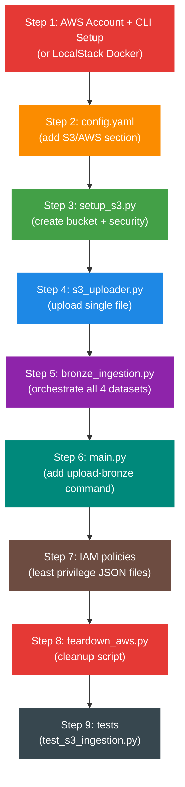
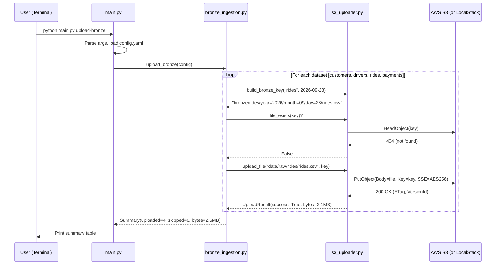

# Phase 3 — Amazon S3 Bronze Layer Ingestion: Planning Document

!!! info "Phase Status"
    **Status**: PLANNING (no code written yet)  
    **Prerequisite**: Phase 2 complete (52/52 tests passing)  
    **Estimated build time**: 2-3 sessions  
    **Estimated AWS cost**: ~$0.05 (see detailed breakdown in Section 2)

---

## 1. Problem Statement — What Are We Solving?

### What's broken or missing right now?

After Phase 2, our data lives in TWO places:

```
data/raw/*.csv  →  Your laptop (flat files)
PostgreSQL      →  Your laptop (Docker container)
```

**Both are on your laptop.** This creates three critical problems:

| Problem | Why it matters |
|---------|---------------|
| **No cloud storage** | If your laptop dies, ALL data is gone. There's no backup, no disaster recovery. |
| **No Bronze layer** | The medallion architecture (Bronze → Silver → Gold) requires raw data to land in a cloud data lake FIRST. Phase 4 (PySpark) needs to READ from S3, not from local CSV files. |
| **No shared access** | Your PostgreSQL is only accessible from your laptop. In a real company, 50+ engineers and analysts need access to the same raw data. S3 provides that shared, centralized landing zone. |

### Why is this a separate phase?

Phase 4 (PySpark transformations) **assumes data is in S3**. If we skip Phase 3, Phase 4 has nothing to read from. The dependency chain is:

```
Phase 1: Generate CSVs locally
Phase 2: Load into PostgreSQL (for SQL practice + validation)
Phase 3: Upload CSVs to S3 Bronze layer  ← YOU ARE HERE
Phase 4: PySpark reads FROM S3 Bronze, writes TO S3 Silver
```

Without Phase 3, Phase 4 would need to read from local files — which doesn't work when we move to AWS Glue (Phase 7), because Glue runs in the cloud and can't access your laptop.

### What does "done" look like?

```
s3://your-bucket-name/
└── bronze/
    ├── customers/year=2026/month=09/day=28/customers.csv
    ├── drivers/year=2026/month=09/day=28/drivers.csv
    ├── rides/year=2026/month=09/day=28/rides.csv
    └── payments/year=2026/month=09/day=28/payments.csv
```

Plus: encryption ON, public access BLOCKED, versioning ON, IAM roles scoped, teardown script ready.

---

## 2. Solution Approach — How Are We Solving It?

### Three realistic approaches evaluated:

| Approach | What it is | Pros | Cons | Verdict |
|----------|-----------|------|------|---------|
| **A. boto3 (Python SDK)** | Write Python code that calls AWS APIs directly | Full control, learnable, same language as our project, reusable in production | Requires understanding AWS auth, more code to write | ✅ **Picking this** |
| **B. AWS CLI** | Use `aws s3 cp` shell commands | Quick, simple, no Python needed | Not programmable, can't add validation/logging, doesn't teach SDK skills | ❌ Too basic |
| **C. Terraform/CloudFormation** | Infrastructure-as-Code templates | Professional, repeatable | Huge learning curve, overkill for Phase 3, better suited for V2 | ❌ Too advanced for now |

**Decision: boto3 (Option A)**

**Why**: You're learning Python. boto3 is Python. Every data engineer uses boto3 daily. The skills transfer directly to Phase 7 (Glue) and Phase 9 (Redshift). AWS CLI is a shortcut that doesn't teach you anything reusable. Terraform is important but belongs in V2 when you've mastered the basics.

### Two paths for running it:

You asked for both options — here they are side by side:

#### Path 1: Real AWS (Recommended)

| Aspect | Details |
|--------|---------|
| **What** | Create a real S3 bucket in your real AWS account |
| **Cost** | ~$0.05/month. S3 free tier gives 5 GB storage + 20,000 GET + 2,000 PUT requests/month for 12 months. Our data is ~50 MB. |
| **Pros** | Real experience. Screenshots for portfolio. Skills transfer directly to interviews. Exactly what production looks like. |
| **Cons** | Requires AWS account creation (15 min). Must remember to teardown to avoid costs. |
| **Setup needed** | Create AWS account → Create IAM user → Install AWS CLI → Configure credentials |

#### Path 2: LocalStack (Free Simulator)

| Aspect | Details |
|--------|---------|
| **What** | A Docker container that simulates AWS services locally. Your code talks to `localhost:4566` instead of `s3.amazonaws.com`. |
| **Cost** | $0. Runs entirely on your laptop. |
| **Pros** | Zero cost, zero risk of accidental charges, no AWS account needed, works offline. |
| **Cons** | Not real AWS — no IAM enforcement, no real encryption, no console screenshots for portfolio. Interviews will ask "did you use real AWS?" |
| **Setup needed** | Add LocalStack to `docker-compose.yml` → Set `endpoint_url` in boto3 |

!!! tip "Recommendation"
    **Do BOTH.** Start with LocalStack to learn the boto3 API without worrying about costs or credentials. Once comfortable, switch to Real AWS to get the real experience and portfolio evidence.

    The code is IDENTICAL — the only difference is one line:
    ```python
    # LocalStack:
    s3 = boto3.client('s3', endpoint_url='http://localhost:4566')

    # Real AWS:
    s3 = boto3.client('s3')  # uses ~/.aws/credentials automatically
    ```
    We'll build the code so that switching between them is a single config toggle.

### Cost Breakdown (Real AWS)

Let's break down exactly what Phase 3 costs:

| Operation | Volume | Unit price | Cost | Free tier? |
|-----------|--------|-----------|:----:|:----------:|
| `PutObject` (upload) | 4 files x ~5 runs = 20 requests | $0.005 per 1,000 | ~$0.00 | Yes, 2,000 free/month |
| `HeadObject` (idempotency check) | 4 files x ~5 runs = 20 requests | $0.004 per 1,000 | ~$0.00 | Yes |
| `GetObject` (verification) | ~20 requests | $0.0004 per 1,000 | ~$0.00 | Yes, 20,000 free/month |
| Storage | ~2.5 MB x 1-2 months | $0.023 per GB/month | ~$0.00 | Yes, 5 GB free for 12 months |
| **Total** | | | **~$0.00** | Fully covered by free tier |

**Bottom line**: Phase 3 is effectively free. The first real cost comes in Phase 7 (Glue ETL: ~$7-15).

### Region Choice: Why `ap-south-1` (Mumbai)?

| Region | Location | Latency from India | S3 price/GB | Verdict |
|--------|----------|:------------------:|:-----------:|--------|
| `ap-south-1` | Mumbai | ~20ms | $0.023 | **Picking this.** Closest. Lowest latency. |
| `us-east-1` | Virginia, USA | ~200ms | $0.023 | Most tutorials use this, but uploads 10x slower from India |
| `ap-southeast-1` | Singapore | ~50ms | $0.023 | Decent, but Mumbai is closer |

**Key rule**: Once you pick a region, ALL services for this project must be in that same region. S3, Glue, Athena, Redshift - all in `ap-south-1`. Cross-region data transfer costs money.

---

## 3. Concepts to Understand First

Before writing any code, you need to understand these concepts. I've ordered them by when you'll encounter them during the build.

### Concept 1: Amazon S3 (Simple Storage Service)

**What it is**: A cloud storage service. Think of it as an infinite, always-available hard drive in the sky. You upload files (called "objects") into containers (called "buckets").

**Key vocabulary**:

| Term | What it means | Analogy |
|------|-------------|---------|
| **Bucket** | A top-level container for files. Like a Google Drive folder. | A filing cabinet |
| **Object** | A single file stored in S3. Has a key (path) and data (contents). | A document in the cabinet |
| **Key** | The "path" to an object. e.g., `bronze/rides/year=2026/month=09/rides.csv` | The label on the folder tab |
| **Prefix** | A "folder" in S3 (S3 doesn't actually have folders — it's a flat namespace, but prefixes ACT like folders) | A drawer in the cabinet |
| **Region** | The physical AWS data center location. e.g., `ap-south-1` = Mumbai | Which city the cabinet is in |

**Should I read more?** Yes — spend 15 minutes on the AWS S3 overview page after reading this plan.

### Concept 2: IAM (Identity and Access Management)

**What it is**: AWS's permission system. It controls WHO can do WHAT on WHICH resources.

**Key vocabulary**:

| Term | What it means | Our use case |
|------|-------------|-------------|
| **IAM User** | A person or application that can access AWS | You (the developer) |
| **IAM Role** | A set of permissions that can be assumed by a user or service | `mobility-ingestion-role` (can only write to `bronze/`) |
| **IAM Policy** | A JSON document that defines specific permissions | "Allow `s3:PutObject` on `s3://bucket/bronze/*`" |
| **Access Key + Secret Key** | Credentials for programmatic access (like a username + password for the API) | Stored in `~/.aws/credentials`, NEVER in code |
| **Principle of Least Privilege** | Give each role ONLY the permissions it needs, nothing more | Our ingestion role can ONLY write to `bronze/`, not `silver/` or `gold/` |

**Should I read more?** Yes — watch a 10-minute YouTube video on IAM before we start. This is one of the most important AWS concepts.

### Concept 3: boto3 (AWS SDK for Python)

**What it is**: A Python library that lets you talk to AWS services. You import it, create a "client" for the service you want (S3, IAM, Glue, etc.), and call methods.

```python
import boto3

# Create an S3 client
s3 = boto3.client('s3')

# Upload a file
s3.upload_file('data/raw/rides/rides.csv', 'my-bucket', 'bronze/rides/rides.csv')
```

**Key pattern**: `client` vs `resource`

| API | Style | Best for |
|-----|-------|----------|
| `boto3.client('s3')` | Low-level, method calls | Full control, exact API calls |
| `boto3.resource('s3')` | High-level, object-oriented | Simpler code, less control |

We'll use `client` because it maps 1:1 to the AWS API docs and gives us full control.

**Should I read more?** Skim the boto3 S3 quickstart after reading this plan. Don't deep-dive — you'll learn by writing the code.

### Concept 4: Date-based partitioning (Hive-style)

**What it is**: Organizing files into folder paths that encode the date. This is how every data lake in the world organizes raw data.

```
# Without partitioning (BAD):
bronze/rides/rides.csv          ← ONE massive file, grows forever

# With partitioning (GOOD):
bronze/rides/year=2026/month=01/day=01/rides.csv
bronze/rides/year=2026/month=01/day=02/rides.csv
bronze/rides/year=2026/month=09/day=28/rides.csv
```

**Why `year=YYYY/month=MM/day=DD`?** This is called "Hive-style partitioning." PySpark (Phase 4), Athena (Phase 8), and Glue (Phase 7) all automatically recognize this naming convention. They'll use it to skip irrelevant files when you query a specific date range.

**Should I read more?** No — you'll understand this by doing it.

### Concept 5: Encryption at rest (SSE-S3)

**What it is**: When you upload a file to S3, AWS automatically encrypts it on disk using AES-256. Even if someone physically steals the hard drive from the AWS data center, they can't read your data.

We'll use **SSE-S3** (Server-Side Encryption with S3-managed keys) — the simplest option. AWS manages the encryption keys for you. Zero code changes needed.

**Should I read more?** No — it's a one-line configuration.

### Concept 6: LocalStack (if using the local path)

**What it is**: An open-source tool that runs a fake AWS cloud on your laptop in Docker. Your Python code thinks it's talking to real AWS, but it's actually talking to a container on `localhost:4566`.

**How it works**:
```
Your Python code → boto3 → endpoint_url=localhost:4566 → LocalStack Docker container
Your Python code → boto3 → endpoint_url=s3.amazonaws.com → Real AWS (default)
```

**Should I read more?** Only if you choose the LocalStack path first. A 5-minute quickstart is enough.

### Concept 7: S3 Bucket Naming Rules (Will bite you if you don't know)

S3 bucket names are **globally unique across ALL 300 million+ AWS accounts**. If someone in Japan already has a bucket named `mobility-data-lake`, you cannot use that name.

| Rule | Valid | Invalid |
|------|-------|---------|
| Must be globally unique | `mobility-lake-YOUR-ACCT-ID` | `mobility-data-lake` (probably taken) |
| Lowercase only | `my-bucket` | `My-Bucket` |
| No underscores | `my-bucket` | `my_bucket` |
| 3-63 characters | `mob` | `mo` |
| Must start with letter or number | `mobility-123` | `-mobility` |

**Our strategy**: `mobility-data-lake-{your-aws-account-id}` makes it unique. Find your ID: `aws sts get-caller-identity`.

### Concept 8: PII in Bronze - The Security Model

AGENTS.md Rule 4: *"Raw landing data with PII must be kept in access-restricted Bronze prefixes."*

Our Bronze CSVs contain raw PII (emails, phones, names, GPS coordinates). We upload them AS-IS. Here is the security model:

```
Bronze (raw PII)     -> Restricted to ingestion role ONLY
    | Phase 4
Silver (masked PII)  -> emails hashed, phones masked, GPS to H3 hex
    | Phase 5  
Gold (no PII)        -> surrogate keys only, no personal data
```

| Layer | Who can access | PII status |
|-------|---------------|------------|
| `bronze/` | ingestion-role (write), etl-role (read). **NO analyst access.** | Raw PII present |
| `silver/` | etl-role (write), analytics-role (read) | PII masked (SHA-256) |
| `gold/` | analytics-role (read), BI tools | Zero PII |

This is enforced by the IAM policies in Step 7. Analysts get an explicit `Deny` on `bronze/*`.

---

## 4. Step-by-Step Build Order

### Dependency DAG for Phase 3:



---

### Step 1: AWS Account + CLI Setup (or LocalStack)

**What**: Set up the infrastructure that our Python code will talk to.

**Files created/changed**: None in the repo (this is environment setup on your machine).

**Depends on**: Nothing.

#### Path A — Real AWS:
1. Create an AWS account at https://aws.amazon.com/free/
2. :material-alert:{.text-red} **SET UP A BILLING ALARM IMMEDIATELY** (see Step 1A below)
3. Create an IAM user (not root) with `AmazonS3FullAccess` (temporary — we'll scope it down in Step 7)
4. Generate Access Key + Secret Key for the IAM user
5. Install AWS CLI: `pip install awscli`
6. Configure credentials: `aws configure` → enter Access Key, Secret Key, region `ap-south-1`
7. Verify credentials are NOT inside the project folder (see Credentials Safety below)
8. Verify: `aws sts get-caller-identity` should return your account ID

!!! danger "Step 1A: Billing Alarm (DO THIS FIRST — non-negotiable)"
    This is your financial safety net. If anything goes wrong, you get an email BEFORE a big bill arrives.

    1. Go to **AWS Console → Billing → Billing Preferences**
    2. Check "Receive Free Tier Usage Alerts" → enter your email
    3. Go to **CloudWatch → Alarms → Create Alarm**
    4. Select metric: **Billing → Total Estimated Charge**
    5. Set threshold: **$5 USD** (our project should cost ~$0.05, so $5 means something is wrong)
    6. Set notification: **Your email address**
    7. Create the alarm

    **Why $5?** Our Phase 3 costs ~$0.05. If charges reach $5, something unexpected is running. The alarm gives you time to investigate and tear down before it becomes $50 or $500.

!!! warning "Credentials Safety Check"
    AWS CLI stores your credentials at `C:\Users\YourName\.aws\credentials`. This file must NEVER be inside your project folder or committed to git.

    ```bash
    # Verify credentials are in the right place (your home directory, NOT project):
    aws configure list
    # Should show: config file = C:\Users\YourName\.aws\credentials
    # Should NOT show any path inside D:\Code\Projects\mobility platform\

    # Verify .gitignore blocks aws credentials:
    grep -n ".aws" .gitignore
    # Should show a line like: .aws/
    ```

#### Path B — LocalStack:
1. Add LocalStack to `docker/docker-compose.yml` (a new service alongside PostgreSQL)
2. `docker compose -f docker/docker-compose.yml up -d`
3. Verify: `aws --endpoint-url=http://localhost:4566 s3 ls` should return empty (no buckets yet)

**"Done" looks like**:
```bash
# Real AWS:
aws s3 ls
# → (empty list or your existing buckets)

# LocalStack:
aws --endpoint-url=http://localhost:4566 s3 ls
# → (empty list)

# Billing alarm:
# → You received a confirmation email from AWS SNS (click to confirm)
```

---

### Step 2: Update `config.yaml` — Add S3/AWS section

**What**: Add AWS and S3 configuration to our single source of truth.

**Files changed**: `config/config.yaml`

**Depends on**: Step 1 (we need to know the region and bucket name)

**What gets added**:
```yaml
# ── AWS Configuration (Phase 3+) ─────────────────────────────
aws:
  region: "ap-south-1"            # Mumbai — closest to us
  use_localstack: false           # Toggle: true = LocalStack, false = Real AWS
  localstack_endpoint: "http://localhost:4566"

# ── S3 Configuration ─────────────────────────────────────────
s3:
  bucket_name: "mobility-data-lake-{account_id}"   # Globally unique
  prefix_bronze: "bronze"
  prefix_silver: "silver"
  prefix_gold: "gold"
  prefix_quarantine: "quarantine"
  encryption: "AES256"            # SSE-S3 encryption
  versioning: true
```

**Why `use_localstack` toggle?** So switching between LocalStack and Real AWS is a config change, not a code change. The Python code reads this flag and sets `endpoint_url` accordingly.

**"Done" looks like**: `config.yaml` has the new sections, and `ConfigLoader.load()` can read them.

---

### Step 3: `scripts/setup_s3.py` — Create the bucket with security

**What**: A Python script that creates the S3 bucket and configures ALL security settings in one shot.

**Files created**: `scripts/setup_s3.py`

**Depends on**: Step 1 (credentials) + Step 2 (config)

**What this script does (in order)**:
1. Create the S3 bucket in `ap-south-1`
2. Enable Block Public Access (all 4 settings)
3. Enable default encryption (SSE-S3 / AES256)
4. Enable versioning
5. Apply bucket policy enforcing TLS (HTTPS only)
6. **Apply S3 Lifecycle policies** (AGENTS.md Rule 8)
7. Create the prefix structure (`bronze/`, `silver/`, `gold/`, `quarantine/`)
8. Print a summary of what was configured

**S3 Lifecycle Policies (Step 6 detail):**

AGENTS.md Rule 8 requires lifecycle rules. These auto-manage storage costs and cleanup:

| Prefix | Rule | Why |
|--------|------|-----|
| `quarantine/` | Auto-delete after 30 days | Bad data doesn't need to live forever. If not investigated in 30 days, it won't be. |
| `bronze/` | Move to Glacier after 90 days | Raw data is rarely re-read after Silver is built. Glacier storage costs ~$0.004/GB vs $0.023/GB (83% cheaper). |
| `silver/`, `gold/` | No lifecycle (Standard storage) | Actively queried by Athena/Redshift. Must stay in fast-access storage. |

**"Done" looks like**:
```bash
python scripts/setup_s3.py

# Output:
# ✓ Bucket created: mobility-data-lake-123456789
# ✓ Block Public Access: ENABLED
# ✓ Default encryption: AES256
# ✓ Versioning: ENABLED
# ✓ TLS-only policy: APPLIED
# ✓ Lifecycle: quarantine/ → delete after 30d, bronze/ → Glacier after 90d
# ✓ Prefixes created: bronze/, silver/, gold/, quarantine/
```

---

### Step 4: `src/ingestion/s3_uploader.py` — Upload a single file

**What**: A reusable module that uploads ONE file to S3 with proper key construction, encryption headers, and logging.

**Files created**: `src/ingestion/__init__.py`, `src/ingestion/s3_uploader.py`

**Depends on**: Step 3 (bucket must exist)

**Key functions**:

| Function | What it does |
|----------|-------------|
| `get_s3_client()` | Creates a boto3 S3 client (handles LocalStack vs Real AWS toggle) |
| `upload_file(local_path, s3_key)` | Uploads a single file to S3 with encryption headers |
| `build_bronze_key(dataset, date)` | Constructs the Hive-style partitioned S3 key: `bronze/rides/year=2026/month=09/day=28/rides.csv` |
| `file_exists(s3_key)` | Checks if a file already exists in S3 (for idempotency) |

**"Done" looks like**:
```python
from src.ingestion.s3_uploader import upload_file, build_bronze_key

key = build_bronze_key("rides", date(2026, 9, 28))
# → "bronze/rides/year=2026/month=09/day=28/rides.csv"

upload_file("data/raw/rides/rides.csv", key)
# → "✓ Uploaded rides.csv to s3://bucket/bronze/rides/year=2026/month=09/day=28/rides.csv"
```

---

### Step 5: `src/ingestion/bronze_ingestion.py` — Orchestrate all 4 datasets

**What**: Orchestrator that uploads ALL 4 CSV files (customers, drivers, rides, payments) to S3 Bronze in one call.

**Files created**: `src/ingestion/bronze_ingestion.py`

**Depends on**: Step 4 (`s3_uploader.py` provides the upload functions)

**What this does**:
1. Read the list of datasets from config (customers, drivers, rides, payments)
2. For each dataset:
   - Build the S3 key with today's date partition
   - Check if file already exists in S3 (idempotency)
   - Upload the file
   - Verify the upload (check file size matches)
3. Return a summary: uploaded count, skipped count, total bytes

**"Done" looks like**:
```bash
python -c "from src.ingestion.bronze_ingestion import upload_bronze; upload_bronze()"

# Output:
# [1/4] customers.csv → s3://.../bronze/customers/year=2026/month=09/day=28/customers.csv ✓ (45 KB)
# [2/4] drivers.csv   → s3://.../bronze/drivers/year=2026/month=09/day=28/drivers.csv ✓ (22 KB)
# [3/4] rides.csv     → s3://.../bronze/rides/year=2026/month=09/day=28/rides.csv ✓ (2.1 MB)
# [4/4] payments.csv  → s3://.../bronze/payments/year=2026/month=09/day=28/payments.csv ✓ (380 KB)
# Total: 4 uploaded, 0 skipped, 2.5 MB
```

---

### Step 6: Update `main.py` — Add `upload-bronze` command

**What**: Wire the bronze ingestion into our CLI.

**Files changed**: `main.py`

**Depends on**: Step 5 (the orchestrator function)

**New command**: `python main.py upload-bronze`

**Arguments**:
- `--date` — Override the partition date (default: today)
- `--force` — Re-upload even if files already exist in S3

**"Done" looks like**:
```bash
python main.py upload-bronze
python main.py upload-bronze --date 2026-01-15
python main.py upload-bronze --force
```

---

### Step 7: IAM Policies — Least Privilege JSON files

**What**: JSON policy documents that define exactly what each role can do. These are documentation AND can be applied via AWS CLI.

**Files created**:

- `infrastructure/iam/mobility-ingestion-policy.json`
- `infrastructure/iam/mobility-etl-policy.json`
- `infrastructure/iam/mobility-analytics-policy.json`
- `infrastructure/s3/bucket-policy.json` — TLS enforcement policy (standalone for security audit)

**Depends on**: Step 3 (bucket must exist, so we know the ARN)

**What each policy allows**:

| Policy | Allowed Actions | On Which Prefixes |
|--------|----------------|-------------------|
| `ingestion-policy` | `s3:PutObject`, `s3:ListBucket` | `bronze/*` only |
| `etl-policy` | `s3:GetObject` on `bronze/*`, `s3:PutObject` on `silver/*`, `gold/*`, `quarantine/*` | Cross-prefix |
| `analytics-policy` | `s3:GetObject`, `s3:ListBucket` | `silver/*`, `gold/*` only. **Explicit Deny** on `bronze/*` |

**AGENTS.md compliance**: No wildcards (`*`) in Action or Resource. Each policy is scoped to specific prefixes.

**Why `bucket-policy.json` as a separate file?** In production, security teams audit policy files directly. They should not need to read Python code (`setup_s3.py`) to verify TLS enforcement. The standalone JSON file is the auditable "source of truth" — the setup script reads and applies it.

**"Done" looks like**: JSON files exist in `infrastructure/iam/` and `infrastructure/s3/`. Can be applied with `aws iam create-policy --policy-document file://infrastructure/iam/...`.

---

### Step 8: `scripts/teardown_aws.py` — Cleanup script

**What**: A Python script that destroys ALL AWS resources created by this project. This is your safety net against surprise bills.

**Files created**: `scripts/teardown_aws.py`

**Depends on**: Steps 3-7 (needs to know what to tear down)

**What it does (in order)**:
1. Empty the S3 bucket (delete all objects + delete all object versions)
2. Delete the S3 bucket
3. Delete IAM policies (if created)
4. Print confirmation of everything deleted

**"Done" looks like**:
```bash
python scripts/teardown_aws.py

# Output:
# ⚠ This will DELETE all AWS resources for this project.
# Type 'DELETE' to confirm: DELETE
# ✓ Deleted 4 objects from s3://mobility-data-lake-123456789
# ✓ Deleted bucket: mobility-data-lake-123456789
# ✓ All resources cleaned up.
```

---

### Step 9: Tests — `tests/test_s3_ingestion.py`

**What**: Integration tests that verify the upload pipeline works correctly.

**Files created**: `tests/test_s3_ingestion.py`

**Depends on**: Steps 4-6 (all ingestion code must be written)

**Test categories**:

| Test | What it verifies |
|------|-----------------|
| `test_build_bronze_key` | Key construction: `bronze/rides/year=2026/month=09/day=28/rides.csv` |
| `test_upload_single_file` | A file actually appears in S3 after upload |
| `test_upload_idempotent` | Uploading twice doesn't create duplicates |
| `test_file_size_matches` | Uploaded file size matches local file size |
| `test_encryption_enabled` | Uploaded object has `ServerSideEncryption: AES256` |
| `test_upload_all_datasets` | All 4 datasets upload successfully |
| `test_invalid_file_path` | Uploading a non-existent file raises `FileNotFoundError` |

**Auto-skip**: Like Phase 2 tests auto-skip when Docker is off, these tests auto-skip when AWS credentials are not configured.

**"Done" looks like**:
```bash
pytest tests/test_s3_ingestion.py -v
# → 7/7 passed ✅ (or skipped if no AWS creds)
```

---

## 5. Data/Control Flow Trace — What Happens at Runtime

When you run `python main.py upload-bronze`, this is the EXACT sequence of function calls:



### The import/call chain:

```
main.py
  └─ _handle_upload_bronze()
       └─ bronze_ingestion.upload_bronze(config)
            ├─ s3_uploader.get_s3_client(config)       # creates boto3 client
            ├─ s3_uploader.build_bronze_key("customers", date)  # constructs S3 path
            ├─ s3_uploader.file_exists(client, bucket, key)     # idempotency check
            └─ s3_uploader.upload_file(client, local_path, bucket, key)  # actual upload
```

---

## 6. Before/After State — Concrete Example

### BEFORE Phase 3 (current state):

```
Your Laptop:
  data/raw/rides/rides.csv     ← 10,000 rows, 2.1 MB
  
AWS S3:
  (nothing — bucket doesn't exist)
```

**Sample row in `rides.csv`:**
```
ride_id,customer_id,driver_id,pickup_city,...,fare,ride_status
R00001,C0042,D0187,Mumbai,...,245.50,completed
```

### AFTER Phase 3:

```
Your Laptop:
  data/raw/rides/rides.csv     ← still here, unchanged

AWS S3:
  s3://mobility-data-lake-123456789/
  └── bronze/
      ├── customers/year=2026/month=09/day=28/customers.csv   (45 KB)
      ├── drivers/year=2026/month=09/day=28/drivers.csv       (22 KB)
      ├── rides/year=2026/month=09/day=28/rides.csv           (2.1 MB)
      └── payments/year=2026/month=09/day=28/payments.csv     (380 KB)
```

!!! note "Key Insight"
    Phase 3 doesn't transform the data — it just moves it to the cloud in a date-partitioned structure. The file content is **IDENTICAL** to what's on your laptop. Transformation happens in Phase 4.

---

## 7. Failure Modes — What Can Go Wrong?

| Step | Failure | What happens | Blast radius | How to detect | How to fix |
|------|---------|-------------|:------------:|---------------|------------|
| Step 1 | AWS credentials not configured | `NoCredentialsError` | Nothing uploaded | Loud crash with clear error | Run `aws configure` |
| Step 3 | Bucket name already taken globally | `BucketAlreadyExists` | Bucket not created | Loud crash | Change bucket name in config.yaml (add your initials or account ID) |
| Step 4 | Network timeout during upload | `ConnectionError` / partial upload | ONE file not uploaded, others unaffected | Loud crash | Re-run; idempotency check skips already-uploaded files |
| Step 4 | CSV file doesn't exist locally | `FileNotFoundError` | That dataset skipped | Loud crash | Run `python main.py generate` first |
| Step 5 | Upload succeeds but file is corrupted | Silent! S3 accepts anything | Bad data in Bronze | Check: compare local file size vs S3 object size | Re-upload with `--force` flag |
| Step 8 | Teardown fails (bucket not empty) | `BucketNotEmpty` error | Bucket still exists, costs $0.01/month | Loud crash | Must delete all objects AND all versions first, then delete bucket |

!!! warning "Key Insight"
    Most failures are LOUD (crashes with clear error messages). The only silent failure is data corruption during upload, which we catch by comparing file sizes.

---

## 8. Interface/Contract with Phase 4

Phase 4 (PySpark Bronze → Silver) will ASSUME:

| What Phase 4 expects | Format | Example |
|---------------------|--------|---------|
| Files exist in S3 at Hive-style paths | `bronze/{dataset}/year=YYYY/month=MM/day=DD/{dataset}.csv` | `bronze/rides/year=2026/month=09/day=28/rides.csv` |
| Files are CSV with headers | First row = column names | `ride_id,customer_id,driver_id,...` |
| Files are readable (not encrypted with customer-managed KMS keys) | SSE-S3 (transparent decryption) | S3 handles decryption automatically |
| Bucket name is in `config.yaml` | Under `s3.bucket_name` | `mobility-data-lake-123456789` |
| Bronze prefix is in `config.yaml` | Under `s3.prefix_bronze` | `bronze` |

**If Phase 3 changes any of these**, Phase 4 breaks. This is the contract.

---

## 9. New Dependencies/Tools

| Dependency | Install command | What problem it solves |
|------------|----------------|----------------------|
| `boto3` | `pip install boto3` | Lets Python talk to AWS services (S3, IAM, etc.). Without it, you'd have to make raw HTTP requests to AWS APIs — 100x more code. |
| `awscli` | `pip install awscli` | Command-line tool for quick AWS operations. Used for `aws configure` (setting up credentials) and quick verification (`aws s3 ls`). |
| `localstack` (optional) | Docker image: `localstack/localstack` | Simulates AWS on your laptop. Lets you develop and test without a real AWS account or internet connection. |

**That's it — only 2 new Python packages** (3 if you count LocalStack's Docker image).

---

## 10. Where This Fits in the Repo

### New directories and files created by Phase 3:

```
mobility-platform/
├── config/config.yaml              ← MODIFIED (add aws/s3 sections)
├── main.py                         ← MODIFIED (add upload-bronze command)
├── requirements.txt                ← MODIFIED (add boto3, awscli)
├── infrastructure/                 ← NEW directory
│   ├── iam/
│   │   ├── mobility-ingestion-policy.json
│   │   ├── mobility-etl-policy.json
│   │   └── mobility-analytics-policy.json
│   └── s3/
│       └── bucket-policy.json
├── scripts/                        ← NEW directory
│   ├── setup_s3.py
│   └── teardown_aws.py
├── src/
│   └── ingestion/                  ← NEW directory
│       ├── __init__.py
│       ├── s3_uploader.py
│       └── bronze_ingestion.py
└── tests/
    └── test_s3_ingestion.py        ← NEW file
```

### What already exists (untouched):

```
src/data_generator/    ← Phase 1 (generates the CSVs we upload)
src/database/          ← Phase 2 (PostgreSQL — independent of S3)
docker/                ← Phase 2 (PostgreSQL Docker — may add LocalStack service)
sql/                   ← Phase 2 (SQL files — untouched)
```

---

## 11. Manual Verification Checklist

Run these commands AFTER Phase 3 is complete to confirm everything works:

### Checklist 0: Billing & Credentials Safety (FIRST!)

```bash
# Verify billing alarm exists
# → Go to AWS Console → CloudWatch → Alarms
# → Should show an alarm named "BillingAlarm" with threshold $5

# Verify credentials are NOT in the project folder
Get-ChildItem -Recurse -Filter "credentials" -Path "D:\Code\Projects\mobility platform"
# → Should return NOTHING. If it finds a credentials file, MOVE it to ~/.aws/

# Verify .gitignore blocks credential files
Select-String -Path ".gitignore" -Pattern ".aws"
# → Should show: .aws/
```

### Checklist 1: S3 Bucket Exists and Is Secure

```bash
# List buckets (should show our bucket)
aws s3 ls

# Verify Block Public Access is ON
aws s3api get-public-access-block --bucket YOUR_BUCKET_NAME

# Verify encryption is enabled
aws s3api get-bucket-encryption --bucket YOUR_BUCKET_NAME

# Verify versioning is enabled
aws s3api get-bucket-versioning --bucket YOUR_BUCKET_NAME

# Verify bucket policy (TLS enforcement)
aws s3api get-bucket-policy --bucket YOUR_BUCKET_NAME

# Verify lifecycle policies are set
aws s3api get-bucket-lifecycle-configuration --bucket YOUR_BUCKET_NAME
```

**Expected output for each**: Block Public Access = all true. Encryption = AES256. Versioning = Enabled. Policy = contains `aws:SecureTransport`. Lifecycle = quarantine 30d expiry + bronze 90d Glacier transition.

### Checklist 2: Files Are Uploaded Correctly

```bash
# List all objects in Bronze
aws s3 ls s3://YOUR_BUCKET_NAME/bronze/ --recursive

# Expected: 4 files with correct sizes
# 2026-09-28 15:30:00      45000 bronze/customers/year=2026/month=09/day=28/customers.csv
# 2026-09-28 15:30:01      22000 bronze/drivers/year=2026/month=09/day=28/drivers.csv
# 2026-09-28 15:30:02    2100000 bronze/rides/year=2026/month=09/day=28/rides.csv
# 2026-09-28 15:30:03     380000 bronze/payments/year=2026/month=09/day=28/payments.csv
```

### Checklist 3: Idempotency Works

```bash
# Run upload-bronze TWICE
python main.py upload-bronze
python main.py upload-bronze

# Second run should say "skipped" for all 4 files (already exists)
# OR overwrite cleanly (no duplicates)
```

### Checklist 4: Tests Pass

```bash
# Run Phase 3 tests
pytest tests/test_s3_ingestion.py -v

# Run ALL tests (no regressions)
pytest tests/ -v
# Expected: 52 (Phase 1+2) + 7 (Phase 3) = 59 passed
```

### Checklist 5: Teardown Works

```bash
# Clean up everything
python scripts/teardown_aws.py

# Verify bucket is gone
aws s3 ls
# Should NOT show our bucket
```

### Checklist 6: PII Access Restriction (AGENTS.md Rule 4)

```bash
# If IAM policies from Step 7 are applied:
# Verify analysts CANNOT access Bronze (where raw PII lives)
aws s3 ls s3://YOUR_BUCKET_NAME/bronze/ --profile analytics
# Expected: AccessDenied

# Verify analysts CAN access Silver/Gold prefixes
aws s3 ls s3://YOUR_BUCKET_NAME/gold/ --profile analytics
# Expected: accessible (no AccessDenied)
```

This confirms PII-containing Bronze data is access-restricted per AGENTS.md Rule 4.

### Checklist 7: Evidence Collection (for portfolio and interviews)

The implementation plan requires screenshots for interview evidence. Capture these and save to `docs/screenshots/phase3/`:

| # | Screenshot | What to capture | Where in AWS Console |
|---|-----------|----------------|---------------------|
| 1 | S3 bucket structure | Folder tree showing `bronze/customers/year=...` | S3 Console > your bucket > Browse |
| 2 | Security settings | Block Public Access = all ON | S3 Console > Permissions tab |
| 3 | Encryption config | Default encryption = AES-256 | S3 Console > Properties tab |
| 4 | Versioning status | Versioning = Enabled | S3 Console > Properties tab |
| 5 | Lifecycle rules | Quarantine 30d, Bronze 90d Glacier | S3 Console > Management tab |
| 6 | IAM policies | The JSON policy content | IAM Console > Policies |
| 7 | Billing alarm | CloudWatch alarm at $5 | CloudWatch Console > Alarms |

```bash
# Create the screenshots directory first
mkdir docs\screenshots\phase3
```

---

## 12. Learning Resources — Watch/Read Before Building

### Must-Do (Before writing code):

| Resource | Time | Why |
|----------|:----:|-----|
| [AWS S3 — How It Works (Official)](https://docs.aws.amazon.com/AmazonS3/latest/userguide/Welcome.html) | 15 min | Understand buckets, objects, keys, regions |
| [IAM Basics — YouTube by TechWorld with Nana](https://www.youtube.com/watch?v=iF9fs8Rdasc) | 12 min | Visual explanation of users, roles, policies |
| [boto3 S3 Quickstart (Official)](https://boto3.amazonaws.com/v1/documentation/api/latest/guide/s3-uploading-files.html) | 10 min | See upload_file, put_object examples |
| [AWS Free Tier — What's Actually Free](https://aws.amazon.com/free/) | 5 min | Know exactly what costs $0 |

### Good-To-Know (During or after building):

| Resource | Time | Why |
|----------|:----:|-----|
| [S3 Encryption Options Explained](https://docs.aws.amazon.com/AmazonS3/latest/userguide/serv-side-encryption.html) | 10 min | SSE-S3 vs SSE-KMS vs SSE-C |
| [IAM Policy Simulator](https://policysim.aws.amazon.com/) | 15 min | Test your IAM policies without deploying |
| [LocalStack Getting Started](https://docs.localstack.cloud/getting-started/) | 10 min | Only if using LocalStack path |
| [Hive-Style Partitioning Explained](https://www.youtube.com/watch?v=K_Gx2SCi4Ws) | 8 min | Understand `year=YYYY/month=MM/day=DD` naming |

### Command-Line Skills to Practice:

```bash
# AWS CLI — S3 operations
aws s3 ls                              # List buckets
aws s3 ls s3://bucket/ --recursive     # List all objects
aws s3 cp file.csv s3://bucket/key     # Upload a file
aws s3 rm s3://bucket/key              # Delete an object
aws s3 rb s3://bucket --force          # Delete bucket + all objects

# AWS CLI — IAM operations
aws sts get-caller-identity            # "Who am I?"
aws iam list-policies --scope Local    # List custom policies

# AWS CLI — Verification
aws s3api get-bucket-encryption --bucket NAME
aws s3api get-bucket-versioning --bucket NAME
aws s3api get-public-access-block --bucket NAME
```
